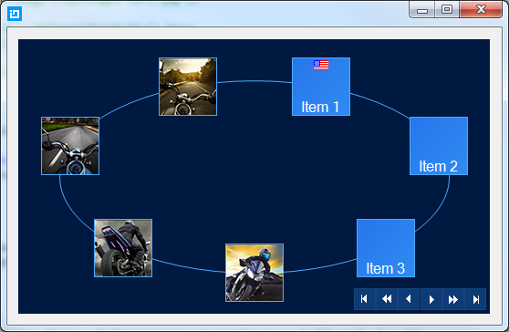
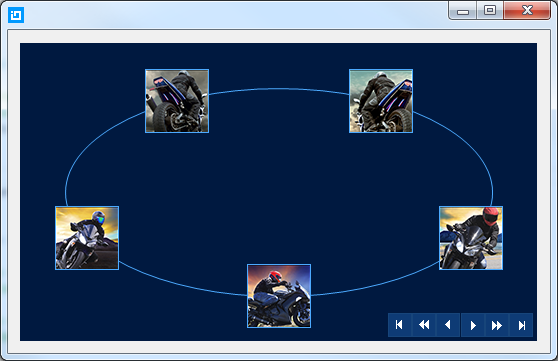

////

|metadata|
{
    "name": "wincarousel-adding-carousel-items-in-code",
    "controlName": [],
    "tags": [],
    "guid": "334c9e9c-eaa3-4981-8a8d-54b27a872c35",  
    "buildFlags": [],
    "createdOn": "2014-09-12T22:23:12.363674Z"
}
|metadata|
////

= Adding Carousel Items in Code

== Topic Overview

=== Purpose

This topic demonstrates how to add link:{ApiPlatform}win.ultrawincarousel{ApiVersion}~infragistics.win.ultrawincarousel.ultracarousel_members.html[UltraCarousel] items using the Code-Behind.

=== In this topic

This topic contains the following sections:

* <<_Ref397444704,Overview>>

** <<_Ref397444711,Introduction>>
** <<_Ref397444829,Application Requirements>>
** <<_Ref397444836,Adding UltraCarousel control>>
** <<_Ref397444844,Adding Items>>
** <<_Ref397444852,Binding data>>
** <<_Ref397444861,Sample test data>>

* <<_Ref381022312,Related Content>>

[[_Ref397444704]]
== Overview

[[_Ref397444711]]

=== Introduction

In this topic, you will learn how to add the UltraCarousel control and configure it through the control’s properties in code. The control has a link:{ApiPlatform}win.ultrawincarousel{ApiVersion}~infragistics.win.ultrawincarousel.ultracarousel~datasource.html[DataSource] property that can be used to bind any collection of strings or images that would display on the items.

.Note:
[NOTE]
====
Each item can display text, picture, or both as long as the image size yields space for text within the item.
====

[[_Ref397444829]]

=== Application Requirements

1. Install the  _Infragistics WinForms 2014 Volume 2_   or later version of the product.

2. Start with a new Windows Forms application using Visual Studio 2010 or later version.

[[_Ref397444836]]

=== Adding UltraCarousel control

The following code example demonstrates creating an instance of UltraCarousel control and adding it to the form. By default the control will display with an item path and scroll buttons before adding any items, or binding to a data.

*In C#:*

[source,csharp]
----
UltraCarousel carousel1 = new UltraCarousel();
this.Controls.Add(carousel1);
----

*In Visual Basic:*

[source,vb]
----
Dim carousel1 As New UltraCarousel()
Me.Controls.Add(carousel1)
----

[[_Ref397444844]]

=== Adding Items

An Item in the UltraCarousel control is the visual representations of the data object. Items appear as square tiles on the path. The link:{ApiPlatform}win.ultrawincarousel{ApiVersion}~infragistics.win.ultrawincarousel.carouselpath~itemslots.html[ItemSlots] property determines the number of items ( _Default=5_  ) displayed on the path. The default size of each item is 64x64 (In pixels).

The following code example demonstrates manually adding carousel items, and setting the item appearance with images.

*In C#:*

[source,csharp]
----
for (int i = 0; i < 5; i++)
{
    CarouselItem item = new CarouselItem();
    item.Settings.Appearance.Image = GetImage(string.Format("motorcycle{0}.png", i + 1));
    carousel1.Items.Add(item);
}
----

*In Visual Basic:*

[source,vb]
----
For i As Integer = 0 To 4
      Dim item As New CarouselItem()
      item.Settings.Appearance.Image = GetImage(String.Format("motorcycle{0}.png", i + 1))
      carousel1.Items.Add(item)
Next
----

[[_Ref397444852]]

=== Binding data

In addition to adding items manually, the UltraCarousel control supports data binding.

.Note:
[NOTE]
====
When the carousel control is bound to data, items cannot be added or updated.
====

This code demonstrates binding the control to a data using its link:{ApiPlatform}win.ultrawincarousel{ApiVersion}~infragistics.win.ultrawincarousel.ultracarousel~datasource.html[DataSource] property.

*In C#:*

[source,csharp]
----
carousel1.DataSource = new TestData();
----

*In Visual Basic:*

[source,vb]
----
carousel1.DataSource = New TestData()
----

[[_Ref397444861]]

=== Sample test data

This is the test data used in the data binding. With this test data model you may need to add some images in your project and set their `Build Action` to  _Embedded Resources_  .

*In C#:*

[source,csharp]
----
public class TestData : List<TestDataItem>
{
    public TestData()
    {
        for (int i = 0; i < 5; i++)
        {
            Add(new TestDataItem { Item = "Item", img = Images.GetImage(string.Format("motorcycle{0}.png", i + 1)) });
        }
    }
}
public class TestDataItem
{
    public string Item { get; set; }
    public Image img { get; set; }
}
public class Images
{
    public static Image GetImage(string imageName)
    {
        var type = typeof(Form1);
        var resName = string.Format("{0}", imageName);
        var stream = type.Module.Assembly.GetManifestResourceStream(type, resName);
        return null == stream ? null : Image.FromStream(stream);
    }
}
----

*In Visual Basic:*

[source,vb]
----
Public Class TestData
      Inherits List(Of TestDataItem)
      Public Sub New()
            For i As Integer = 0 To 4
                  Add(New TestDataItem() With { _
                        .Item = "Item", _
                        .img = Images.GetImage(String.Format("motorcycle{0}.png", i + 1)) _
                  })
            Next
      End Sub
End Class
Public Class TestDataItem
      Public Property Item() As String
            Get
                  Return m_Item
            End Get
            Set
                  m_Item = Value
            End Set
      End Property
      Private m_Item As String
      Public Property img() As Image
            Get
                  Return m_img
            End Get
            Set
                  m_img = Value
            End Set
      End Property
      Private m_img As Image
End Class
Public Class Images
      Public Shared Function GetImage(imageName As String) As Image
            Dim type = GetType(Form1)
            Dim resName = String.Format("{0}", imageName)
            Dim stream = type.[Module].Assembly.GetManifestResourceStream(type, resName)
            Return If(stream Is Nothing, Nothing, Image.FromStream(stream))
      End Function
End Class
----

[[_Ref381022312]]
== Related Content

=== Topics

The following topics provide additional information related to this topic.

[options="header", cols="a,a"]
|====
|Topic|Purpose

| link:wincarousel-adding-carousel-items-using-the-designer.html[Adding Carousel Items Using the Designer]
|This topic demonstrates how to add and configure the UltraCarousel items using the control's design-time interface.

| link:wincarousel-binding-data-to-carousel-in-code.html[Binding Data to Carousel in Code]
|This topic demonstrates binding data to the UltraCarousel in code-behind.

| link:wincarousel-binding-data-to-carousel-using-the-designer.html[Binding Data to Carousel Using the Designer]
|This topic will demonstrate with steps, how to set up a data source at design-time, and bind it to the UltraCarousel control.

| link:wincarousel-save-load-carousel-layout.html[Save/Load Carousel Configuration]
|This topic demonstrates how to Save/Load the UltraCarousel layout including carousel items, unless the control is bound to data. In that case the control has to be re-bound after loading the saved layout.

|====