////
|metadata|
{
    "name": "wincarousel-adding-carousel-items-using-the-designer",
    "controlName": [],
    "tags": [],
    "guid": "9becaadd-037e-43ca-9630-92ec983627e1",
    "buildFlags": [],
    "createdOn": "2014-09-12T22:11:09.4642173Z"
}
|metadata|
////

= Adding Carousel Items Using the Designer

This topic demonstrates how to add and configure the link:{ApiPlatform}win.ultrawincarousel{ApiVersion}~infragistics.win.ultrawincarousel.ultracarousel_members.html[UltraCarousel] items using the control’s design-time interface.

toc::[]

== Introduction

In this topic, you will learn how to add the UltraCarousel control and configure it through the control’s design-time interface. The main components of the carousel control are the `Path`, `Items`, and `Scroll buttons`.

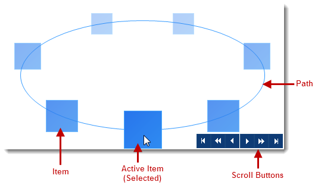

== Application Requirements

. Install the  _Infragistics WinForms 2014 Volume 2_   or later version of the product.

. Start with a new Windows Forms application using Visual Studio 2010 or later version.

== Adding UltraCarousel Control

Drag and drop the UltraCarousel control from the Visual Studio toolbox area on to the form. As you can see the control displays the default item path and navigation buttons by default.

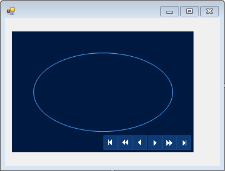

== Smart Tag

The UltraCarousel control contains a smart tag for optional, initial property settings.

Click on the surface of the control to enable the smart tag indicator (arrow) located in the control’s upper-right corner. The smart tag consists of a drop-down task list containing  _Name_   and two sections for  _Appearance_   and  _Data_   properties for design-time customization.

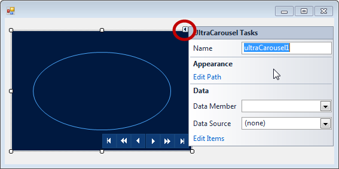

== Carousel Designer

To open the carousel designer simply `Right-click` on the control’s surface and select “ _Carousel Designer_  ”. Another way to open the carousel designer is through “ *Edit Path* ” link on the smart tag drop-down, explained in the next section.

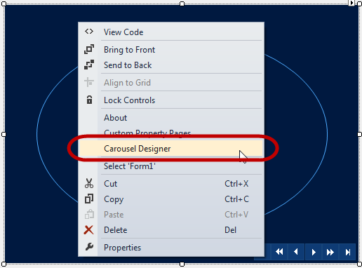

== Adding Path

The Path is the continuous track on the control on which the carousel items are rendered. There are various predefined Path types for configuration. The UltraCarousel design-time interface provides a convenient way to interact with those Path properties.

Click the “ *Edit Path* ” in the Appearance section of the “UltraCarousel Tasks” dialog to open the designer.

On top of the designer window you may notice three sections (In the screenshot below). Those sections contain predefined templates:  *Path Data* ,  *Path Opacity*  and  *Path Scaling*  for item path configuration.

You can preview the predefined path templates on the control by simply moving the mouse over  *Path Data*  icons, and when the icon is clicked that template will be selected.

Similarly, you can preview the opacity and scaling stop positions in the  *Opacity Stops*  and  *Scaling Stops*  window below it.

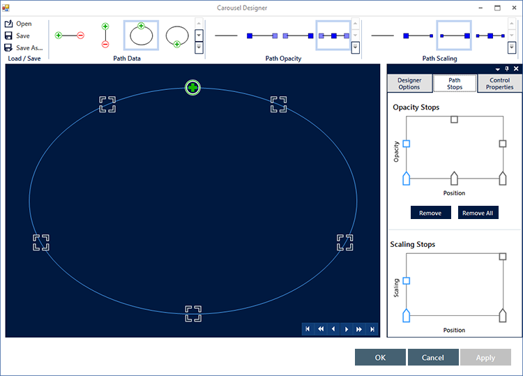

Continue with the following selections illustrated in the screenshot below:

* For “ *Path Data* ” select “ _EllipsTop_  ” by clicking on the icon or use the drop-down.
* For “ *Path Opacity* ” select “ _FadeFromMiddle_  ”.
* For “ *Path Scaling* ” select “ _Growing_  ”.

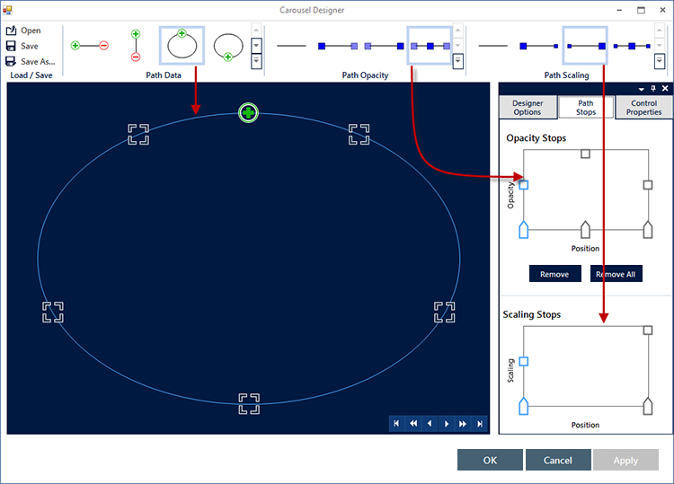

Optionally, you can apply additional configurations, while in designer view, using the “ _Control Properties_  ” tab. You may notice the default Item size is 64x64 (In pixels), item slots (5 slots allocated for five items), and the color of the path.

.Note:
[NOTE]
====
The UltraCarousel control renders as many items as defined in the `ItemSlots` property ( _Default=5_  ).
====

* If the actual items are less than the item slots, blank slots will appear on the path
* If the actual items are more than the item slots, the additional items will not render, because there would be no slots allocated for them.

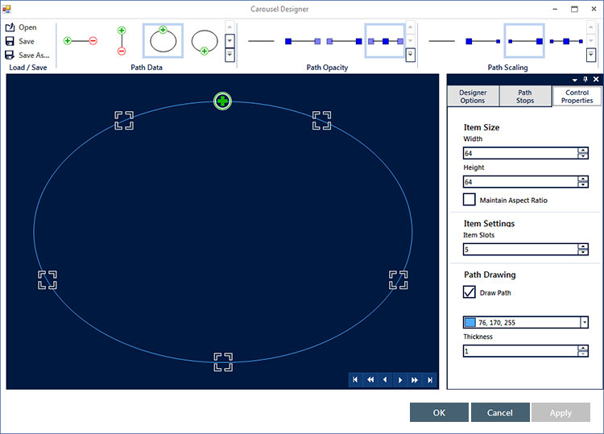

Optionally, configurations can be saved as XML or Binary files and loaded in an application. You can open an existing (previously saved) configuration file in the designer and reuse it for a new project.

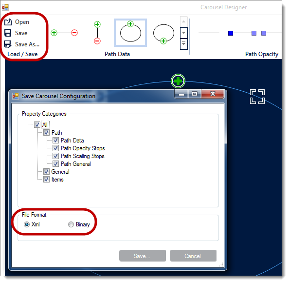

The “Designer Options” tab (outlined below) allows to display the path glyphs, which are the ornamental symbols on the path and stop points.

.Note:
[NOTE]
====
Glyphs are merely for visualizing the start/end and stop points on the path at design-time, they are not rendered on the control.
====

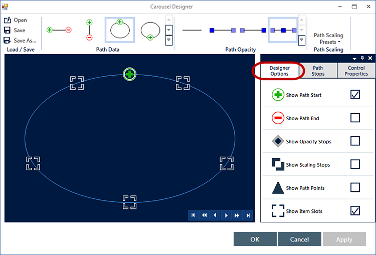

== Adding Items

An Item in the UltraCarousel control is the visual representations of the data object. Items can be added using the designer or in code, and also can be bound to a data source. The next screenshot illustrates adding items through the design-time interface.

Click the smart tag on the control and select “Edit Items”. Start adding your first item in the items editor.

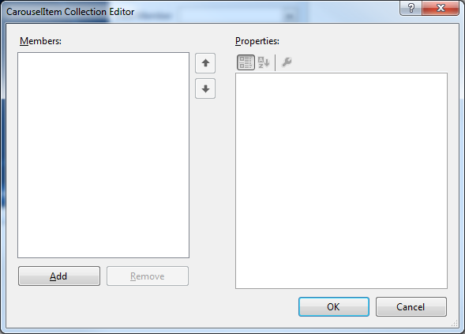

After adding your first item, you will notice the  *Text*  property, which displays the name on the item. The  *Settings*  object exposes more properties for configuration including the  _Appearance_   property, which is illustrated in the next screenshot.

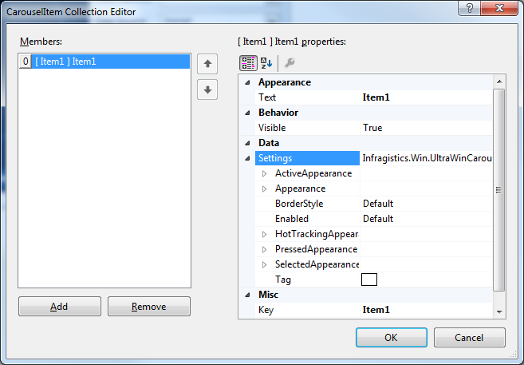

Expand the  _Settings_   object, followed by the  _Appearance_   object and navigate to the  _Image_   property.

Click the ellipses (`…`) to open a dialog window and import an existing image for the Image property. Click OK to apply the setting, and repeat this step to add four more items.

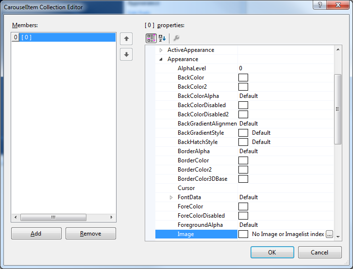

After adding five items, the carousel should look similar to the following screenshot in the designer. Run the application to verify the result.

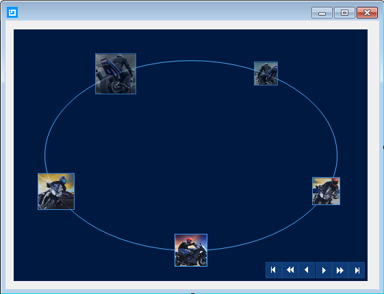

== Related Content

* link:wincarousel-adding-carousel-items-in-code.html[Adding Carousel Items in Code] -- This topic demonstrates how to add UltraCarousel items using the Code-Behind.

* link:wincarousel-binding-data-to-carousel-in-code.html[Binding Data to Carousel in Code]
|This topic demonstrates binding data to the UltraCarousel in code-behind.

* link:wincarousel-binding-data-to-carousel-using-the-designer.html[Binding Data to Carousel Using the Designer] -- This topic will demonstrate with steps, how to set up a data source at design-time, and bind it to the UltraCarousel control.

* link:wincarousel-save-load-carousel-layout.html[Save/Load Carousel Layout] -- This topic demonstrates how to Save/Load the UltraCarousel layout including carousel items, unless the control is bound to data. In that case the control has to be re-bound after loading the saved layout.