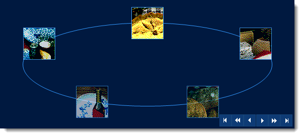

////

|metadata|
{
    "name": "wincarousel-binding-data-to-carousel-in-code",
    "controlName": [],
    "tags": [],
    "guid": "42b39208-5d5c-43ef-a8cc-de2fa1b8d079",  
    "buildFlags": [],
    "createdOn": "2014-09-17T00:49:19.9278218Z"
}
|metadata|
////

= Binding Data to Carousel in Code

== Topic Overview

=== Purpose

This topic demonstrates binding data to the link:{ApiPlatform}win.ultrawincarousel{ApiVersion}~infragistics.win.ultrawincarousel.ultracarousel_members.html[UltraCarousel] in code-behind.

=== In this topic

This topic contains the following sections:

* <<_Ref397457597,Overview>>

** <<_Ref397457606,Introduction>>
** <<_Ref397457617,Application Requirements>>
** <<_Ref397457625,Binding Data>>

* <<_Ref381022312,Related Content>>

[[_Ref397457597]]
== Overview

[[_Ref397457606]]

=== Introduction

In this topic, you will learn how to bind the  _UltraCarousel_   to SQL data in code.

.Note:
[NOTE]
====
The Northwind SQL data base is used in this exercise to demonstrate the data binding.
====

[[_Ref397457617]]

=== Application Requirements

1. Install the  _Infragistics WinForms 2014 Volume 2_   or later version of the product.

2. Start with new Windows Forms application using Visual Studio 2010 or later version.

3. Drag and drop the UltraCarousel control from the Visual Studio toolbox area on to the form, or add the following assemblies to your project if the control is being created in code.

* {ApiPlatform}Shared
* {ApiPlatform}Win.UltraWinCarousel
* {ApiPlatform}Win

[[_Ref397457625]]

=== Binding Data

Continue with the following code example to retrieve data from SQL data base and bind it to the  _UltraCarousel_   control using the `DataSource` property of the control.

*In C#:*

[source,csharp]
----
using System.Data;
using System.Data.SqlClient;
. . . . .
private void Form1_Load(object sender, EventArgs e)
{
    // Initialize DataSet and give it a name
    this.dataSet = new DataSet("dataSet");
    // Initialize the SqlConnection providing the connection string
    this.sqlConnection1 = new SqlConnection("Data Source=(local);Initial Catalog=Northwind;Integrated Security=True");
    // Initialize the SqlCommand that contains the Select command
    this.sqlCommand1 = new SqlCommand("SELECT CategoryName, Picture FROM Categories");
    // Assign the SqlConnection to the Connection property of the SqlCommand.
    this.sqlCommand1.Connection = this.sqlConnection1;
    // Initialize the SqlDataAdapter
    this.sqlAdapter1 = new SqlDataAdapter();
    // Assign the SelectCommand property of Adapter to the SqlCommand that has been created(SQL Query).
    this.sqlAdapter1.SelectCommand = sqlCommand1;
    try
    {
        // Fill the DataSet
        this.sqlAdapter1.Fill(this.dataSet);
        // Assign the DataSet's DefaultView to a control's data source.
        this.ultraCarousel1.DataSource = this.dataSet.Tables[0].DefaultView;
    }
    catch (SqlException ex)
    {
        // Catch and display any exceptions that may occur
        MessageBox.Show(ex.Message.ToString());
    }
}
----

*In Visual Basic:*

[source,vb]
----
Imports System.Data
Imports System.Data.SqlClient
. . . . .
Private Sub Form1_Load(sender As Object, e As EventArgs)
      ' Initialize DataSet and give it a name
      Me.dataSet = New DataSet("dataSet")
      ' Initialize the SqlConnection providing the connection string
      Me.sqlConnection1 = New SqlConnection("Data Source=(local);Initial Catalog=Northwind;Integrated Security=True")
      ' Initialize the SqlCommand that contains the Select command
      Me.sqlCommand1 = New SqlCommand("SELECT CategoryName, Picture FROM Categories")
      ' Assign the SqlConnection to the Connection property of the SqlCommand.
      Me.sqlCommand1.Connection = Me.sqlConnection1
      ' Initialize the SqlDataAdapter
      Me.sqlAdapter1 = New SqlDataAdapter()
      ' Assign the SelectCommand property of Adapter to the SqlCommand that has been created(SQL Query).
      Me.sqlAdapter1.SelectCommand = sqlCommand1
      Try
            ' Fill the DataSet
            Me.sqlAdapter1.Fill(Me.dataSet)
            ' Assign the DataSet's DefaultView to a control's data source.
            Me.ultraCarousel1.DataSource = Me.dataSet.Tables(0).DefaultView
      Catch ex As SqlException
            ' Catch and display any exceptions that may occur
            MessageBox.Show(ex.Message.ToString())
      End Try
End Sub
----

Run the application to verify the result.

[[_Ref381022312]]
== Related Content

=== Topics

The following topics provide additional information related to this topic.

[options="header", cols="a,a"]
|====
|Topic|Purpose

| link:wincarousel-binding-data-to-carousel-using-the-designer.html[Binding Data to Carousel Using the Designer]
|This topic will demonstrate with steps, how to set up a data source at design-time, and bind it to the UltraCarousel control.

| link:wincarousel-adding-carousel-items-in-code.html[Adding Carousel Items in Code]
|This topic demonstrates how to add UltraCarousel items using the Code-Behind.

| link:wincarousel-adding-carousel-items-using-the-designer.html[Adding Carousel Items Using the Designer]
|This topic demonstrates how to add and configure the UltraCarousel items using the control's design-time interface.

| link:wincarousel-save-load-carousel-layout.html[Save/Load Carousel Layout]
|This topic demonstrates how to Save/Load the UltraCarousel layout including carousel items, unless the control is bound to data. In that case the control has to be re-bound after loading the saved layout.

|====