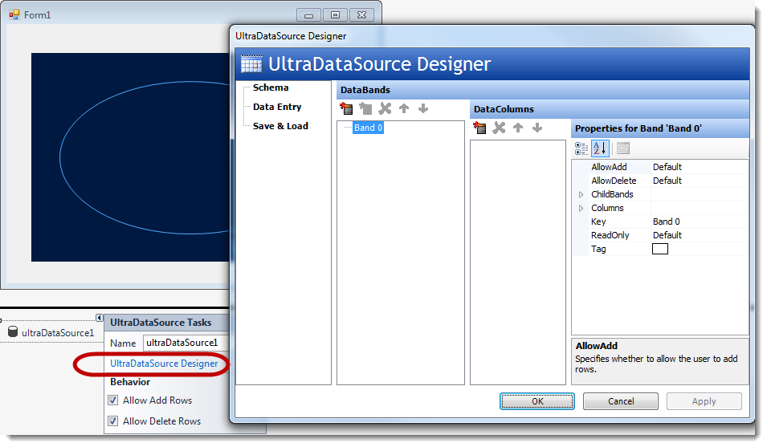
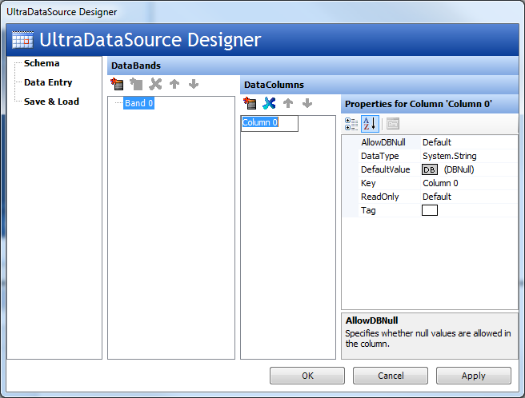
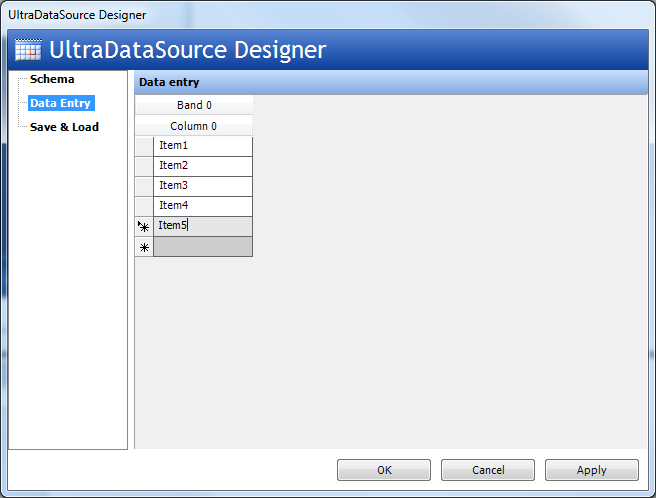
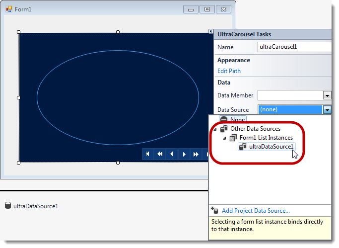
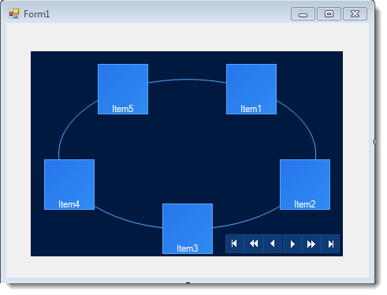

////
|metadata|
{
    "name": "wincarousel-binding-data-to-carousel-using-the-designer",
    "controlName": [],
    "tags": [],
    "guid": "1b9c875c-7447-44c1-b333-ca71f3615993",
    "buildFlags": [],
    "createdOn": "2014-09-12T22:51:36.7510957Z"
}
|metadata|
////

= Binding Data to Carousel Using the Designer

== Topic Overview

=== Purpose

This topic will demonstrate with steps, how to set up a data source at design-time, and bind it to the link:{ApiPlatform}win.ultrawincarousel{ApiVersion}~infragistics.win.ultrawincarousel.ultracarousel_members.html[UltraCarousel] control.

=== In this topic

This topic contains the following sections:

* <<_Ref397457597,Overview>>

** <<_Ref397457606,Introduction>>
** <<_Ref397457617,Application Requirements>>
** <<_Ref398742490,Configure the data source>>

* <<_Ref381022312,Related Content>>

[[_Ref397457597]]
== Overview

=== Introduction

In this topic, you will learn how to configure the data source at design-time, which will be set for bind data to the  _UltraCarousel_   control using the control’s  _DataSource_   property.

[[_Ref397457617]]

=== Application Requirements

1. Install the  _Infragistics WinForms 2014 Volume 2_   or later version of the product.

2. Start with new Windows Forms application using Visual Studio 2010 or later version.

[[_Ref397457625]]

=== Configure the data source

1. Drag and drop the  _UltraCarousel_   control from the Visual Studio toolbox area onto the form, or if you decide to create the control in code, then you need to add the following assembly references:

* {ApiPlatform}Shared
* {ApiPlatform}Win.UltraWinCarousel
* {ApiPlatform}Win

2. Drag and drop the Infragistics  _UltraDataSource_   component from the toolbox area on to the form.

3. Use the smart tag of the  _UltraDataSource_   component and select “ _UltraDataSourceDesigner_  ” option, which opens the designer dialog.

[start=4]
4. Add a column in the  *DataColumns*  section by clicking the left-most icon in that section.

[start=5]
5. Select  *Data Entry*  and add several rows (for items) in the column. Then Click OK to close the designer dialog.

[start=6]
6. On  _UltraCarousel_   control, use the smart tag to drop down the control’s task list and set the “Data Source” property to the  _UltraDataSource_   object.

At this point the control will display the data collection, as the carousel items at design-time.

Run the application to verify the result.

[[_Ref381022312]]
== Related Content

=== Topics

The following topics provide additional information related to this topic.

[options="header", cols="a,a"]
|====
|Topic|Purpose

| link:wincarousel-binding-data-to-carousel-in-code.html[Binding Data to Carousel in Code]
|This topic demonstrates binding data to the UltraCarousel in code-behind.

| link:wincarousel-adding-carousel-items-in-code.html[Adding Carousel Items in Code]
|This topic demonstrates how to add UltraCarousel items using the Code-Behind.

| link:wincarousel-adding-carousel-items-using-the-designer.html[Adding Carousel Items Using the Designer]
|This topic demonstrates how to add and configure the UltraCarousel items using the control's design-time interface.

| link:wincarousel-save-load-carousel-layout.html[Save/Load Carousel Configuration]
|This topic demonstrates how to Save/Load the UltraCarousel layout including carousel items, unless the control is bound to data. In that case the control has to be re-bound after loading the saved layout.

|====