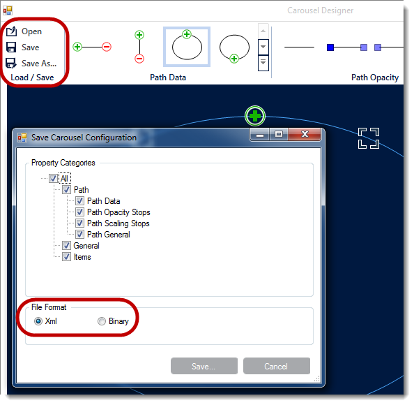

////

|metadata|
{
    "name": "wincarousel-save-load-carousel-layout",
    "controlName": [],
    "tags": [],
    "guid": "731deff9-733a-422d-ad55-49b0461d16ab",  
    "buildFlags": [],
    "createdOn": "2014-09-12T22:36:41.3405636Z"
}
|metadata|
////

= Save/Load Carousel Layout

== Topic Overview

=== Purpose

This topic demonstrates how to Save/Load the link:{ApiPlatform}win.ultrawincarousel{ApiVersion}~infragistics.win.ultrawincarousel.ultracarousel_members.html[UltraCarousel] layout including carousel items, unless the control is bound to data. In that case the control has to be re-bound after loading the saved layout.

=== In this topic

This topic contains the following sections:

* <<_Ref397459010,Overview>>

** <<_Ref397459018,Introduction>>
** <<_Ref397459026,Application Requirements>>
** <<_Ref397459035,Design-time Save/Load>>
** <<_Ref397459062,In-Code Save/Load>>

* <<_Ref381022312,Related Content>>

[[_Ref397459010]]
== Overview

[[_Ref397459018]]

=== Introduction

The UltraCarousel control allows to save and load the user configuration in code and design-time. The configuration dialog contains additional options to include/exclude elements for saving.

.Note:
[NOTE]
====
The saved configuration will include the items, unless the control is bound to data. In that case it would be necessary to re-bind the control after loading the previously saved configuration.
====

[[_Ref397459026]]

=== Application Requirements

1. Install the  _Infragistics WinForms 2014 Volume 2_   or later version of the product.

2. Start with a new Windows Forms application using Visual Studio 2010 or later version.

[[_Ref397459035]]

=== Design-time Save/Load

This topic assumes that you already have an existing application with UltraCarousel control on the form.

==== Saving carousel configuration:

1. Start with your existing project, and open the form that contains UltraCarousel control in the Visual Studio designer.

2. Configure the carousel control with desired options, and click the `Save`/`Save As` button icons on the carousel designer.

3. In the popup window you have options to save all or selectively, and also file format ( _XML_   or  _Binary_  ), then click `Save` on the popup dialog.

==== Loading carousel configuration:

To Load previously saved configuration, simply click the “`Open`” folder icon in the configuration dialog and navigate to the location of the saved file, and open.

[[_Ref397459062]]

=== In-Code Save/Load

Saving and Loading of the user configuration is available in two file formats, XML and Binary.

==== Saving as XML file:

*In C#:*

[source,csharp]
----
carousel1.SaveAsXml("SaveCarousel.xml");
----

*In Visual Basic:*

[source,vb]
----
carousel1.SaveAsXml("SaveCarousel.xml")
----

==== Loading from XML file:

*In C#:*

[source,csharp]
----
if (File.Exists("SaveCarousel.xml"))
{
    using (Stream file = File.OpenRead("SaveCarousel.xml"))
    {
        carousel1.LoadFromXml("SaveCarousel.xml");
    }
}
----

*In Visual Basic:*

[source,vb]
----
If File.Exists("SaveCarousel.xml") Then
      Using file__1 As Stream = File.OpenRead("SaveCarousel.xml")
            carousel1.LoadFromXml("SaveCarousel.xml")
      End Using
End If
----

==== Saving as Binary file:

*In C#:*

[source,csharp]
----
carousel1.SaveAsBinary("SaveCarousel.bin");
----

*In Visual Basic:*

[source,vb]
----
carousel1.SaveAsBinary("SaveCarousel.bin")
----

==== Loading from Binary file:

*In C#:*

[source,csharp]
----
if (File.Exists("SaveCarousel.bin"))
{
    using (Stream file = File.OpenRead("SaveCarousel.bin"))
    {
        carousel1.LoadFromBinary("SaveCarousel.bin");
    }
}
----

*In Visual Basic:*

[source,vb]
----
If File.Exists("SaveCarousel.bin") Then
      Using file__1 As Stream = File.OpenRead("SaveCarousel.bin")
            carousel1.LoadFromBinary("SaveCarousel.bin")
      End Using
End If
----

[[_Ref381022312]]
== Related Content

=== Topics

The following topics provide additional information related to this topic.

[options="header", cols="a,a"]
|====
|Topic|Purpose

| link:wincarousel-adding-carousel-items-in-code.html[Adding Carousel Items in Code]
|This topic demonstrates how to add UltraCarousel items using the Code-Behind.

| link:wincarousel-adding-carousel-items-using-the-designer.html[Adding Carousel Items Using the Designer]
|This topic demonstrates how to add and configure the UltraCarousel items using the control's design-time interface.

| link:wincarousel-binding-data-to-carousel-in-code.html[Binding Data to Carousel in Code]
|This topic demonstrates binding data to the UltraCarousel in code-behind.

| link:wincarousel-binding-data-to-carousel-using-the-designer.html[Binding Data to Carousel Using the Designer]
|This topic will demonstrate with steps, how to set up a data source at design-time, and bind it to the UltraCarousel control.

|====