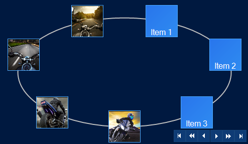

////

|metadata|
{
    "name": "wincarousel",
    "controlName": [],
    "tags": [],
    "guid": "e0b60e04-7081-477a-a29e-46a44727845b",  
    "buildFlags": [],
    "createdOn": "2014-09-12T20:36:07.8341913Z"
}
|metadata|
////

= WinCarousel

=== Introduction

This section contains topics covering the link:{ApiPlatform}win.ultrawincarousel.v{ProductVersion}~infragistics.win.ultrawincarousel.ultracarousel_members.html[UltraCarousel] control for Infragistics Windows Forms®.

The UltraCarousel is a navigation control that displays a list of items in form of rectangular tiles along a predefined path. Each item may present a text or an image.

=== Topics

[options="header", cols="a,a"]
|====
|Topic|Purpose

| link:wincarousel-using-wincarousel.html[Using WinCarousel]
|The topics in this group introduce the WinCarousel control including steps on how to create and configure using the Visual Studio designer interface and in code.

| link:wincarousel-events.html[WinCarousel Events]
|This topic provides an overview of the WinCarousel control’s commonly used events.

| link:wincarousel-properties.html[WinCarousel Properties]
|This topic provides a list of properties of the WinCarousel control and its commonly used objects.

|====