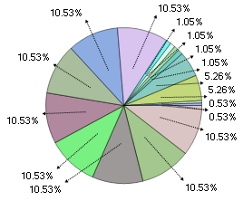

////

|metadata|
{
    "name": "winchart-anti-collision-pie-chart-labels-whats-new-2005-3",
    "controlName": [],
    "tags": [],
    "guid": "{38DDFFF6-7899-4874-AC6E-D3B3323F4A3D}",  
    "buildFlags": [],
    "createdOn": "0001-01-01T00:00:00Z"
}
|metadata|
////

= Anti-Collision Pie Chart Labels

The layout algorithm of the PieChart label has been improved. This algorithm is used when the chart attempts to place the labels and leader lines on the Pie Chart.

