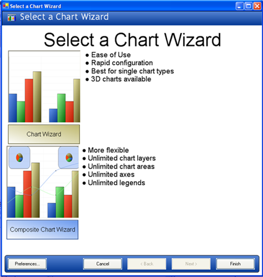

////

|metadata|
{
    "name": "winchart-updated-chart-wizard-whats-new-2005-3",
    "controlName": [],
    "tags": [],
    "guid": "{7620CB2D-E8FE-45DE-BFCF-4AD8A01EB3A6}",  
    "buildFlags": [],
    "createdOn": "0001-01-01T00:00:00Z"
}
|metadata|
////

= Updated Chart Wizard

The Chart Wizard has been updated to reflect the new abilities of the Chart to make a Composite chart, or standard chart. The chart wizard has the ability to help you set up either a standard Chart or the new Composite chart -- all from one convenient location.

== Related Topics:

link:chart-creating-a-composite-chart-using-the-chart-wizard-part-1-of-2.html[Creating a Composite Chart Using the Chart Wizard (Part 1 of 2)]

link:chart-creating-a-composite-chart-using-the-chart-wizard-part-2-of-2.html[Creating a Composite Chart Using the Chart Wizard (Part 2 of 2)]