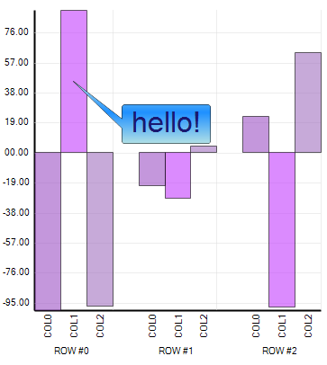
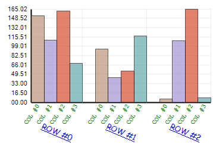
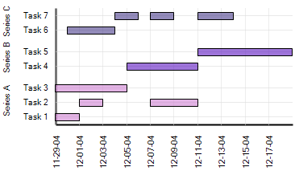
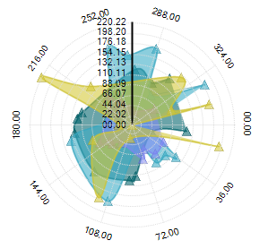
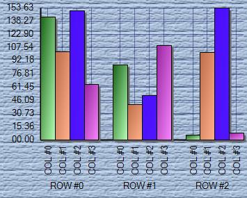
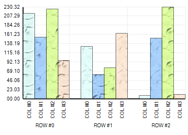

////

|metadata|
{
    "name": "winchart-whats-new-2005-1",
    "controlName": [],
    "tags": [],
    "guid": "{A1D2C3B2-E637-43CC-9C41-AAF1F9AB2123}",  
    "buildFlags": [],
    "createdOn": "0001-01-01T00:00:00Z"
}
|metadata|
////

= WinChart 2005.1

== Annotations

Annotations are graphical elements on a chart which provide information or a visual cue, supplemental to the existing chart data. They can take the form of additional labels, arrows, or other shapes which point to a particular location on the chart. Types of annotations include line, ellipse, callout, box, line+image, and custom. For more information, see link:chart-create-annotations.html[Create Annotations].

== Consolidation of Assemblies

The number of assemblies will be reduced from six to two.

== Custom Orientation Series Labels

Custom series label orientation adds the ability to orient series labels horizontally, vertical left-facing, vertical right-facing, and at custom angles. All properties that apply to Item Labels now apply to Series Labels. For more information, see link:chart-rotate-series-labels.html[Rotate Series Labels].

== New Chart Type – Gantt

A basic Gantt chart type will enable the charting of data that includes start and end times. For more information, see link:chart-about-gantt-charts.html[About Gantt Charts].

== New Chart Type – Polar

The Polar chart is a two-dimensional data representation drawn on the combination of linear and radial axes. It charts a double *{r, θ}* representing the distance from the center of the chart and angle of orientation. Other variations are special cases of this intrinsic representation (points represented by *{r, θ}* can be connected to join lines and points connected with line and *spline*-interpolated for estimating missing values). Another special case groups the data together making a triple *{r, θ, group},* forming a series of data. Again, the data plotted as a group can be plotted as a scatter point on the radial axes or the point in the group can be joined to be grouped as one series. These intrinsic characteristics of a polar plot make a polar chart a scatter chart with radial mappings. For more information, see link:chart-about-polar-charts.html[About Polar Charts].

== One-Step Visual Effects

One-step visual effects are effects that are " _switched on_ " for the entire chart. While we already provide the flexible architecture of PaintElements, there is a lack of impact because developers are required to write custom code to implement them.

One step visual effects will provide automatic " _under-the-hood_ " visual effects using PaintElements on existing Primitives and additional drawing code in the Skin Layer.

Effects include: Shadow, Gradient, ThreeD, and Texture. For more information, see link:chart-add-effects-to-a-chart.html[Add Effects to a Chart].

== Series/Item-Based Appearances

This functionality allows you to specify a color on just one column or just one row, without having to override the other chart's columns or rows color. For more information, see link:chart-apply-an-override-to-a-chart.html[Apply an Override to a Chart].

== Textures

A texture can be applied over individual elements (or the entire chart image) to make the chart look like it is printed on top of cloth, paper or any other material. For more information, see link:chart-render-charts-using-the-paint-element.html[Render Charts Using the Paint Element].

