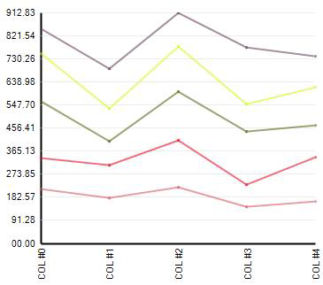
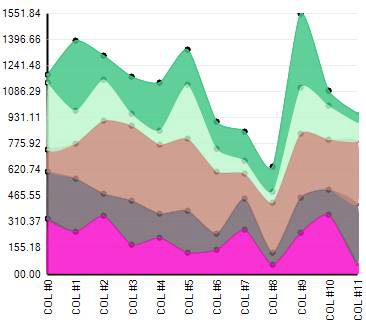

////

|metadata|
{
    "name": "winchart-whats-new-2005-2",
    "controlName": [],
    "tags": [],
    "guid": "{652B884E-D647-43F7-9483-1E6BDE7A5A0B}",  
    "buildFlags": [],
    "createdOn": "0001-01-01T00:00:00Z"
}
|metadata|
////

= WinChart 2005.2

== Consolidation of Chart Assemblies

The number of assemblies has been reduced from two to one for WinChart™.

The Infragistics.UltraChart.Resources assembly has been merged into both Infragistics.WebUI.UltraWebChart and Infragistics.Win.UltraWinChart.

The WinChart assembly has been marked with the Assembly:AllowPartiallyTrustedCallers() attribute, which makes no-touch deployment possible for Windows Forms applications using WinChart.

== Auto-Launch of the Chart Wizard

The Chart Wizard automatically opens when you drag the WinChart control onto a form.

.Note
[NOTE]
====
You can disable this feature by deselecting a checkbox in the Chart Wizard.
====

== Chart Wizard Improvements

Added "Axis Extent and Margins" editor to the Axes tab of the Chart Wizard. This editor simplifies the arrangement of chart axes and axis margins.

== Customizable Axis Margins

A Margin property has been added to the AxisAppearance class. This property provides a way of specifying the margins on the near and/or far sides of any axis. Values can be specified as Percentage, Data Values, or Pixels. For more information, see link:chart-axis-margins.html[Axis Margins].

== Interpolation

The property "NullHandling" exists under most chart types (ColumnChart.NullHandling, LineChart.NullHandling, etc.). The two values in the NullHandling Enumeration are "Zero" and "DontPlot".

Two new values have been added to the NullHandling Enumeration: "InterpolateSimple" and "InterpolateCustom". These new null handling options can be used for each chart type which provides a NullHandling property (ColumnChart.NullHandling, LineChart.NullHandling, etc.).

InterpolateSimple performs simple linear interpolation across values preceding and following null values. InterpolateCustom raises the InterpolateValues event, in which the application developer is passed an array created from his data, and he is responsible for populating the array so that no values are left as null. When using NullHandling.InterpolateCustom, the application developer can use whatever business logic is appropriate to interpolate or substitute the correct values where nulls were found in the data source.

The new UltraChart.Data.EmptyStyle property is provided for customizing the appearance of values which have been interpolated.

The following four images use different types of null handling. In the upper area, Point C is null. In the lower area, Point G is null. Consider the following four images: Area A is blue, Area B is Brown. In the source data for these areas, which points were provided as null? (check all that apply). For more information, see link:chart-customize-the-display-of-null-values.html[Customize the Display of Null Values].

[options="header", cols="a,a"]
|====
|NullHandling.Zero|NullHandling.DontPlot

|image::images/Whats_New_UltraWinChart_2005_2_03.png[interpolation in ultrachart]
|image::images/Whats_New_UltraWinChart_2005_2_04.png[interpolation in ultrachart]

|NullHandling.InterpolateSimple|NullHandling.InterpolateCustom

|image::images/Whats_New_UltraWinChart_2005_2_05.png[interpolation in ultrachart]
|image::images/Whats_New_UltraWinChart_2005_2_06.png[interpolation in ultrachart]

|====

== Stacked Area (2D) Chart

A stacked area chart is an area chart in which areas do not overlap, because they are cumulative at each point. In a stacked 100% area chart, the areas reach a total of 100% of the axis range at each point.

An area chart is a form of line chart, but the area between the horizontal (X) axis and the line connecting the data markers is filled with color. This makes it easy to see where the points encompassed by the different data series overlap. For more information, see link:chart-about-stacked-area-charts.html[About Stacked Area Charts].

image::images/Whats_New_UltraWinChart_2005_2_07.png[stacked area 2d chart type]

== Stacked Line (2D) Chart

A stacked line chart is a line chart in which lines do not intersect, because they are cumulative at each point. In a stacked 100% line chart, the lines reach a total of 100% of the axis range at each point. For more information, see link:chart-about-stacked-line-charts.html[About Stacked Line Charts].

== Stacked Spline Area (2D) Chart

A stacked area chart is an area chart in which areas do not overlap, because they are cumulative at each point. In a stacked 100% area chart, the areas reach a total of 100% of the axis range at each point.

An area chart is a form of line chart, but the area between the horizontal (X) axis and the line connecting the data markers is filled with color. This makes it easy to see where the points encompassed by the different data series overlap.

A stacked spline area chart is different from a stacked area chart because it uses spline tension to connect points in each line. For more information, see link:chart-about-stacked-spline-area-charts.html[About Stacked Spline Area Charts].

== Stacked 100% Spline (2D) Chart

A stacked line chart is a line chart in which lines do not intersect, because they are cumulative at each point. In a stacked 100% line chart, the lines reach a total of 100% of the axis range at each point.

A stacked spline chart is different from a stacked line chart because it uses spline tension to connect points in each line. For more information, see link:chart-about-stacked-spline-charts.html[About Stacked Spline Charts].

== Smart Axis Labels

Chart now has smarter range calculations. Instead of just using the data minimum and maximum as the axis minimum and maximum, using the AxisTickStyle.Smart property, round numbers are calculated below the minimum and above the maximum and then used. Smarter intervals are used to calculate round numbers that are a factor of the data minimum and maximum. For more information, see link:chart-smart-tickmarks.html[Smart Tickmarks].

== Pareto (2D) Chart

Pareto charts are column charts sorted by value (greatest to smallest), and accompanied by a line which shows the running total as a percentage of the set. For more information, see link:chart-about-pareto-charts.html[About Pareto Charts].

The Y-axis shows the data values which correspond to the columns, and the Y2-axis shows the percentage values which correspond to the line.

.Note
[NOTE]
====
to display the Y2 axis, set the UltraChart.Axis.Y2.Visible property to True.
====

This chart is used in quality control, and is most commonly meant to illustrate the "80/20 rule." For example, "80% of problems can usually be tracked to 20% of sources," or, "80% of sales come from 20% of products."

== Concentric Doughnut (2D) Chart

== Tabbed ChartType Property Editor

Tabs are now used to organize the 34 chart types available.

