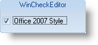

////

|metadata|
{
    "name": "wincheckeditor-apply-the-office-2007-style-to-wincheckeditor",
    "controlName": ["WinCheckEditor"],
    "tags": ["Styling"],
    "guid": "{FEE35443-1E2D-427F-B461-6506CB2C8C2F}",  
    "buildFlags": [],
    "createdOn": "2006-10-10T09:42:02Z"
}
|metadata|
////

= Apply the Office 2007 Style to WinCheckEditor

In the 2006 volume 3 release, we added the Office 2007 look and feel to several of our controls. WinCheckEditor™ is one of these controls that has gained the new look and feel; however, the look and feel is achieved in a little different way than other controls. Other controls have a ViewStyle property that changes the look and feel, WinCheckEditor has a GlyphInfo property. In addition, to see the Office 2007 look and feel, you will need to turn off OS themes.

.Note
[NOTE]
====
If you want to view instances of UltraCheckEditor inside WinGrid™, WinTree™, WinListView™, etc. (not as an embeddable editor) in the Office 2007 style, you need to set the  pick:[win-forms="link:{ApiPlatform}win{ApiVersion}~infragistics.win.uielementdrawparams~checkboxglyphinfo.html[CheckBoxGlyphInfo]"]  property off of  pick:[win-forms="link:{ApiPlatform}win{ApiVersion}~infragistics.win.uielementdrawparams.html[Infragistics.Win.UIElementDrawParams]"]  instead. This is an application-wide setting and will affect all WinCheckEditors and WinOptionSets displayed in any of the previously mentioned controls. You can still set the WinCheckEditor control's GlyphStyle property if it is being used as an embeddable editor.
====

View WinCheckEditor in the Office 2007 look and feel by setting the  pick:[win-forms="link:{ApiPlatform}win.ultrawineditors{ApiVersion}~infragistics.win.ultrawineditors.ultracheckeditor~glyphinfo.html[GlyphInfo]"]  property to Office2007, and UseOsThemes to False.

*In Visual Basic:*

----
Me.UltraCheckEditor1.UseOsThemes = _    Infragistics.Win.DefaultableBoolean.False
Me.UltraCheckEditor1.GlyphInfo = _    Infragistics.Win.UIElementDrawParams.Office2007CheckBoxGlyphInfo
----

*In C#:*

----
this.ultraCheckEditor1.UseOsThemes =     Infragistics.Win.DefaultableBoolean.False;
this.ultraCheckEditor1.GlyphInfo =    Infragistics.Win.UIElementDrawParams.Office2007CheckBoxGlyphInfo;
----