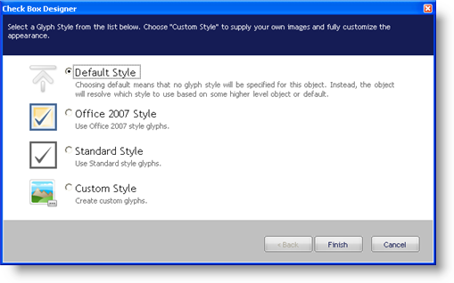
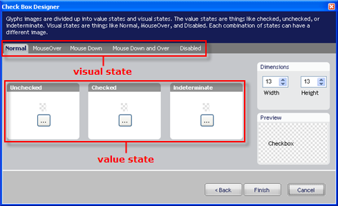

////

|metadata|
{
    "name": "wincheckeditor-creating-a-custom-style-for-wincheckeditor",
    "controlName": ["WinCheckEditor"],
    "tags": ["Styling"],
    "guid": "{6F867BFB-C37F-46DE-BA3B-016A61703875}",  
    "buildFlags": [],
    "createdOn": "0001-01-01T00:00:00Z"
}
|metadata|
////

= Creating a Custom Style for WinCheckEditor

== Before You Begin

Using WinCheckEditor's GlyphInfo object, you can change the look and feel to a familiar, operating system-themed style, or an up-to-date Microsoft® Office® 2007 style. However, in the 2008 Volume 2 release of Infragistics Windows Forms, we allowed you to add any custom image for each state that WinCheckEditor can exist in. You can set these custom images using the Check Box Designer.

== What You Will Accomplish

You will learn how to create a custom style for WinCheckEditor using the Check Box Designer.

== Follow these Steps

[start=1]
. *Add WinCheckEditor to your form* .

.. In a new or existing Windows Forms project, find the UltraCheckEditor control in the Visual Studio® toolbox and double-click it. WinCheckEditor is added to your form.
.. With WinCheckEditor still selected, locate the GlyphInfo property in the properties window and click the ellipsis to the right of the window. The Check Box Designer appears.

[start=2]
. *Set custom images for WinCheckEditor's normal state* .

.. By default, Default Style is selected. Select Custom Style so that you can set individual images for each of WinCheckEditor's states.
.. Click Next to continue. The Check Box Designer presents you with a tabbed interface allowing you to set three value-state images for each visual state.

.. Click the ellipsis (...) button in the Unchecked group box. A popup menu appears.
.. Click Load from File... on the popup menu. An Open File dialog box appears.
.. Locate the particular image you wish to use for the normal, unchecked state of WinCheckEditor. For this topic, we will use the following image: When you have found the image, click Open to set the image.
.. Click the ellipsis (...) button in the Checked group box. A popup menu appears.
.. Click Load from File... on the popup menu. An Open File dialog box appears.
.. Locate the particular image you wish to use for the normal, checked state of WinCheckEditor. For this topic, we will use the following image: When you have found the image, click Open to set the image. The checked and unchecked states are now set.

[start=3]
. *Set custom images for the remaining WinCheckEditor visual states* .

.. Click the MouseOver tab directly to the right of the Normal tab.
.. Click the ellipsis (...) button in the Unchecked group box. A popup menu appears.
.. Click Copy From... on the popup menu. A fly-out menu appears with each of the five available visual states, the current state being grayed out.
.. Click Normal on the fly-out menu to use the same image from the normal, unchecked state.
.. Click the ellipsis (...) button in the Checked group box.
.. Click Copy From... on the popup menu.
.. Click Normal on the fly-out menu to use the same image from the normal, checked state.
.. Repeat steps b through g for the Mouse Down, Mouse Down and Over, and Disabled visual states.
.. Click Finish.

[start=4]
. *Run the application* .

When you hover over the check box, you should see the image change. When you select the check box, you should also see the image change.