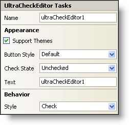

////

|metadata|
{
    "name": "wincheckeditor-smart-tag",
    "controlName": ["WinCheckEditor"],
    "tags": ["Design Environment"],
    "guid": "{37943D71-BBCF-4379-AF5E-41B3CB4CA93C}",  
    "buildFlags": [],
    "createdOn": "2005-09-11T00:00:00Z"
}
|metadata|
////

= WinCheckEditor Smart Tag

In Visual Studio 2005 (.NET Framework 2.0), each Infragistics Windows Forms control/component is equipped with a Smart Tag. By simply selecting the control/component, a Smart Tag anchor appears. When you click this anchor, a pop-up panel appears, providing you with quick and easy access to the most common properties and settings of the control/component.

The WinCheckEditor™ Smart Tag contains the name of the control, as well as the following sections:

* Appearance -- Provides common tasks involving the appearance, look, and feel of the control.
* Behavior -- Provides easy access to properties that govern how the control behaves on the form.

See below for a description of the item (e.g., field, drop-down list, checkbox) in each section, as well as the item's corresponding property in the properties grid.

[options="header", cols="a,a,a"]
|====
|Appearance|Description|Corresponding Property

|Support Themes
|Check this box to support basic Microsoft OS themes; for example, Windows Classic theme versus Windows XP theme.
| pick:[win-forms="link:{ApiPlatform}win{ApiVersion}~infragistics.win.ultracontrolbase~supportthemes.html[SupportThemes]"] 

|Button Style
|Choose from a variety of styles to make your check box look exactly the way you want it. However, if the SupportThemes property is set to True, you will not be able to change the button style.
| pick:[win-forms="link:{ApiPlatform}win.ultrawineditors{ApiVersion}~infragistics.win.ultrawineditors.ultracheckeditor~buttonstyle.html[ButtonStyle]"] 

|Check State
|Determines whether the checkbox is checked, unchecked, or indeterminate.
| pick:[win-forms="link:{ApiPlatform}win.ultrawineditors{ApiVersion}~infragistics.win.ultrawineditors.ultracheckeditor~checkstate.html[CheckState]"] 

|Text
|This is the text that will display next to the checkbox.
| pick:[win-forms="link:{ApiPlatform}win.ultrawineditors{ApiVersion}~infragistics.win.ultrawineditors.ultracheckeditor~text.html[Text]"] 

|====

[options="header", cols="a,a,a"]
|====
|Behavior|Description|Corresponding Property

|Style
|Change the style of the WinCheckEditor to be either a checkbox or a button. The button will remain depressed to signify the "checked" position.
| pick:[win-forms="link:{ApiPlatform}win.ultrawineditors{ApiVersion}~infragistics.win.ultrawineditors.ultracheckeditor~style.html[Style]"] 

|====