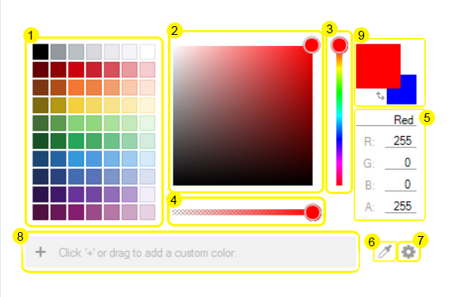

////
|metadata|
{
    "controlName": ["WinColorPalette", "UltraColorPalette"],
    "tags": []
}
|metadata|
////

= About WinColorPalette

The WinColorPalette allows the user to preview and select colors using any color component values specified in either RGB, HSL, or CMYK format. The WinColorPalette seeks to improve the experience of the WinColorPicker, and can be used as its own stand alone control, or as a dropdown by setting the
link:{ApiPlatform}win.ultrawineditors{ApiVersion}~infragistics.win.ultrawineditors.ultracolorpicker~style.html[UltraColorPicker.Style]
to ColorPalette.

Like the link:winschedule.html[WinSchedule] controls and link:wincalendarinfo.html[WinCalendarInfo], the WinColorPalette depends on a link:winpaletteinfo.html[WinPaletteInfo] object to control its settings and data (including the custom colors created in the WinColorPalette). This way, many WinColorPalettes and WinColorPickers throughout a Form may be synced by setting their
link:{ApiPlatform}win.ultrawineditors{ApiVersion}~infragistics.win.ultrawineditors.ultracolorpicker~paletteinfo.html[PaletteInfo]
properties to the same WinPaltteInfo object.

There are many parts within the WinColorPalette which help define the color the user is looking for. Most parts can be hidden through the WinColorPalette's
link:{ApiPlatform}win{ApiVersion}~infragistics.win.ultracolorpalette.ultrapaletteinfo.html[WinPaletteInfo]
object. Below is a diagram identifying the parts which comprise the WinColorPalette:

Click below to find more information on each of the WinColorPalette parts:

. Grid Palette -- gives the user predefined colors to choose from or start with. The columns and rows can be set through code.
//For more information, please see link:winpaletteinfo-grid-palette-customization.html[Grid Palette Customization].
. Continuous Palette -- shows the user a gradient hue transition to visually fine tune the color from the hue selected.
. Hue Slider -- allows the user to select the hue from the ROYGBIV spectrum.
. Alpha Slider -- sets the alpha component of the color, which defines transparency.
. Color Components -- the values which comprise the color selected. The user can review the values which are created by the selections made via the graphic pieces of the WinColorPalette, or type directly into the text boxes the values desired and reflect these settings in the Color Preview Box. The top text box shows the current color name, which is often shown as the hexadecimal name when creating a color. The user can also type in a color name to select that color, E.G. "blue" or "aqua".
. Color Grabber -- allows the user to sample a color on the screen. By holding down the Color Grabber, a magnifying glass appears allowing the user to see individual pixels under the cursor. The user can then drag the glass over the desired color to select it in the WinColorPalette.
. Options Button -- selects in which style the color components are defined. Options are RGB, HSL, or CMYK.
. Custom Colors Box -- any custom made colors created by the user can be saved here. The user can either click the "+" button to add the color shown in the Preview Box, or can drag a color from the Grid Palette into the Custom Colors Box to add it. Drag colors out of the Custom Colors Box to remove them.
. Color Preview Box -- shows an active preivew of the color currently selected. A secondary color can be shown via
link:{ApiPlatform}win{ApiVersion}~infragistics.win.ultracolorpalette.ultrapaletteinfo~showsecondarycolor.html[UltraPaletteInfo.ShowSecondaryColor].
When this is true, a swap button allows the user to swap primary and secondary, and can be shown via
link:{ApiPlatform}win{ApiVersion}~infragistics.win.ultracolorpalette.ultrapaletteinfo~showswapbutton.html[UltraPaletteInfo.ShowSwapButton].

With these tools, the user has a broad spectrum of possible colors from which to choose. The selected color/secondary color are available via
link:{ApiPlatform}win{ApiVersion}~infragistics.win.ultracolorpalette.ultracolorpalette~color.html[UltraColorPalette.Color]
and
link:{ApiPlatform}win{ApiVersion}~infragistics.win.ultracolorpalette.ultracolorpalette~secondarycolor.html[UltraColorPalette.SecondaryColor].

////
=== Related Topics
* link:winpaletteinfo-grid-palette-customization.html[Grid Palette Customization]