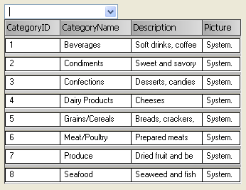

////

|metadata|
{
    "name": "wincombo-about-wincombo",
    "controlName": ["WinCombo"],
    "tags": [],
    "guid": "{673867C9-C959-4930-910A-FF51E0EA1189}",  
    "buildFlags": [],
    "createdOn": "0001-01-01T00:00:00Z"
}
|metadata|
////

= About WinCombo

The WinCombo™ control is a Windows Forms control that provides a simplified version of the WinGrid™ control in the form of a drop-down list.

* Appearance Support -- Full appearance support including alpha-blending, gradients, and image, etc.
* Presets -- Built-in presets that set the look and behavior of the WinGrid portion of the WinCombo.
* Data Binding -- Full data-binding support using DataSource and DataMember properties.
* WinGrid -- Similar architecture to the WinGrid control, including the DisplayLayout.

