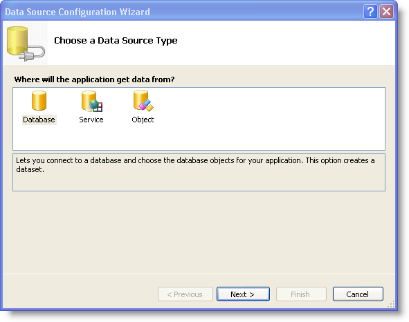

////

|metadata|
{
    "name": "wincombo-binding-wincombo-to-a-data-table",
    "controlName": ["WinCombo"],
    "tags": ["Data Binding"],
    "guid": "{9DD143E5-85FA-4FFE-937D-D4C3EE8E604B}",  
    "buildFlags": [],
    "createdOn": "2009-07-12T15:50:49Z"
}
|metadata|
////

= Binding WinCombo to a Data Table

== Before You Begin:

The WinCombo™ control is a Windows Forms control, which provides full data binding support using DataSource and DataMember properties.

== What You Will Accomplish:

You will learn how to bind WinCombo to the Employees data table of the Northwind database.

== Follow These Steps:

1. Drag and drop an ultraCombo onto your form.

2. Click the smart tag of the WinCombo control and click the drop down button of the DataSource member.

3. Select Add Project DataSource from the drop down list, and the Data Source configuration wizard appears.

4. In the Data Source configuration wizard select Database and click next.

5. In the Choose your Data Connection dialog, click the New Connection button to configure the connection string. The Add Connection dialog appears.

6. Set the server name to the server you are using, .\SQLEXPRESS in this case. Set the database to Northwind.

7. Click Ok. You are returned to the Choose your Data Connection dialog.

8. Click Next.

9. Select Tables and do the following:

[start=1]
. Choose the Employees table from the drop-down list.
[start=2]
. From the Employees drop down list, choose the EmployeeID, LastName, FirstName, and HireDate columns in order to display those columns.

10. Click the Finish button to close the configuration wizard. The employeesBindingSource object is created and WinCombo is now set up to retrieve Employees data from the Northwind database.

11. Run the application. WinCombo binds to the Employees table and displays its data.

