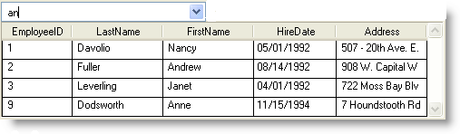

////

|metadata|
{
    "name": "wincombo-filter-options-to-filter-suggested-values-of-a-column",
    "controlName": ["WinCombo"],
    "tags": ["Filtering"],
    "guid": "{ECB273BC-CD2A-4D44-ACEF-00190B4C2BC4}",  
    "buildFlags": [],
    "createdOn": "2009-07-12T16:52:01Z"
}
|metadata|
////

= Filter Options to Filter Suggested Values of a Column

The link:{ApiPlatform}win.ultrawingrid{ApiVersion}~infragistics.win.ultrawingrid.ultracombo~autocompletemode.html[AutoCompleteMode] property offers different settings that allow your end users to have possible suggested values listed from a column, as they type in the text box of WinCombo™. By default, when the AutoCompleteMode property is set to Suggest or SuggestAppend, only the items that *start* with the characters typed into the Textbox will be listed. The link:{ApiPlatform}win.ultrawingrid{ApiVersion}~infragistics.win.ultrawingrid.ultracombo~autosuggestfiltermode.html[AutoSuggestFilterMode] property provides you with the option to choose between StartWith and Contains, so that your end users can have items suggested that either *start with* the specific character string or *contains* the specific character string.

.Note
[NOTE]
====
When the AutoSuggestFilterMode property is set to 'Contains', the AutoCompleteMode setting of 'SuggestAppend' resolves to 'Suggest', i.e., automatic completion of the text typed in the edit portion is disabled, and the text selection is not modified.
====

This topic assumes that you have an UltraCombo control dropped onto your form that is bound to the Employees data table of the Northwind database displaying the EmployeeID, LastName, FirstName, HireDate, and Address columns.

*In Visual Basic:*

----
Me.ultraCombo1.DisplayMember = "FirstName" 
Me.ultraCombo1.ValueMember = "EmployeeID" 
Me.ultraCombo1.AutoCompleteMode = Infragistics.Win.AutoCompleteMode.Suggest 
Me.ultraCombo1.AutoSuggestFilterMode = Infragistics.Win.AutoSuggestFilterMode.Contains
----

*In C#:*

----
this.ultraCombo1.DisplayMember = "FirstName";
this.ultraCombo1.ValueMember = "EmployeeID";
this.ultraCombo1.AutoCompleteMode = Infragistics.Win.AutoCompleteMode.Suggest;
this.ultraCombo1.AutoSuggestFilterMode = Infragistics.Win.AutoSuggestFilterMode.Contains;
----

In the following image, UltraCombo lists only the records whose FirstName column contains the string ‘an’.

== Related Topic
link:wincombo-selecting-multiple-values-within-wincombo.html[Selecting Multiple Values within WinCombo]