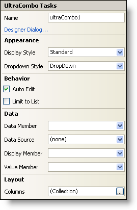

////

|metadata|
{
    "name": "wincombo-smart-tag",
    "controlName": ["WinCombo"],
    "tags": ["Design Environment"],
    "guid": "{8B633070-2D04-4312-B79C-98F2C519AF05}",  
    "buildFlags": [],
    "createdOn": "2005-11-11T00:00:00Z"
}
|metadata|
////

= WinCombo Smart Tag

In Visual Studio 2005 (.NET Framework 2.0), each Infragistics Windows Forms control/component is equipped with a Smart Tag. By simply selecting the control/component, a Smart Tag anchor appears. When you click this anchor, a pop-up panel appears, providing you with quick and easy access to the most common properties and settings of the control/component.

The WinCombo™ Smart Tag contains the name of the control, as well as the following sections:

* Appearance -- Provides common tasks involving the appearance, look, and feel of the control.
* Behavior -- Provides easy access to properties that govern how the control behaves on the form.
* Data -- Refers to any underlying data the control is using such as data sources and data members.
* Layout -- Offers properties that will determine where and how the control is placed on the form.

See below for a description of the item (e.g., field, drop-down list, checkbox) in each section, as well as the item's corresponding property in the properties grid.

[options="header", cols="a,a,a"]
|====
|Appearance|Description|Corresponding Property

|Display Style
|Change the style of the WinCombo to make it look like Office 2000, Office XP, Office 2003, Visual Studio 2005, Office 2007.
| pick:[win-forms="link:{ApiPlatform}win.ultrawingrid{ApiVersion}~infragistics.win.ultrawingrid.ultracombo~displaystyle.html[DisplayStyle]"] 

|Dropdown Style
|The WinCombo can be styled like a drop-down, or a drop-down list.
| pick:[win-forms="link:{ApiPlatform}win.ultrawingrid{ApiVersion}~infragistics.win.ultrawingrid.ultracombo~dropdownstyle.html[DropDownStyle]"] 

|====

[options="header", cols="a,a,a"]
|====
|Behavior|Description|Corresponding Property

|Auto Edit
|Check the checkbox if you want the WinCombo to automatically complete a word or value using its available data.
| link:{ApiPlatform}win.ultrawingrid{ApiVersion}~infragistics.win.ultrawingrid.ultracombo~autocompletemode.html[AutoCompleteMode]

|Limit to List
|Checking this will limit the user's input to only allow values in the control's ValueList.
| pick:[win-forms="link:{ApiPlatform}win.ultrawingrid{ApiVersion}~infragistics.win.ultrawingrid.ultracombo~limittolist.html[LimitToList]"] 

|====

[options="header", cols="a,a,a"]
|====
|Data|Description|Corresponding Property

|Data Member
|Once you have selected a valid data source, you can select all available data members from this drop-down.
| pick:[win-forms="link:{ApiPlatform}win.ultrawingrid{ApiVersion}~infragistics.win.ultrawingrid.ultragridbase~datamember.html[DataMember]"] 

|Data Source
|Click the drop-down and all available data sources in your project will be displayed. If you do not have a data source set up, you can select, "Add Project Data Source..." to create one.
| pick:[win-forms="link:{ApiPlatform}win.ultrawingrid{ApiVersion}~infragistics.win.ultrawingrid.ultragridbase~datasource.html[DataSource]"] 

|Display Member
|The Display Member is a field from the data source that will be displayed in the edit area.
| pick:[win-forms="link:{ApiPlatform}win.ultrawingrid{ApiVersion}~infragistics.win.ultrawingrid.ultradropdownbase~displaymember.html[DisplayMember]"] 

|Value Member
|The Value Member is a field from the data source that will actually be bound to the data.
| pick:[win-forms="link:{ApiPlatform}win.ultrawingrid{ApiVersion}~infragistics.win.ultrawingrid.ultradropdownbase~valuemember.html[ValueMember]"] 

|====

[options="header", cols="a,a,a"]
|====
|Layout|Description|Corresponding Property

|Columns
|More than one column can be displayed in the WinCombo's drop-down. This is where you can edit the Columns collection. You can also edit the Columns collection in the properties grid. Expand link:{ApiPlatform}win.ultrawingrid{ApiVersion}~infragistics.win.ultrawingrid.ultragriddisplaylayout.html[DisplayLayout], expand link:{ApiPlatform}win.ultrawingrid{ApiVersion}~infragistics.win.ultrawingrid.ultragridlayout~bands.html[Bands], and then expand Band 0 (which will display in the grid as "0 - _tablename_ "). Under Band 0, click the ellipsis (...) in the Columns row to open the Columns collection.
|n/a

|====