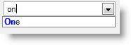
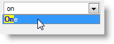
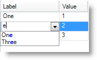
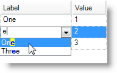

////

|metadata|
{
    "name": "wincomboeditor-autosuggest-highlight-appearance",
    "controlName": ["WinComboEditor"],
    "tags": ["How Do I","Selection","Styling"],
    "guid": "107e98af-8108-48e2-a38b-21bea2728784",  
    "buildFlags": [],
    "createdOn": "2013-02-20T21:20:32.4420275Z"
}
|metadata|
////

= AutoSuggest Highlight Appearance

== Topic Overview

=== Purpose

This topic demonstrates how to configure the appearance of highlighted text in the  _WinComboEditor™_   control’s auto-suggest dropdown list and embedded auto complete cell values in  _WinGrid_   columns.

=== Required background

The following topic is a prerequisite to understanding this topic:

[options="header", cols="a,a"]
|====
|Topic|Purpose

| link:wincomboeditor-suggest-possible-values-with-wincomboeditor.html[Suggest Possible Values with WinComboEditor]
|This topic explains about the _WinComboEditor_ ’s auto-complete functionality with suggest option, and demonstrates the configuration with a code example.

|====

=== In this topic

This topic contains the following sections:

* <<_Ref347736192,AutoSuggestHighlight Appearance Feature>>

** <<_Ref341518673,Introduction>>
** <<_Ref347736208,Configuring AutoSuggestHighlight Appearances in  _WinComboEditor_  >>
** <<_Ref347736216,Configuring AutoSuggestHighlight Appearances in  _UltraGridColumn_  >>
** <<_Ref347736271,Test Data>>

* <<_Ref341518687,Related Content>>

[[_Ref347736192]]
== AutoSuggestHighlight Appearance Feature

[[_Ref341518673]]

=== Introduction

This feature presents two additional Value List properties normally used with the  _WinGrid’s_   column object drop-down controls such as  _WinComboEditor_   and  _UltraGridColumn_  .

* link:{ApiPlatform}win{ApiVersion}~infragistics.win.valuelist~autosuggesthighlightappearance.html[AutoSuggestHighlightAppearance] – applies to the highlighted text in the dropdown when the item’s autosuggest option is in the normal state
* link:{ApiPlatform}win{ApiVersion}~infragistics.win.valuelist~autosuggesthighlightselectedappearance.html[AutoSuggestHighlightSelectedAppearance] – applies to the selected highlighted text in the dropdown, selected using either the keyboard, a mouse, or HotTracked (Moving the mouse over the item) with autosuggest option enabled

.Note:
[NOTE]
====
The Appearance object exposes a set of properties for configuring this feature and provides support for the following supported Appearance properties:
====

* ForeColor
* BackColor
* Font properties (Bold, Underline, Italic and Strikeout)

=== Prerequisites

To complete the procedure, you must first set the following properties for  _WinComboEditor_   or  _WinGrid_   depending on the control being used:

* `AutoCompleteMode` Enables the drop down list of suggestions, based on the user’s typed characters, capability
* `AutoSuggestFilterMode` – filters out user typed characters for highlighting in the drop-down

==== _WinComboEditor_

*In C#:*

[source,csharp]
----
ultraComboEditor1.AutoCompleteMode = AutoCompleteMode.Suggest;
ultraComboEditor1.AutoSuggestFilterMode = AutoSuggestFilterMode.Contains;
----

*In Visual Basic:*

[source,vb]
----
ultraComboEditor1.AutoCompleteMode = AutoCompleteMode.Suggest
ultraComboEditor1.AutoSuggestFilterMode = AutoSuggestFilterMode.Contains
----

==== _WinGrid_

*In C#:*

[source,csharp]
----
ultraGrid1.DataSource = new TestData();
ultraGrid1.DisplayLayout.Bands[0].Columns[0].AutoCompleteMode = AutoCompleteMode.Suggest;
ultraGrid1.DisplayLayout.Bands[0].Columns[0].AutoSuggestFilterMode = AutoSuggestFilterMode.Contains;
----

*In Visual Basic:*

[source,vb]
----
ultraGrid1.DataSource = New TestData()
ultraGrid1.DisplayLayout.Bands(0).Columns(0).AutoCompleteMode = AutoCompleteMode.Suggest
ultraGrid1.DisplayLayout.Bands(0).Columns(0).AutoSuggestFilterMode = AutoSuggestFilterMode.Contains
----

[[_Ref347736208]]

=== Configuring AutoSuggestHighlight Appearances in WinComboEditor

==== Create ValueList

The following code example demonstrates creating a  _WinComboEditor_   control ValueList with `AutoSuggestHighlightAppearance` and `AutoSuggestHighlightSelectedAppearance`.

*In C#:*

[source,csharp]
----
public void CreateValueList()
{
    ValueList _valueList = new ValueList(0); 
    // Add some items to the list. 
    _valueList.ValueListItems.Add(1, "One");
    _valueList.ValueListItems.Add(2, "Two");
    _valueList.ValueListItems.Add(3, "Three");
    // Set the featured properties appearances.
    _valueList.AutoSuggestHighlightAppearance.ForeColor = Color.Blue;
    _valueList.AutoSuggestHighlightSelectedAppearance.BackColor = Color.Yellow;
    // Set the WinComboEditor to the ValueList.
    ultraComboEditor1.ValueList = _valueList;
}
----

*In Visual Basic:*

[source,vb]
----
Public Sub CreateValueList()
      Dim _valueList As New ValueList(0)
      ' Add some items to the list. 
      _valueList.ValueListItems.Add(1, "One")
      _valueList.ValueListItems.Add(2, "Two")
      _valueList.ValueListItems.Add(3, "Three")
      ' Set the featured properties appearancies.
      _valueList.AutoSuggestHighlightAppearance.ForeColor = Color.Blue
      _valueList.AutoSuggestHighlightSelectedAppearance.BackColor = Color.Yellow
      ' Set the WinComboEditor to the ValueList.
      ultraComboEditor1.ValueList = _valueList
End Sub
----

The following screenshot illustrates user typed characters, highligted in the  _WinComboEditor_  ’s drop-down with optional character coloring applied.

The following screenshot illustrates user typed characters, highlighted and HotTracked when the user moved the mouse over the item in the drop-down.

[[_Ref347736216]]

=== Configuring AutoSuggestHighlight Appearances in UltraGridColumn

==== Create a ValueList.

The following code example demonstrates creating a ValueList with `AutoSuggestHighlightAppearance` and `AutoSuggestHighlightSelectedAppearance` for the  _UltraGridColumn_   control.

*In C#:*

[source,csharp]
----
public void CreateValueList(UltraGrid grid)
{
    // Assign a key to an instance of the ValueList.
    ValueList _valueList = ultraGrid1.DisplayLayout.ValueLists.Add("vList");
    // Add some items to the list. 
    _valueList.ValueListItems.Add(1, "One");
    _valueList.ValueListItems.Add(2, "Two");
    _valueList.ValueListItems.Add(3, "Three");
    // Optionally, Set the Appearance and Selected Appearance propeties.
    _valueList.AutoSuggestHighlightAppearance.ForeColor = Color.Blue;
    _valueList.AutoSuggestHighlightSelectedAppearance.BackColor = Color.Yellow;
    // Retrieve the column you want to contain the value list.
    UltraGridColumn column = grid.DisplayLayout.Bands[0].Columns["Label"];
    // Set the column to the ValueList.
    column.ValueList = _valueList;
}
----

*In Visual Basic:*

[source,vb]
----
Public Sub CreateValueList(grid As UltraGrid)
      ' Assign a key to an instance of the ValueList.
      Dim _valueList As ValueList = ultraGrid1.DisplayLayout.ValueLists.Add("vList")
      ' Add some items to the list. 
      _valueList.ValueListItems.Add(1, "One")
      _valueList.ValueListItems.Add(2, "Two")
      _valueList.ValueListItems.Add(3, "Three")
      ' Optionally, Set the Appearance and Selected Appearance propeties.
      _valueList.AutoSuggestHighlightAppearance.ForeColor = Color.Blue
      _valueList.AutoSuggestHighlightSelectedAppearance.BackColor = Color.Yellow
      ' Retrieve the column you want to contain the value list.
      Dim column As UltraGridColumn = grid.DisplayLayout.Bands(0).Columns("Label")
      ' Set the column to the ValueList.
      column.ValueList = _valueList
End Sub
----

The following screenshot illustrates user typed characters highligted, with optional character coloring applied, in the  _WinGrid_   column’s embedded drop-down in.

The following screenshot illustrates user typed characters, highlighted and HotTracked when the user moves the mouse over the drop-down.

[[_Ref347736271]]

=== Test Data

The preceding UltraGridColumn code examples use the following test data.

*In C#:*

[source,csharp]
----
public class TestData : List<TestDataItem>
{
    public TestData()
    {
        Add(new TestDataItem { Label = "One", Value = 1 });
        Add(new TestDataItem { Label = "Two", Value = 2 });
        Add(new TestDataItem { Label = "Three", Value = 3 });
    }
}
public class TestDataItem
{
    public string Label { get; set; }
    public int Value { get; set; }
}
----

*In Visual Basic:*

[source,vb]
----
Public Class TestData
      Inherits List(Of TestDataItem)
      Public Sub New()
            Add(New TestDataItem() With { _
                  .Label = "One", _
                  .Value = 1 _
            })
            Add(New TestDataItem() With { _
                  .Label = "Two", _
                  .Value = 2 _
            })
            Add(New TestDataItem() With { _
                  .Label = "Three", _
                  .Value = 3 _
            })
      End Sub
End Class
Public Class TestDataItem
      Public Property Label() As String
            Get
                  Return m_Label
            End Get
            Set
                  m_Label = Value
            End Set
      End Property
      Private m_Label As String
      Public Property Value() As Integer
            Get
                  Return m_Value
            End Get
            Set
                  m_Value = Value
            End Set
      End Property
      Private m_Value As Integer
End Class
----

[[_Ref341518687]]
== Related Content

=== Topics

The following topics provide additional information related to this topic.

[options="header", cols="a,a"]
|====
|Topic|Purpose

| link:wincomboeditor-filter-options-to-filter-suggested-values.html[Filter Options to Filter Suggested Values]
|The `AutoCompleteMode` property offers different settings that allow your end users to have possible suggested values listed, as they type in the text box of _WinComboEditor_ .

| link:wingrid-embeddable-editors.html[Embeddable Editors]
|In this section, you will find list of topics presenting various embeddable editors as a major structural enhancement to _WinGrid_ .

|====