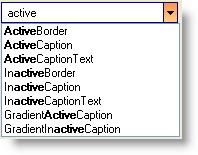

////

|metadata|
{
    "name": "wincomboeditor-filter-options-to-filter-suggested-values",
    "controlName": ["WinComboEditor"],
    "tags": ["Filtering","Selection"],
    "guid": "{5A0DE12A-A9D0-43F7-BDDE-4DF8830D16A9}",  
    "buildFlags": [],
    "createdOn": "0001-01-01T00:00:00Z"
}
|metadata|
////

= Filter Options to Filter Suggested Values

The link:{ApiPlatform}win{ApiVersion}~infragistics.win.autocompletemode.html[AutoCompleteMode] property offers different settings that allow your end users to have possible suggested values listed, as they type in the text box of WinComboEditor™. By default, when the AutoCompleteMode property is set to Suggest or SuggestAppend, only the items that start with the characters typed in the Textbox will be listed. The link:{ApiPlatform}win{ApiVersion}~infragistics.win.autosuggestfiltermode.html[AutoSuggestFilterMode] property provides you the option to choose between StartWith and Contains, so that your end users can have items suggested that either start with the specific character string or contains the specific character string.

.Note
[NOTE]
====
When the AutoSuggestFilterMode property is set to 'Contains', the AutoCompleteMode setting of 'SuggestAppend' resolves to 'Suggest', i.e., automatic completion of the text typed in the edit portion is disabled, and the text selection is not modified.
====

.Note
[NOTE]
====
By default when the AutoSuggestFilterMode is set to Contains, the character string typed by the end user during an auto-suggest session will be highlighted within each item in the drop down. This setting can be altered using the link:{ApiPlatform}win{ApiVersion}~infragistics.win.valuelist~formatfiltereditems.html[FormatFilteredItems] property.
====

Assuming your form contains an UltraComboEditor control, the following example code demonstrates how to list items that contains the character string typed by the end user. Write the following code in the form load event.

*In Visual Basic:*

----
'Get a list of colors from the KnownColor enumeration. 
For Each s As String In System.[Enum].GetNames(GetType(KnownColor)) 
'add each color to WinComboEditor's items collection. 
    Me.ultraComboEditor1.Items.Add(s) 
Next 
' Have WinComboEditor suggest possible colors. 
Me.ultraComboEditor1.AutoCompleteMode = Infragistics.Win.AutoCompleteMode.Suggest 
' Display items in the drop down list that contains the character typed by the end user. 
Me.ultraComboEditor1.AutoSuggestFilterMode = Infragistics.Win.AutoSuggestFilterMode.Contains 
' Do not format text in filtered items.
' this.ultraComboEditor1.Items.ValueList.FormatFilteredItems = DefaultableBoolean.False
----

*In C#:*

----
//Get a list of colors from the KnownColor enumeration.
foreach (string s in System.Enum.GetNames(typeof(KnownColor)))
{
  //add each color to WinComboEditor's items collection.
  this.ultraComboEditor1.Items.Add(s);
}
// Have WinComboEditor suggest possible colors.
this.ultraComboEditor1.AutoCompleteMode =Infragistics.Win.AutoCompleteMode.Suggest;
// Display items in the drop down list that contains the character typed by the end user.
this.ultraComboEditor1.AutoSuggestFilterMode = Infragistics.Win.AutoSuggestFilterMode.Contains;
// Do not format text in filtered items.
// this.ultraComboEditor1.Items.ValueList.FormatFilteredItems = DefaultableBoolean.False;
----

