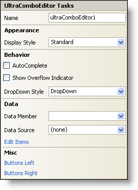

////

|metadata|
{
    "name": "wincomboeditor-smart-tag",
    "controlName": ["WinComboEditor"],
    "tags": ["Summaries"],
    "guid": "{0580F150-40DA-4324-8F07-920A31B2230F}",  
    "buildFlags": [],
    "createdOn": "2005-09-11T00:00:00Z"
}
|metadata|
////

= WinComboEditor Smart Tag

In Visual Studio 2005 (.NET Framework 2.0), each Infragistics Windows Forms control/component is equipped with a Smart Tag. By simply selecting the control/component, a Smart Tag anchor appears. When you click this anchor, a pop-up panel appears, providing you with quick and easy access to the most common properties and settings of the control/component.

The WinComboEditor™ Smart Tag contains the name of the control, as well as the following sections:

* Appearance -- Provides common tasks involving the appearance, look, and feel of the control.
* Behavior -- Provides easy access to properties that govern how the control behaves on the form.
* Data -- Refers to any underlying data the control is using such as data sources and data members.
* Misc -- Provides various options that will enhance the overall look or performance of the control.

See below for a description of the item (e.g., field, drop-down list, checkbox) in each section, as well as the item's corresponding property in the properties grid.

[options="header", cols="a,a,a"]
|====
|Appearance|Description|Corresponding Property

|Display Style
|Change the style of the WinComboEditor to make it look like Office 2000, Office XP, Office 2003, Visual Studio 2005, Office 2007.
| pick:[win-forms="link:{ApiPlatform}win.ultrawineditors{ApiVersion}~infragistics.win.ultrawineditors.texteditorcontrolbase~displaystyle.html[DisplayStyle]"] 

|====

[options="header", cols="a,a,a"]
|====
|Behavior|Description|Corresponding Property

|AutoComplete
|Checking this will allow the editor to automatically update itself as letters are typed to match an item in the list.
| pick:[win-forms="link:{ApiPlatform}win.ultrawineditors{ApiVersion}~infragistics.win.ultrawineditors.ultracomboeditor~autocompletemode.html[AutoCompleteMode]"] 

|Show Overflow Indicator
|When the Text property is too long to be seen in the editor, a small box with two right arrows shows up to indicate that there is more text.
| pick:[win-forms="link:{ApiPlatform}win.ultrawineditors{ApiVersion}~infragistics.win.ultrawineditors.texteditorcontrolbase~showoverflowindicator.html[ShowOverflowIndicator]"] 

|DropDown Style
|Select DropDownList from the drop-down to prevent the WinComboEditor from being editable.
| pick:[win-forms="link:{ApiPlatform}win.ultrawineditors{ApiVersion}~infragistics.win.ultrawineditors.ultracomboeditor~dropdownstyle.html[DropDownStyle]"] 

|====

[options="header", cols="a,a,a"]
|====
|Data|Description|Corresponding Property

|Data Member
|Once you have selected a valid data source, you can select all available data members from this drop-down.
| pick:[win-forms="link:{ApiPlatform}win.ultrawineditors{ApiVersion}~infragistics.win.ultrawineditors.ultracomboeditor~datamember.html[DataMember]"] 

|Data Source
|Click the drop-down and all available data sources in your project will be displayed. If you do not have a data source set up, you can select, "Add Project Data Source..." to create one.
| pick:[win-forms="link:{ApiPlatform}win.ultrawineditors{ApiVersion}~infragistics.win.ultrawineditors.ultracomboeditor~datasource.html[DataSource]"] 

|Edit Items
|If the WinComboEditor is bound to a data source, this option will not be available. If the WinComboEditor is not bound to a data source, selecting Edit Items will open the WinComboEditor's Items collection. This is where you can edit the drop-down items in the drop-down box.
| pick:[win-forms="link:{ApiPlatform}win.ultrawineditors{ApiVersion}~infragistics.win.ultrawineditors.ultracomboeditor~items.html[Items]"] 

|====

[options="header", cols="a,a,a"]
|====
|Misc|Description|Corresponding Property

|Buttons Left
|Click the ellipsis (...) to open the ButtonsLeft collection. This is a collection of custom buttons that can be placed on the left of the editor.
| pick:[win-forms="link:{ApiPlatform}win{ApiVersion}~infragistics.win.ultrawineditors.editorbuttoncontrolbase~buttonsleft.html[ButtonsLeft]"] 

|Buttons Right
|Click the ellipsis (...) to open the ButtonsRight collection. This is a collection of custom buttons that can be placed on the right of the editor.
| pick:[win-forms="link:{ApiPlatform}win{ApiVersion}~infragistics.win.ultrawineditors.editorbuttoncontrolbase~buttonsright.html[ButtonsRight]"] 

|====