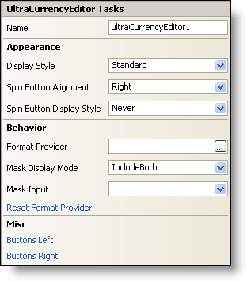

////

|metadata|
{
    "name": "wincurrencyeditor-smart-tag",
    "controlName": ["WinCurrencyEditor"],
    "tags": ["API"],
    "guid": "{CBD35110-80ED-40B2-A906-4278B3DADE8F}",  
    "buildFlags": [],
    "createdOn": "2005-09-11T00:00:00Z"
}
|metadata|
////

= WinCurrencyEditor Smart Tag

In Visual Studio 2005 (.NET Framework 2.0), each Infragistics Windows Forms control/component is equipped with a Smart Tag. By simply selecting the control/component, a Smart Tag anchor appears. When you click this anchor, a pop-up panel appears, providing you with quick and easy access to the most common properties and settings of the control/component.

The WinCurrencyEditor™ Smart Tag contains the name of the control, as well as the following sections:

* Appearance -- Provides common tasks involving the appearance, look, and feel of the control.
* Behavior -- Provides easy access to properties that govern how the control behaves on the form.
* Misc -- Provides various options that will enhance the overall look or performance of the control.

See below for a description of the item (e.g., field, drop-down list, checkbox) in each section, as well as the item's corresponding property in the properties grid.

[options="header", cols="a,a,a"]
|====
|Appearance|Description|Corresponding Property

|Display Style
|Change the style of the WinCurrencyEditor to make it look like Office 2000, Office XP, Office 2003, Visual Studio 2005, Office 2007.
| pick:[win-forms="link:{ApiPlatform}win.ultrawineditors.v{ProductVersion}~infragistics.win.ultrawineditors.texteditorcontrolbase~displaystyle.html[DisplayStyle]"] 

|Spin Button Alignment
|When the SpinButtonDisplayStyle property is set to Always, spin buttons will display on the right of the editor (by default). You can change this by selecting Left from this drop-down.
| pick:[win-forms="link:infragistics4.win.ultrawineditors.v{ProductVersion}~infragistics.win.ultrawineditors.ultranumericeditorbase~spinbuttonalignment.html[SpinButtonAlignment]"] 

|Spin Button Display Style
|Setting this to Always will display the spin buttons. Setting this to OnMouseEnter will display the spin buttons when the user presses the enter key.
| pick:[win-forms="link:infragistics4.win.ultrawineditors.v{ProductVersion}~infragistics.win.ultrawineditors.ultranumericeditorbase~spinbuttondisplaystyle.html[SpinButtonDisplayStyle]"] 

|====

[options="header", cols="a,a,a"]
|====
|Behavior|Description|Corresponding Property

|Format Provider
|Click the ellipsis (...) to choose a format provider. The format provider is a specific language from a region that will govern how the editor is formatted.
| pick:[win-forms="link:infragistics4.win.ultrawineditors.v{ProductVersion}~infragistics.win.ultrawineditors.ultranumericeditorbase~formatprovider.html[FormatProvider]"] 

|Mask Display Mode
|Use the drop-down to select how the editor should mask the text in the control.
| pick:[win-forms="link:infragistics4.win.ultrawineditors.v{ProductVersion}~infragistics.win.ultrawineditors.ultranumericeditorbase~maskdisplaymode.html[MaskDisplayMode]"] 

|Mask Input
|This sets the input mask used by the editor.
| pick:[win-forms="link:infragistics4.win.ultrawineditors.v{ProductVersion}~infragistics.win.ultrawineditors.ultranumericeditorbase~maskinput.html[MaskInput]"] 

|Reset Format Provider
|Clicking this will clear the format provider, removing any specific language you may have chosen.
|n/a

|====

[options="header", cols="a,a,a"]
|====
|Misc|Description|Corresponding Property

|Buttons Left
|Click the ellipsis (...) to open the ButtonsLeft collection. This is a collection of custom buttons that can be placed on the left of the editor.
| pick:[win-forms="link:infragistics4.win.v{ProductVersion}~infragistics.win.ultrawineditors.editorbuttoncontrolbase~buttonsleft.html[ButtonsLeft]"] 

|Buttons Right
|Click the ellipsis (...) to open the ButtonsRight collection. This is a collection of custom buttons that can be placed on the right of the editor.
| pick:[win-forms="link:infragistics4.win.v{ProductVersion}~infragistics.win.ultrawineditors.editorbuttoncontrolbase~buttonsright.html[ButtonsRight]"] 

|====