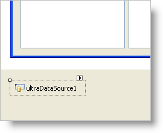

////

|metadata|
{
    "name": "windatasource-about-windatasource",
    "controlName": ["WinDataSource"],
    "tags": ["Getting Started"],
    "guid": "{FFF48120-7135-4A7F-A3C2-66EF6C43187D}",  
    "buildFlags": [],
    "createdOn": "0001-01-01T00:00:00Z"
}
|metadata|
////

= About WinDataSource

One problem facing developers who want to use the WinGrid™ control in unbound mode is that they have to go through the trouble of having to implement an IList, ITypedList or IBindingList interface. This can be a difficult task for inexperienced developers, and it is inconvenient even for experienced developers. The new WinDataSource™ component makes it easier to use the UltraWinGrid in unbound mode. It is also useful for creating an unbound implementation of any control that typically operates in data-bound mode.

The WinDataSource component implements unbound functionality in a way compatible with traditional data binding. WinDataSource is a dynamic data source in the sense that the data can be managed by the component or can be provided by the developer as it is needed.

Here is a typical scenario for using the WinDataSource component. You add the UltraDataSource component to the form's component tray. (This is a component and not a control and thus appears in the component tray rather than on the form.)

Once the component is instantiated, it shows up in the drop down list associated with the DataSource property of all the data-aware controls, including UltraWinGrid. Then all you have to do to bind the UltraGrid to the UltraDataSource is to go to the DataSource property of the UltraWinGrid and select the UltraWinDataSource from the drop down list, just like any other data source.

To define the data structure in an UltraDataSource, there is a "Define Data Structure" action associated with the component that the developer can initiate, either through the right-click popup menu or the action list in the property grid, which brings up a dialog for defining the data structure. There is also an "Input Data" action associated with the component that allows for entering data at design-time through a dialog. The dialog for inputting data is separate from the dialog for defining the data structure. Data entered at design-time is serialized by the UltraWinDataSource and thus provides a very easy way for the developer to quickly populate the UltraWinDataSource with some data.

UltraWinGrid exposes a  pick:[win-forms="link:infragistics4.win.ultrawingrid.v{ProductVersion}~infragistics.win.ultrawingrid.ultragridlayout~loadstyle.html[LoadStyle]"]  property on  pick:[win-forms="link:infragistics4.win.ultrawingrid.v{ProductVersion}~infragistics.win.ultrawingrid.ultragridlayout.html[UltraGridLayout]"]  object that the developer can optionally set to 'LoadOnDemand' to cause the UltraWinGrid to load rows lazily (only as they are needed) improving the load time and performance in case the UltraWinDataSource component contains a lot of rows.

UltraWinDataSource exposes  pick:[win-forms="link:infragistics4.win.ultrawindatasource.v{ProductVersion}~infragistics.win.ultrawindatasource.celldatarequestedeventargs.html[CellDataRequested]"]  event that occurs when the component requires data but none has been provided. Developers can use this event handler to provide the data. You can also indicate that the provided data should be cached by setting the  pick:[win-forms="link:infragistics4.win.ultrawindatasource.v{ProductVersion}~infragistics.win.ultrawindatasource.celldatarequestedeventargs~cachedata.html[CacheData]"]  property in the event arguments to true. UltraWinDataSource does not fire CellDataRequested again for cells with cached data. If CacheData is left to its default value of false, UltraWinDataSource will not cache the data and fire the event next time data for that cell is needed. This offers you the flexibility of deciding how to manage the data. In effect, you can specify whether the UltraWinDataSource is a "virtual" or an "add-item" data source. This is why the UltraWinDataSource is referred to as dynamic data source.

UltraWinDataSource supports hierarchical data structures. It has a  pick:[win-forms="link:infragistics4.win.ultrawindatasource.v{ProductVersion}~infragistics.win.ultrawindatasource.ultradatasource~band.html[Band]"]  property which represents the data structure of the topmost band. A band is represented by an UltraDataBand object. UltraDataBand exposes a  pick:[win-forms="link:infragistics4.win.ultrawindatasource.v{ProductVersion}~infragistics.win.ultrawindatasource.ultradataband~columns.html[Columns]"]  property that contains collection of columns. Each column is represented by an UltraDataColumn object. UltraDataBand also exposes a  pick:[win-forms="link:infragistics4.win.ultrawindatasource.v{ProductVersion}~infragistics.win.ultrawindatasource.ultradataband~childbands.html[ChildBands]"]  property which is a collection of UltraDataBand objects. Hierarchy is defined through this child bands collection.

Here is what a two-level hierarchy with Customers as the parent band and Orders as the child band would look like from the object model perspective:

----
UltraDataSource
  Band: UltraDataBand(Customers)
    Columns[]:
      UltraDataColumn(CustomerID, NonChaptered)
      UltraDataColumn(Name, NonChaptered)
      UltraDataColumn(Address, NonChaptered)
      UltraDataColumn(Orders, Chaptered)
    ChildBands[]:
      UltraDataBand(Orders)
        Columns[]:
          UltraDataColumn[OrderDate]
          UltraDataColumn[ShipDate]
          UltraDataColumn[OrderTotal]
----

UltraDataBand and UltraDataColumn objects are used to define the data structure but they do not contain any data. UltraWinDataSource exposes a  pick:[win-forms="link:infragistics4.win.ultrawindatasource.v{ProductVersion}~infragistics.win.ultrawindatasource.ultradatasource~rows.html[Rows]"]  property of type UltraDataRowsCollection. UltraDataRowsCollection contains UltraDataRow objects. Each UltraDataRow object can contain data for that row. If you want to use the UltraDataSource as an "add-item" data source, UltraDataRow objects are populated with the cell data. If you want to use the UltraDataSource as "virtual" data source, you can leave UltraDataRow objects without any cell data and UltraDataSource will request the cell data by firing the CellDataRequested event.

When the user of your application modifies the contents of a cell in a control to which the UltraDataSource has been bound, the  pick:[win-forms="link:infragistics4.win.ultrawindatasource.v{ProductVersion}~infragistics.win.ultrawindatasource.celldataupdatingeventargs.html[CellDataUpdating]"]  event is fired. If this event is not canceled, data for the cell is updated and  pick:[win-forms="link:infragistics4.win.ultrawindatasource.v{ProductVersion}~infragistics.win.ultrawindatasource.celldataupdatedeventargs.html[CellDataUpdated]"]  event is fired. In CellDataUpdating, you can change the value that will be sent back to the data source by setting the  pick:[win-forms="link:infragistics4.win.ultrawindatasource.v{ProductVersion}~infragistics.win.ultrawindatasource.celldataupdatingeventargs~newvalue.html[NewValue]"]  property off the event arguments to the new value.

Similarly, when the user tries to add a row, the  pick:[win-forms="link:infragistics4.win.ultrawindatasource.v{ProductVersion}~infragistics.win.ultrawindatasource.rowaddingeventargs.html[RowAdding]"]  event is fired. If this event is not canceled, a new row is added and  pick:[win-forms="link:infragistics4.win.ultrawindatasource.v{ProductVersion}~infragistics.win.ultrawindatasource.rowaddedeventargs.html[RowAdded]"]  event is fired. After the RowAdded event is fired, the  pick:[win-forms="link:infragistics4.win.ultrawindatasource.v{ProductVersion}~infragistics.win.ultrawindatasource.initializedataroweventargs.html[InitializeDataRow]"]  event is fired to initialize the new row. In the RowAdding event you can specify the index at which the new row should be added in the rows collection.

When the user tries to delete a row, the  pick:[win-forms="link:infragistics4.win.ultrawindatasource.v{ProductVersion}~infragistics.win.ultrawindatasource.rowdeletingeventargs.html[RowDeleting]"]  event is fired. If that event is not canceled, the row is deleted and the  pick:[win-forms="link:infragistics4.win.ultrawindatasource.v{ProductVersion}~infragistics.win.ultrawindatasource.rowdeletedeventargs.html[RowDeleted]"]  event is fired.

UltraDataSource also exposes an  pick:[win-forms="link:infragistics4.win.ultrawindatasource.v{ProductVersion}~infragistics.win.ultrawindatasource.initializerowscollectioneventargs.html[InitializeRowsCollection]"]  event which you can use to initialize the whole rows collection. This can be useful in a hierarchical data structure where whenever child rows collection for a parent row is needed (when for example the user expands the parent row in the UltraGrid), InitializeRowsCollection is fired for the child rows collection. Here the user would typically get the child rows and populate the rows collection with them.