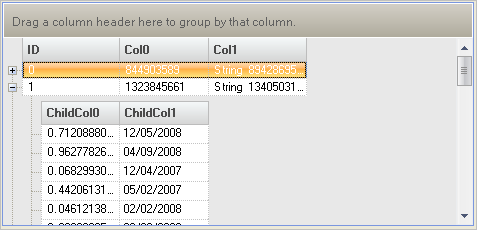

////

|metadata|
{
    "name": "windatasource-load-data-on-demand",
    "controlName": ["WinDataSource"],
    "tags": ["Application Scenarios","Data Binding"],
    "guid": "{B51D895B-EB11-4460-A021-2419AD29ED87}",  
    "buildFlags": [],
    "createdOn": "0001-01-01T00:00:00Z"
}
|metadata|
////

= Load Data On-Demand

To load data on demand into the WinDataSource™ component, use the  pick:[win-forms="link:{ApiPlatform}win.ultrawindatasource{ApiVersion}~infragistics.win.ultrawindatasource.ultradatasource~celldatarequested_ev.html[CellDataRequested]"]  event. The CellDataRequested event is fired when a control bound to the WinDataSource requests value for a cell and WinDataSource doesn't have the cell value (for example, the row being displayed has just been brought into the viewable area of a grid). This "Load on Demand" or "Virtual Mode" is different than setting the  pick:[win-forms="link:{ApiPlatform}win.ultrawingrid{ApiVersion}~infragistics.win.ultrawingrid.ultragridlayout~loadstyle.html[LoadStyle]"]  property on the WinGrid™ control.

Set LoadStyle to  pick:[win-forms="link:{ApiPlatform}win.ultrawingrid{ApiVersion}~infragistics.win.ultrawingrid.loadstyle.html[LoadOnDemand]"]  to load rows as needed instead of loading all rows at once. Some operations, like sorting, will cause all rows to be loaded regardless of the load style set because they require access to all rows.

== Understanding CellDataRequested

Once the value is provided, WinDataSource will cache it and this event will not be fired for the cell next time. You can prevent the value from being cached by setting the  pick:[win-forms="link:{ApiPlatform}win.ultrawindatasource{ApiVersion}~infragistics.win.ultrawindatasource.celldatarequestedeventargs~cachedata.html[CacheData]"]  to False in the event handler. You can also provide cell values without having to hook into this event by using  pick:[win-forms="link:{ApiPlatform}win.ultrawindatasource{ApiVersion}~infragistics.win.ultrawindatasource.ultradatarow~setcellvalue.html[SetCellValue]"]  method. You can clear the cached value for a cell using  pick:[win-forms="link:{ApiPlatform}win.ultrawindatasource{ApiVersion}~infragistics.win.ultrawindatasource.ultradatarow~resetcachedvalue.html[ResetCachedValue]"]  method to cause this event to be fired next time for the cell.

The following example code will demonstrate how to implement a virtual load scenario using the WinDataSource component. It is assumed you have a WinGrid and WinDataSource already on your form.

*In Visual Basic:*

----
Imports Infragistics.Win.UltraWinDataSource
Imports Infragistics.Win.UltraWinGrid
Private Sub Load_Data_on_Demand_Load(ByVal sender As Object, _
  ByVal e As System.EventArgs) Handles MyBase.Load
	Me.UltraGrid1.DataSource = Me.UltraDataSource1
	' Set the root band key so we can easily refer to it later in various
	' event handlers.
	Me.UltraDataSource1.Band.Key = "RootBand"
	' Add three columns to the root band.
	Me.UltraDataSource1.Band.Columns.Add("ID", GetType(Integer))
	Me.UltraDataSource1.Band.Columns.Add("Col0", GetType(Integer))
	Me.UltraDataSource1.Band.Columns.Add("Col1", GetType(String))
	' Add a child band to the root band.
	Dim childBand As UltraDataBand = Me.UltraDataSource1.Band.ChildBands.Add("ChildBand")
	' Add two columns to the child band.
	childBand.Columns.Add("ChildCol0", GetType(Double))
	childBand.Columns.Add("ChildCol1", GetType(DateTime))
	' Set the count on the root rows collection to 100.
	Me.UltraDataSource1.Rows.SetCount(100)
	' Set the id on the root rows.
	Dim column As UltraDataColumn = Me.UltraDataSource1.Band.Columns("ID")
	Dim i As Integer
	For i = 0 To Me.UltraDataSource1.Rows.Count - 1
		Me.UltraDataSource1.Rows(i)(column) = i
	Next
End Sub
Dim random As Random = New Random()
Private Sub UltraDataSource1_CellDataRequested(ByVal sender As Object, _
  ByVal e As Infragistics.Win.UltraWinDataSource.CellDataRequestedEventArgs) _
  Handles UltraDataSource1.CellDataRequested
	' CellDataRequested is fired for every cell. In CellDataRequested event handler
	' e.Row property indicates which row and e.Column indicates which column the
	' cell data is being requested for.
	Dim row As UltraDataRow = e.Row
	If "RootBand" Is e.Column.Band.Key Then
		Select Case e.Column.Key
			Case "Col0"
				e.Data = Me.random.Next()
			Case "Col1"
				e.Data = "String " & Me.random.Next()
		End Select
	ElseIf "ChildBand" Is e.Column.Band.Key Then   
		Select Case e.Column.Key
			Case "ChildCol0"
				e.Data = Me.random.NextDouble()
			Case "ChildCol1"
				e.Data = DateTime.Now.AddDays(Me.random.Next(1000))
		End Select   
	End If
	' If CacheData is set to true, which it is by default, then UltraDataSource
	' will cache the provided cell value and won't fire CellDataRequested next
	' time for the cell.
	e.CacheData = True
End Sub
Private Sub UltraDataSource1_InitializeRowsCollection(ByVal sender As Object, _
  ByVal e As Infragistics.Win.UltraWinDataSource.InitializeRowsCollectionEventArgs) _
  Handles UltraDataSource1.InitializeRowsCollection
	If "ChildBand" Is e.Rows.Band.Key Then
		' For every parent row, we will have 10 child rows.
		e.Rows.SetCount(10)
	End If
End Sub
----

*In C#:*

----
using Infragistics.Win.UltraWinDataSource; 
using Infragistics.Win.UltraWinGrid; 
private void Load_Data_on_Demand_Load(object sender, EventArgs e) 
{ 
	this.ultraGrid1.DataSource = this.ultraDataSource1; 
	// Set the root band key so we can easily refer to it later in various 
	// event handlers. 
	this.ultraDataSource1.Band.Key = "RootBand"; 
	// Add three columns to the root band. 
	this.ultraDataSource1.Band.Columns.Add("ID", typeof(int)); 
	this.ultraDataSource1.Band.Columns.Add("Col0", typeof(int)); 
	this.ultraDataSource1.Band.Columns.Add("Col1", typeof(string)); 
	// Add a child band to the root band. 
	UltraDataBand childBand = 
	  this.ultraDataSource1.Band.ChildBands.Add("ChildBand"); 
	// Add two columns to the child band. 
	childBand.Columns.Add("ChildCol0", typeof(double)); 
	childBand.Columns.Add("ChildCol1", typeof(DateTime)); 
	// Set the count on the root rows collection to 100. 
	this.ultraDataSource1.Rows.SetCount(100); 
	// Set the id on the root rows. 
	UltraDataColumn column = this.ultraDataSource1.Band.Columns["ID"]; 
	for ( int i = 0; i < this.ultraDataSource1.Rows.Count; i++ ) 
	this.ultraDataSource1.Rows[i][column] = i; 
} 
Random random = new Random( ); 
private void ultraDataSource1_CellDataRequested(object sender, 
  Infragistics.Win.UltraWinDataSource.CellDataRequestedEventArgs e) 
{ 
	// CellDataRequested is fired for every cell. 
	// e.Row property indicates which row and e.Column indicates which column the 
	// cell data is being requested for. 
	UltraDataRow row = e.Row; 
	if ("RootBand" == e.Column.Band.Key) 
	{ 
		switch (e.Column.Key) 
		{ 
			case "Col0": 
				e.Data = this.random.Next(); 
				break; 
			case "Col1": 
				e.Data = "String " + this.random.Next(); 
				break; 
		} 
	} 
	else if ("ChildBand" == e.Column.Band.Key) 
	{ 
		switch (e.Column.Key) 
		{ 
			case "ChildCol0": 
				e.Data = this.random.NextDouble(); 
				break; 
			case "ChildCol1": 
				e.Data = DateTime.Now.AddDays(this.random.Next(1000)); 
				break; 
		} 
	} 
	// If CacheData is set to true, which it is by default, then UltraDataSource 
	// will cache the provided cell value and won't fire CellDataRequested next 
	// time for the cell. 
	e.CacheData = true; 
}
private void ultraDataSource1_InitializeRowsCollection(object sender, 
  Infragistics.Win.UltraWinDataSource.InitializeRowsCollectionEventArgs e) 
{ 
	if ("ChildBand" == e.Rows.Band.Key) 
	{ 
		// For every parent row, we will have 10 child rows. 
		e.Rows.SetCount(10); 
	} 
}
----

