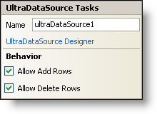

////

|metadata|
{
    "name": "windatasource-smart-tag",
    "controlName": ["WinDataSource"],
    "tags": ["Extending"],
    "guid": "{AA603C45-B11D-4398-BECB-FE52BA15096B}",  
    "buildFlags": [],
    "createdOn": "2005-09-11T00:00:00Z"
}
|metadata|
////

= WinDataSource Smart Tag

In Visual Studio 2005 (.NET Framework 2.0), each Infragistics Windows Forms control/component is equipped with a Smart Tag. By simply selecting the control/component, a Smart Tag anchor appears. When you click this anchor, a pop-up panel appears, providing you with quick and easy access to the most common properties and settings of the control/component.

The WinDataSource™ Smart Tag contains the name of the component, as well as the following sections:

* Behavior -- Provides easy access to properties that govern how the control behaves on the form.

See below for a description of the item (e.g., field, drop-down list, checkbox) in each section, as well as the item's corresponding property in the properties grid.

[options="header", cols="a,a,a"]
|====
|Behavior|Description|Corresponding Property

|Allow Add Rows
|Checking this checkbox will allow users to add rows to the data source.
| pick:[win-forms="link:infragistics4.win.ultrawindatasource.v{ProductVersion}~infragistics.win.ultrawindatasource.ultradatasource~allowadd.html[AllowAdd]"] 

|Allow Delete Rows
|Checking this checkbox will allow users to delete rows from the data source.
| pick:[win-forms="link:infragistics4.win.ultrawindatasource.v{ProductVersion}~infragistics.win.ultrawindatasource.ultradatasource~allowdelete.html[AllowDelete]"] 

|====