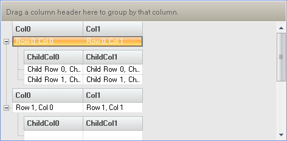

////

|metadata|
{
    "name": "windatasource-use-windatasource-at-run-time",
    "controlName": ["WinDataSource"],
    "tags": ["Application Scenarios","How Do I"],
    "guid": "{8E17A853-2153-4ED2-B0E2-9926E90650D3}",  
    "buildFlags": [],
    "createdOn": "0001-01-01T00:00:00Z"
}
|metadata|
////

= Use WinDataSource at Run Time

You can easily define a data schema and add rows of data to your schema at runtime as well as design time using the link:windatasource-using-the-windatasource-designer.html[WinDataSource designer].

The following code will programmatically add  pick:[win-forms="link:{ApiPlatform}win.ultrawindatasource{ApiVersion}~infragistics.win.ultrawindatasource.ultradataband.html[Bands]"] ,  pick:[win-forms="link:{ApiPlatform}win.ultrawindatasource{ApiVersion}~infragistics.win.ultrawindatasource.ultradatacolumn.html[Columns]"]  and  pick:[win-forms="link:{ApiPlatform}win.ultrawindatasource{ApiVersion}~infragistics.win.ultrawindatasource.ultradatarow.html[Rows]"]  to an existing WinDataSource™ control, then bind the WinDataSource to an existing WinGrid element.

[start=1]
. Create a new Windows Forms Application
[start=2]
. Drag a UltraDataSource and UltraGrid control onto the Form.
[start=3]
. Before you start writing any code, you should place using/imports directives in your code-behind so you don't need to always type out a member's fully qualified name.

*In Visual Basic:*

----
Imports Infragistics.Win.UltraWinDataSource
Imports Infragistics.Win.UltraWinGrid
----

*In C#:*

----
using Infragistics.Win.UltraWinDataSource;
using Infragistics.Win.UltraWinGrid;
----

[start=4]
. Add the following code to the Load event of the form:

*In Visual Basic:*

----
   Private Sub Use_WinDataSource_at_Run_Time_Load( _
  ByVal sender As Object, _
  ByVal e As System.EventArgs) Handles MyBase.Load
	Me.UltraGrid1.DataSource = Me.UltraDataSource1
	' Add two columns to the root band.
	Me.UltraDataSource1.Band.Columns.Add("Col0", GetType(String))
	Me.UltraDataSource1.Band.Columns.Add("Col1", GetType(String))
	' Add a child band to the root band with the key of "ChildBand"
	Dim childBand As UltraDataBand = _
	  Me.UltraDataSource1.Band.ChildBands.Add("ChildBand")
	' Add two columns to the child band.
	childBand.Columns.Add("ChildCol0", GetType(String))
	childBand.Columns.Add("ChildCol1", GetType(String))
	' Set the count on the root rows collection to 2.
	Me.UltraDataSource1.Rows.SetCount(2)
	Dim row As UltraDataRow
	' Initialize rows with data.
	'Get the first row.
	row = Me.UltraDataSource1.Rows(0)
	row("Col0") = "Row 0, Col 0"
	row("Col1") = "Row 0, Col 1"
	' Initialize the child rows of the row.
	Dim childRows As UltraDataRowsCollection = row.GetChildRows("ChildBand")
	childRows.SetCount(2)
	childRows(0)("ChildCol0") = "Child Row 0, ChildCol 0"
	childRows(0)("ChildCol1") = "Child Row 0, ChildCol 1"
	childRows(1)("ChildCol0") = "Child Row 1, ChildCol 0"
	childRows(1)("ChildCol1") = "Child Row 1, ChildCol 1"
	' Get the second row.
	row = Me.UltraDataSource1.Rows(1)
	row("Col0") = "Row 1, Col 0"
	row("Col1") = "Row 1, Col 1"
	' Initialize the child rows of the row.
	childRows = row.GetChildRows("ChildBand")
	childRows.SetCount(1)
End Sub
----

*In C#:*

----
private void Use_WinDataSource_at_Run_Time_Load(
  object sender, System.EventArgs e)
{
	this.ultraGrid1.DataSource = this.ultraDataSource1;
	// Add two columns to the root band.
	this.ultraDataSource1.Band.Columns.Add( "Col0", typeof( string ) ); 
	this.ultraDataSource1.Band.Columns.Add( "Col1", typeof( string ) ); 
	// Add a child band to the root band with the key of "ChildBand". 
	UltraDataBand childBand = 
	  this.ultraDataSource1.Band.ChildBands.Add( "ChildBand" );
	// Add two columns to the child band. 
	childBand.Columns.Add( "ChildCol0", typeof( string ) ); 
	childBand.Columns.Add( "ChildCol1", typeof( string ) ); 
	// Set the count on the root rows collection to 2. 
	this.ultraDataSource1.Rows.SetCount( 2 ); 
	UltraDataRow row; 
	// Initialize rows with data. 
	// Get the first row. 
	row = this.ultraDataSource1.Rows[0]; 
	row[ "Col0" ] = "Row 0, Col 0"; 
	row[ "Col1" ] = "Row 0, Col 1"; 
	// Initialize the child rows of the row. 
	UltraDataRowsCollection childRows = row.GetChildRows( "ChildBand" ); 
	childRows.SetCount( 2 ); 
	childRows[0][ "ChildCol0" ] = "Child Row 0, ChildCol 0"; 
	childRows[0][ "ChildCol1" ] = "Child Row 0, ChildCol 1"; 
	childRows[1][ "ChildCol0" ] = "Child Row 1, ChildCol 0"; 
	childRows[1][ "ChildCol1" ] = "Child Row 1, ChildCol 1"; 
	// Get the second row. 
	row = this.ultraDataSource1.Rows[1]; 
	row[ "Col0" ] = "Row 1, Col 0"; 
	row[ "Col1" ] = "Row 1, Col 1"; 
	// Initialize the child rows of the row. 
	childRows = row.GetChildRows( "ChildBand" ); 
	childRows.SetCount( 1 );
}
----

[start=5]
. Build and run the application. If you expand the bands you will see something similar to the following.

