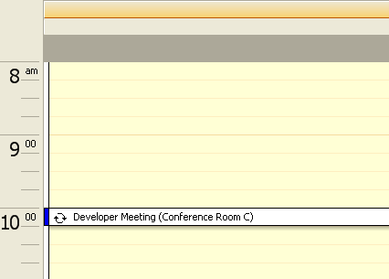

////

|metadata|
{
    "name": "windayview-about-windayview",
    "controlName": ["WinDayView"],
    "tags": ["Getting Started"],
    "guid": "{87F3B75B-79DB-43EE-BB9A-983CC27F4B4F}",  
    "buildFlags": [],
    "createdOn": "0001-01-01T00:00:00Z"
}
|metadata|
////

= About WinDayView

The WinDayView™ control displays individual day information in a time segmented-oriented view. The following is a list of some of the functionalities available in WinDayView:

* Viewing -- Allows end users to view appointments, notes, owners, and other items on a day-to-day basis, or spanning several days.
* Adding/Updating/Removing -- Allows you to add, update, and remove appointments, notes, owners, and other items using the WinCalendarInfo component.
* Appearance support -- Full appearance support including alpha-blending, gradients, and images. Some appearances can be set at the control level, the others are set using the WinCalendarLook component.
* Built-in theming -- Supports Standard, Office 2003, Visual Studio® 2005, and Office 2007 themes via the WinCalendarLook component.

