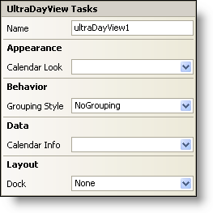

////

|metadata|
{
    "name": "windayview-smart-tag",
    "controlName": ["WinDayView"],
    "tags": ["Getting Started"],
    "guid": "{F7FF13D7-A7C5-4429-8FFF-E77D99413D24}",  
    "buildFlags": [],
    "createdOn": "0001-01-01T00:00:00Z"
}
|metadata|
////

= WinDayView Smart Tag

In Visual Studio 2005 (.NET Framework 2.0), each Infragistics Windows Forms control/component is equipped with a Smart Tag. By simply selecting the control/component, a Smart Tag anchor appears. When you click this anchor, a pop-up panel appears, providing you with quick and easy access to the most common properties and settings of the control/component.

The WinDayView™ Smart Tag contains the name of the control, as well as the following sections:

* Appearance -- Provides common tasks involving the appearance, look, and feel of the control.
* Behavior -- Provides easy access to properties that govern how the control behaves on the form.
* Data -- Refers to any underlying data the control is using such as data sources and data members.
* Layout -- Offers properties that will determine where and how the control is placed on the form.

See below for a description of the item (e.g., field, drop-down list, checkbox) in each section, as well as the item's corresponding property in the properties grid.

[options="header", cols="a,a,a"]
|====
|Appearance|Description|Corresponding Property

|Calendar Look
|Upon clicking the drop-down, all available WinCalendarLook controls on the form will be displayed.
| pick:[win-forms="link:{ApiPlatform}win.ultrawinschedule{ApiVersion}~infragistics.win.ultrawinschedule.ultraschedulecontrolbase~calendarlook.html[CalendarLook]"] 

|====

[options="header", cols="a,a,a"]
|====
|Behavior|Description|Corresponding Property

|Grouping Style
|Three types of groupings are available: no grouping, grouping owners within dates, and grouping dates within owners.
| pick:[win-forms="link:{ApiPlatform}win.ultrawinschedule{ApiVersion}~infragistics.win.ultrawinschedule.ultradayview~groupingstyle.html[GroupingStyle]"] 

|====

[options="header", cols="a,a,a"]
|====
|Data|Description|Corresponding Property

|Calendar Info
|Upon clicking the drop-down, all available WinCalendarInfo controls on the form will be displayed.
| pick:[win-forms="link:{ApiPlatform}win.ultrawinschedule{ApiVersion}~infragistics.win.ultrawinschedule.ultraschedulecontrolbase~calendarinfo.html[CalendarInfo]"] 

|====

[options="header", cols="a,a,a"]
|====
|Layout|Description|Corresponding Property

|Dock
|Choose to dock the WinDayView top, right, bottom, left, fill, and none.
|Dock

|====