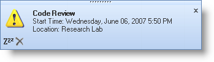

////

|metadata|
{
    "name": "windesktopalert-adding-alert-buttons-to-the-desktop-alert-reminder",
    "controlName": ["WinDesktopAlert"],
    "tags": ["Application Scenarios","How Do I"],
    "guid": "{04479E12-3546-4B64-AAB4-139C1DFB86F0}",  
    "buildFlags": [],
    "createdOn": "0001-01-01T00:00:00Z"
}
|metadata|
////

= Adding Alert Buttons to the Desktop Alert Reminder

== Before You Begin

This is the second topic in a three-part walkthrough designed to demonstrate several key WinDesktopAlert™ features working in a common scenario that you might encounter. For more information on this scenario, see link:windesktopalert-creating-a-desktop-alert-reminder-for-winschedule.html[Creating a Desktop Alert Reminder for WinSchedule]. If you have not completed the first topic, link:windesktopalert-displaying-a-desktop-alert-window-when-a-winschedule-reminder-comes-due.html[Displaying a Desktop Alert Window When a WinSchedule Reminder Comes Due], consider doing so now, as the current topic will build upon it.

WinDesktopAlert has a collection of link:{ApiPlatform}win.misc{ApiVersion}~infragistics.win.misc.ultradesktopalertbutton.html[UltraDesktopAlertButtons] that display in the lower-left corner of the desktop alert window. This collection is very similar to tools on a toolbar if you are familiar with WinToolbarsManager™. The link:{ApiPlatform}win.misc{ApiVersion}~infragistics.win.misc.alertbuttonclickedeventargs.html[AlertButtonClickedEventArgs] class passes an link:{ApiPlatform}win.misc{ApiVersion}~infragistics.win.misc.ultradesktopalertwindowinfo.html[UltraDesktopAlertWindowInfo] object, similar to the link:{ApiPlatform}win.misc{ApiVersion}~infragistics.win.misc.desktopalertlinkclickedeventargs.html[DesktopAlertLinkClickedEventArgs] class you used in the previous topic. Again, you will get a reference to the link:{ApiPlatform}win.ultrawinschedule{ApiVersion}~infragistics.win.ultrawinschedule.appointment.html[Appointment] through the UltraDesktopAlertWindowInfo object.

== What You Will Accomplish

This topic demonstrates how to add alert buttons to the desktop alert window. You will create the alert buttons, add them to the AlertButtons collection, and then handle the link:{ApiPlatform}win.misc{ApiVersion}~infragistics.win.misc.ultradesktopalert~alertbuttonclicked_ev.html[AlertButtonClicked] event, allowing you to snooze or dismiss the desktop alert reminder.

== Follow these Steps

[start=1]
. *Create two alert buttons* .

You'll be creating two alert buttons in the form's Load event. You can create the event handler for the Load event by double-clicking the form's header in Design View. Once the buttons are instantiated with a few properties set, you'll need to add them to the AlertButtons collection and then create the event handler for the AlertButtonClicked event. Place the following code in the form's Load event.

.Note
[NOTE]
====
You'll need to place the link:images/snooze.gif[Snooze] and link:images/dismiss.gif[Dismiss] images in your project's startup path. Right-click each image, select Save Target As..., and then navigate to your project's startup path and click Save.
====

*In Visual Basic:*

----
Private Sub Form1_Load(ByVal sender As System.Object, _
  ByVal e As System.EventArgs) Handles MyBase.Load
	Dim snoozeButton As UltraDesktopAlertButton = New UltraDesktopAlertButton()
	Dim dismissButton As UltraDesktopAlertButton = New UltraDesktopAlertButton()
	snoozeButton.Key = "SnoozeButton"
	dismissButton.Key = "DismissButton"
	snoozeButton.Appearance.Image = _
	  New Bitmap(Application.StartupPath + "\Snooze.gif")
	dismissButton.Appearance.Image = _
	  New Bitmap(Application.StartupPath + "\Dismiss.gif")
	Me.UltraDesktopAlert1.AlertButtons.AddRange(New UltraDesktopAlertButton() _
	  {snoozeButton, dismissButton})
	AddHandler UltraDesktopAlert1.AlertButtonClicked, _
	  AddressOf UltraDesktopAlert1_AlertButtonClicked
End Sub
----

*In C#:*

----
private void Form1_Load(object sender, EventArgs e)
{
	UltraDesktopAlertButton snoozeButton = new UltraDesktopAlertButton();
	UltraDesktopAlertButton dismissButton = new UltraDesktopAlertButton();
	snoozeButton.Key = "SnoozeButton";
	dismissButton.Key = "DismissButton";
	snoozeButton.Appearance.Image =
	  new Bitmap(Application.StartupPath + @"..\Snooze.gif");
	dismissButton.Appearance.Image =
	  new Bitmap(Application.StartupPath + @"..\Dismiss.gif");
	this.ultraDesktopAlert1.AlertButtons.AddRange(new UltraDesktopAlertButton[]
	  { snoozeButton, dismissButton });
	this.ultraDesktopAlert1.AlertButtonClicked += 
	  new AlertButtonClickedHandler(this.ultraDesktopAlert1_AlertButtonClicked);
}
----

[start=2]
. *Handle the Click event for the Alert buttons* .

The two alert buttons are going to snooze and dismiss the Reminder dialog box respectively. Therefore, you need to create the AlertButtonClicked event and add code to perform these two tasks. You'll start off by getting a reference to the Appointment object through the EventArgs. Once you have the reference, you can use a switch/select statement to handle the different button's click events.

*In Visual Basic:*

----
Private Sub UltraDesktopAlert1_AlertButtonClicked _
  (ByVal sender As System.Object, ByVal e As AlertButtonClickedEventArgs) _
  Handles UltraDesktopAlert1.AlertButtonClicked
	Dim alertButtonAppt As Appointment = e.WindowInfo.Data
	Select Case e.Button.Key
		Case "SnoozeButton"
			alertButtonAppt.Reminder.Snooze( _
			  SnoozeIntervalUnits.Minutes, 15)
			MessageBox.Show( _
			  "You will be reminded again in 15 minutes.")
		Case "DismissButton"
			alertButtonAppt.Reminder.Enabled = False
			MessageBox.Show("You will not be reminded about " + _
			alertButtonAppt.Subject + " again.")
	End Select
End Sub
----

*In C#:*

----
private void ultraDesktopAlert1_AlertButtonClicked(object sender,
  AlertButtonClickedEventArgs e)
{
	Appointment alertButtonAppt = e.WindowInfo.Data as Appointment;
	switch (e.Button.Key)
	{
		case "SnoozeButton":
			alertButtonAppt.Reminder.Snooze( 
			  SnoozeIntervalUnits.Minutes, 15);
			MessageBox.Show(
			  "You will be reminded again in 15 minutes.");
			break;
		case "DismissButton":
			alertButtonAppt.Reminder.Enabled = false;
			MessageBox.Show("You will not be reminded about " + 
			alertButtonAppt.Subject + " again.");
			break;
	}
}
----

[start=3]
. *Run the application* .

When you run the application and click the Create Appointment button, you will notice an addition to the desktop alert reminder. You will see two buttons at the lower-left corner of the desktop alert window. Clicking the first button will snooze the reminder and display a dialog box confirming that the reminder was snoozed. Clicking the second button will dismiss the reminder and display a dialog box confirming that the reminder was dismissed. The next task is link:windesktopalert-adding-a-menu-to-the-desktop-alert-reminders-dropdown-button.html[Adding a Menu to the Desktop Alert Reminder's Drop-Down Button].

