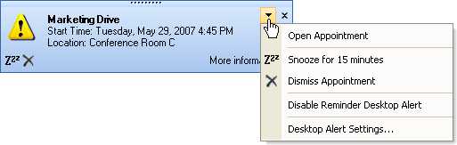

////

|metadata|
{
    "name": "windesktopalert-creating-a-desktop-alert-reminder-for-winschedule",
    "controlName": ["WinDesktopAlert"],
    "tags": ["Application Scenarios","Appointments","How Do I","Scheduling"],
    "guid": "{E48D9A8D-B99C-4DD9-92A6-24726B400957}",  
    "buildFlags": [],
    "createdOn": "0001-01-01T00:00:00Z"
}
|metadata|
////

= Creating a Desktop Alert Reminder for WinSchedule

This section is comprised of three walkthroughs designed to demonstrate the versatility of WinDesktopAlert™ and several of its features. These walkthroughs are intended to be completed in order, as they will be building upon each other. By the end of the third walkthrough, you will have a fully-functioning desktop alert reminder that mimics the functionality of WinSchedule™'s Reminder dialog box.

The desktop alert window is quite similar to WinSchedule's Reminder dialog box, both in design and function. Both the window and dialog box have text fields allowing for a description of an event. They both have a collection of buttons that can be used to open, snooze, or dismiss a reminder. And lastly, they both can handle multiple reminders (WinDesktopAlert can manage multiple windows simultaneously).

Click the following links to learn how to create a desktop alert reminder for WinSchedule.

* link:windesktopalert-displaying-a-desktop-alert-window-when-a-winschedule-reminder-comes-due.html[Displaying a Desktop Alert Window When a WinSchedule Reminder Comes Due] -- In this topic, you will set up the form with the necessary controls/components to create the desktop alert reminder. You will create an appointment with sample information. You will use the  pick:[win-forms="link:{ApiPlatform}win.ultrawinschedule{ApiVersion}~infragistics.win.ultrawinschedule.ultracalendarinfo~beforedisplayappointmentdialog_ev.html[BeforeDisplayReminderDialog]"]  event of WinCalendarInfo™ to cancel the Reminder dialog box and show the desktop alert window. You will then handle WinDesktopAlert's  pick:[win-forms="link:{ApiPlatform}win.misc{ApiVersion}~infragistics.win.misc.ultradesktopalert~desktopalertlinkclicked_ev.html[DesktopAlertLinkClicked]"]  event to open the Appointment dialog box when the end user clicks the caption or text in the desktop alert reminder.
* link:windesktopalert-adding-alert-buttons-to-the-desktop-alert-reminder.html[Adding Alert Buttons to the Desktop Alert Reminder] -- This topic demonstrates how to add Alert buttons to the desktop alert window. You will create the Alert buttons, add them to the  pick:[win-forms="link:{ApiPlatform}win.misc{ApiVersion}~infragistics.win.misc.desktopalertbuttonscollection.html[DesktopAlertButtons]"]  collection, and then handle the  pick:[win-forms="link:{ApiPlatform}win.misc{ApiVersion}~infragistics.win.misc.ultradesktopalert~alertbuttonclicked_ev.html[AlertButtonClicked]"]  event, allowing you to snooze or dismiss the desktop alert reminder.
* link:windesktopalert-adding-a-menu-to-the-desktop-alert-reminders-dropdown-button.html[Adding a Menu to the Desktop Alert Reminder's Drop-Down Button] -- You will learn how to display a menu when the end user clicks the drop-down button on the desktop alert window. You will create a menu using the  pick:[win-forms="link:{ApiPlatform}win.ultrawintoolbars{ApiVersion}~infragistics.win.ultrawintoolbars.popupmenutool.html[PopupMenuTool]"]  of WinToolbarsManager™. This menu will look similar to the Microsoft® Outlook® New Mail Desktop Alert. You will then handle WinToolbarsManager's  pick:[win-forms="link:{ApiPlatform}win.ultrawintoolbars{ApiVersion}~infragistics.win.ultrawintoolbars.ultratoolbarsmanager~toolclick_ev.html[ToolClick]"]  event for the menu items followed by WinDesktopAlert's  pick:[win-forms="link:{ApiPlatform}win.misc{ApiVersion}~infragistics.win.misc.ultradesktopalert~dropdownbuttonclicked_ev.html[DropDownButtonClicked]"]  event to display the menu.