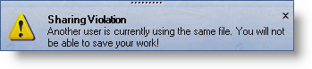

////

|metadata|
{
    "name": "windesktopalert-display-a-desktop-alert-window",
    "controlName": ["WinDesktopAlert"],
    "tags": ["Application Scenarios","Getting Started","How Do I"],
    "guid": "{10AB4589-C3F9-46B4-8AC0-1A040966C0CB}",  
    "buildFlags": [],
    "createdOn": "0001-01-01T00:00:00Z"
}
|metadata|
////

= Display a Desktop Alert Window

If all you need to do is simply show a standard notification with a caption and description (similar to a MessageBox) with all default settings, then this is the topic for you. The second overload for the link:{ApiPlatform}win.misc{ApiVersion}~infragistics.win.misc.ultradesktopalert~show.html[UltraDesktopAlert.Show] method accepts two string parameters: caption and text. The first parameter is the title at the top of the alert window, the second parameter is the text, or description, of whatever you are notifying the end user about.

Use the following code to display a simple desktop alert window similar to the screen shot above.

*In Visual Basic:*

----
' The minimum amount of code to show a desktop alert window.
' The first parameter is the caption (title), the second is 
' the description text.
Me.UltraDesktopAlert1.Show("Sharing Violation", _
  "Another user is currently using the same file. " + _
  "You will not be able to save your work!")
----

*In C#:*

----
// The minimum amount of code to show a desktop alert window.
// The first parameter is the caption (title), the second is 
// the description text.
this.ultraDesktopAlert1.Show("Sharing Violation",
  "Another user is currently using the same file. " +
  "You will not be able to save your work!");
----