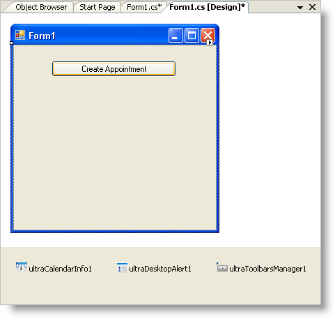
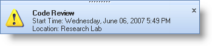

////

|metadata|
{
    "name": "windesktopalert-displaying-a-desktop-alert-window-when-a-winschedule-reminder-comes-due",
    "controlName": ["WinDesktopAlert"],
    "tags": ["Application Scenarios","Appointments","How Do I","Scheduling"],
    "guid": "{2EC5CA05-A9FF-4CB1-8A2A-85D95DF543B2}",  
    "buildFlags": [],
    "createdOn": "0001-01-01T00:00:00Z"
}
|metadata|
////

= Displaying a Desktop Alert Window When a WinSchedule Reminder Comes Due

== Before You Begin

This is the first topic in a three-part walkthrough designed to demonstrate several key WinDesktopAlert™ features working in a common scenario that you might encounter. For more information on this scenario, see link:windesktopalert-creating-a-desktop-alert-reminder-for-winschedule.html[Creating a Desktop Alert Reminder for WinSchedule].

The one property that makes this scenario possible is the link:{ApiPlatform}win.misc{ApiVersion}~infragistics.win.misc.ultradesktopalertwindowinfo~data.html[Data] property off the link:{ApiPlatform}win.misc{ApiVersion}~infragistics.win.misc.ultradesktopalertwindowinfo.html[UltraDesktopAlertWindowInfo] object. This property allows you to pass in an object of any type. This can be any bit of arbitrary data, but in this case, it will be the underlying WinSchedule™ link:{ApiPlatform}win.ultrawinschedule{ApiVersion}~infragistics.win.ultrawinschedule.appointment.html[Appointment] object for which you will be displaying the desktop alert reminder. The event arguments for several of WinDesktopAlert's events include the UltraDesktopAlertWindowInfo object associated with that particular desktop alert window. Because of this, you can pass the Appointment object through to each event using the Data property. Once this concept is understood, the rest of this scenario is as easy as creating buttons and handling events!

== What You Will Accomplish

In this topic, you will set up the form with the necessary controls/components to create the desktop alert reminder. You will create an appointment with sample information. You will use the link:{ApiPlatform}win.ultrawinschedule{ApiVersion}~infragistics.win.ultrawinschedule.ultracalendarinfo~beforedisplayreminderdialog_ev.html[BeforeDisplayReminderDialog] event of WinCalendarInfo™ to cancel the Reminder dialog box and show the desktop alert window. You will then handle WinDesktopAlert's link:{ApiPlatform}win.misc{ApiVersion}~infragistics.win.misc.ultradesktopalert~desktopalertlinkclicked_ev.html[DesktopAlertLinkClicked] event to open the Appointment dialog box when the end user clicks the caption or text in the desktop alert reminder.

== Follow these Steps

[start=1]
. *Set up your form.*

You will need to add a WinButton™, WinCalendarInfo, WinToolbarsManager™, and WinDesktopAlert to your form. Double-click each in the toolbox. The only item that will be placed on the form is the button. Change the name of the button to "Create Appointment". Your form should look similar to the following screen shot.

[start=2]
. Before you start writing any code, you should place using/imports directives in your code-behind so you don't need to always type out a member's fully qualified name.

*In Visual Basic:*

----
Imports Infragistics.Win
Imports Infragistics.Win.Misc
Imports Infragistics.Win.UltraWinSchedule
----

*In C#:*

----
using Infragistics.Win;
using Infragistics.Win.Misc;
using Infragistics.Win.UltraWinSchedule;
----

[start=3]
. Create an instance of UltraDesktopAlertShowWindowInfo class called windowInfo.

*In Visual Basic:*

----
Dim windowInfo As New UltraDesktopAlertShowWindowInfo()
----

*In C#:*

----
UltraDesktopAlertShowWindowInfo windowInfo=new UltraDesktopAlertShowWindowInfo();
----

[start=4]
. *Create the Appointment using the button's Click event.*

Double-click the button to create the Click event handler. In this event, you will be performing two tasks. The first task is creating the Appointment. The appointment will begin one minute from the current time and last for five minutes. You will also set additional properties such as the appointment's subject, description, and location. After you create the appointment, you need to set a few properties on the desktop alert window based on the properties in the appointment. The desktop alert window's caption will be the appointment's subject, and the text will be the appointment's starting time and location. One more important property to set on the desktop alert window is the Data property. Set the Data property to the appointment; this way, you will be able to access this appointment in other events.

*In Visual Basic:*

----
Private Sub UltraButton1_Click(ByVal sender As System.Object, _
  ByVal e As System.EventArgs) Handles UltraButton1.Click
	Dim appt As Appointment = New Appointment(DateTime.Now.AddMinutes(1), _
	  DateTime.Now.AddMinutes(6))
	appt.CalendarInfo = Me.UltraCalendarInfo1
	appt.Subject = "Code Review"
	appt.Description = "Let's discuss how efficient our code base is."
	appt.Location = "Research Lab"
	appt.Reminder.Enabled = True
	Me.windowInfo.Caption = appt.Subject
	Me.windowInfo.Text = _
	  "Start Time: " + _
	  appt.StartDateTime.ToLongDateString() + " " + _
	  appt.StartDateTime.ToShortTimeString() + vbCrLf + _
	  "Location: " + _
	  appt.Location
	Me.windowInfo.Data = appt
End Sub
----

*In C#:*

----
private void ultraButton1_Click(object sender, EventArgs e)
{
	Appointment appt = new Appointment(DateTime.Now.AddMinutes(1), 
	DateTime.Now.AddMinutes(6));
	appt.CalendarInfo = this.ultraCalendarInfo1;
	appt.Subject = "Code Review";
	appt.Description = "Let's discuss how efficient our code base is.";
	appt.Location = "Research Lab";
	appt.Reminder.Enabled = true;
	this.windowInfo.Caption = appt.Subject;
	this.windowInfo.Text = 
	  "Start Time: " + 
	  appt.StartDateTime.ToLongDateString() + " " +
	  appt.StartDateTime.ToShortTimeString() + "\n" +
	  "Location: " +
	  appt.Location;
	this.windowInfo.Data = appt;
}
----

[start=5]
. *Cancel the Reminder dialog box and show the desktop alert window* .

You need to create the event handler for WinCalendarInfo's BeforeDisplayReminderDialog event. This is accomplished differently depending on whether you are in a Visual Basic project or a C# project.

*Visual Basic* – Right-click your main form (Form1.cs by default) in the Solution Explorer and click View Code. In the code-behind, you will see two drop-down lists just above the code window. In the left drop-down list, select UltraCalendarInfo1 . The second drop-down list will then be populated with UltraCalendarInfo1's members. Find the BeforeDisplayReminderDialog event in the right drop-down list and click it. Visual Studio creates the event handler for you.

*C#* - In Design View, ensure that ultraCalendarInfo1 is selected in the component tray. In the Properties window, under the events section, double-click the BeforeDisplayReminderDialog event. Visual Studio creates the event handler for you.

Now that you've created the event handler, you need to cancel the Reminder dialog box. Simply set the Cancel property off the EventArgs to True. Now that the Reminder dialog box won't appear, you need to show the desktop alert reminder. This is also very easy to do. Call the link:{ApiPlatform}win.misc{ApiVersion}~infragistics.win.misc.ultradesktopalert~show.html[Show] method off the link:{ApiPlatform}win.misc{ApiVersion}~infragistics.win.misc.ultradesktopalert.html[UltraDesktopAlert] component and pass in the UltraDesktopAlertShowWindowInfo object created in step 1.

*In Visual Basic:*

----
Private Sub UltraCalendarInfo1_BeforeDisplayReminderDialog( _
  ByVal sender As Object, _
  ByVal e As Infragistics.Win.UltraWinSchedule.CancelableAppointmentEventArgs) _
  Handles UltraCalendarInfo1.BeforeDisplayReminderDialog
        e.Cancel = True
        Me.UltraDesktopAlert1.Show(Me.windowInfo)
    End Sub
----

*In C#:*

----
private void ultraCalendarInfo1_BeforeDisplayReminderDialog(object sender,
  CancelableAppointmentEventArgs e)
{
	e.Cancel = true;
	this.ultraDesktopAlert1.Show(this.windowInfo);
}
----

[start=6]
. *Open the Appointment dialog box when the desktop alert window's link is clicked* .

The WinDesktopAlert component has three text areas that the end user can click as if clicking a link. These areas are the Caption, Text, and FooterText. The underlying mechanism uses the link:{ApiPlatform}win{ApiVersion}~infragistics.win.formattedlinklabel.formattedlinkeditor.html[FormattedLinkEditor] object to display text and handle LinkClicked events. Therefore, you can use formatted text in these three properties as well as perform tasks when any of the text is clicked, such as open the Appointment dialog box.

Since this desktop alert window doesn't have footer text, and it doesn't matter to us whether the end user clicks the caption (appointment subject) or the text (appointment time and location). All you need to do is call WinCalendarInfo's link:{ApiPlatform}win.ultrawinschedule{ApiVersion}~infragistics.win.ultrawinschedule.ultracalendarinfo~displayappointmentdialog.html[DisplayAppointmentDialog] method and pass in a reference to the appointment through WindowInfo's Data property off the EventArgs.

.Note
[NOTE]
====
If it did matter which link the end user clicked, you could use either an IF/ELSE statement or a switch/select statement to test which link the end user clicked using the link:{ApiPlatform}win.misc{ApiVersion}~infragistics.win.misc.desktopalertlinktype.html[DesktopAlertLinkType] property off the EventArgs.
====

Create the event handler for WinDesktopAlert's DesktopAlertLinkClicked event in the same manner as described in step 2.

*In Visual Basic:*

----
' NOTE: This event will only fire if the 
' link has anchor tags wrapped around it!!!
Private Sub UltraDesktopAlert1_DesktopAlertLinkClicked(ByVal sender As Object, _
  ByVal e As Infragistics.Win.Misc.DesktopAlertLinkClickedEventArgs) _
  Handles UltraDesktopAlert1.DesktopAlertLinkClicked
	Dim appt As Appointment = e.WindowInfo.Data
	Me.UltraCalendarInfo1.DisplayAppointmentDialog(appt)
End Sub
----

*In C#:*

----
// NOTE: This event will only fire if the 
// link has anchor tags wrapped around it!!!
private void ultraDesktopAlert1_DesktopAlertLinkClicked(object sender,
  DesktopAlertLinkClickedEventArgs e)
{
	this.ultraCalendarInfo1.DisplayAppointmentDialog(e.WindowInfo.Data 
	  as Appointment);
}
----

[start=7]
. *Run the application*

When you run the application and click the button, an appointment is created. Since the reminder is enabled and the default reminder interval is 15 minutes, the desktop alert reminder pops up. The next step is link:windesktopalert-adding-alert-buttons-to-the-desktop-alert-reminder.html[Adding Alert Buttons to the Desktop Alert Reminder].

