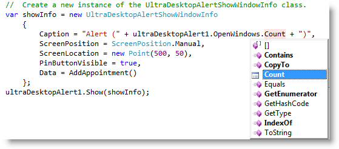

////

|metadata|
{
    "name": "windesktopalert-exposing-openalert-windows",
    "controlName": ["WinDesktopAlert"],
    "tags": ["Application Scenarios","How Do I","Scheduling"],
    "guid": "d3652c8b-5fd6-40f6-b9c2-d93dd85c5e57",  
    "buildFlags": [],
    "createdOn": "2013-02-20T21:03:19.7760275Z"
}
|metadata|
////

= Exposing OpenAlert Windows

== Topic Overview

=== Purpose

This topic provides an overview of the  _WinDesktopAlert_™ feature allowing you to expose and navigate open window desktop alerts.

=== Required background

The following topic is a prerequisite to understanding this topic:

[options="header", cols="a,a"]
|====
|Topic|Purpose

| link:windesktopalert-understanding-windesktopalert.html[Understanding WinDesktopAlert]
|The topics in this section will give you a better idea of why you would want to use _WinDesktopAlert_™ in your applications.

|====

=== In this topic

This topic contains the following sections:

* <<_Ref348021830,Expose Open Windows Overview>>

** <<_Ref341518673,Introduction>>
** <<_Ref348350555,Code Illustration>>

* <<_Ref341518687,Related Content>>

[[_Ref348021830]]
== Expose Open Windows Overview

[[_Ref341518673]]

=== Introduction

Earlier version the  _UltraDesktopAlert_   did not expose the open windows collection requiring you to invoke the `IsOpen` method passing a Key or previously stored instance of an link:{ApiPlatform}win.misc{ApiVersion}~infragistics.win.misc.ultradesktopalertwindowinfo_members.html[UltraDesktopAlertWindowInfo] in order to traverse the open windows.

The newly enhanced feature, presented here, makes it much easier to query the collection of open windows using the link:{ApiPlatform}win.misc{ApiVersion}~infragistics.win.misc.ultradesktopalert~openwindows.html[OpenWindows] property exposes a read-only version of the collection that internally tracks open windows.

Users can traverse the collection of each link:{ApiPlatform}win.misc{ApiVersion}~infragistics.win.misc.ultradesktopalertwindowinfo_members.html[UltraDesktopAlertWindowInfo] object currently displayed and retrieve the count of the collection through the `ReadOnlyCollection` object; returned by the link:{ApiPlatform}win.misc{ApiVersion}~infragistics.win.misc.ultradesktopalert~openwindows.html[OpenWindows] property.

.Note:
[NOTE]
====
Adding new windows to the collection and displaying the windows within the collection requires you to use the previously defined architecture.
====

[[_Ref348021859]]

=== Code Illustration

The following IDE screenshot shows a code example, triggered by a button-click event for retrieving the count of open alert windows from the link:{ApiPlatform}win.misc{ApiVersion}~infragistics.win.misc.ultradesktopalert~openwindows.html[OpenWindows] collection. Other properties and methods are also available as shown in the IntelliSense drop-down.

The open windows collection works best when paired with the link:{ApiPlatform}win.misc{ApiVersion}~infragistics.win.misc.ultradesktopalert~autoclose.html[AutoClose] property set to  _false,_   and the link:{ApiPlatform}win.misc{ApiVersion}~infragistics.win.misc.ultradesktopalert~multiplewindowdisplaystyle.html[MultipleWindowDisplayStyle] set to anything other than  _Default_   or  _None_  , otherwise it will always contain one alert window, for example:

*In C#:*

[source,csharp]
----
ultraDesktopAlert1.AutoClose = Infragistics.Win.DefaultableBoolean.False;
ultraDesktopAlert1.MultipleWindowDisplayStyle = MultipleWindowDisplayStyle.Tiled;
----

*In Visual Basic:*

[source,vb]
----
ultraDesktopAlert1.AutoClose = Infragistics.Win.DefaultableBoolean.[False]
ultraDesktopAlert1.MultipleWindowDisplayStyle = MultipleWindowDisplayStyle.Tiled
----

[[_Ref341518687]]
== Related Content

=== Topics

The following topic provides additional information related to this topic.

[options="header", cols="a,a"]
|====
|Topic|Purpose

| link:win-windesktopalert-using-windesktopalert.html[Using WinDesktopAlert]
|In this section, you'll find short, task-based topics that explain how to perform a specific task related to the _WinDesktopAlert_ component.

|====