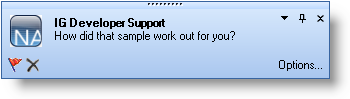
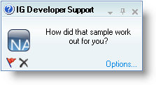

////

|metadata|
{
    "name": "windesktopalert-new-windesktopalert-component-whats-new-20072",
    "controlName": [],
    "tags": [],
    "guid": "{B36A5ACE-8D0F-4774-A55F-6A3EE9E67F0A}",  
    "buildFlags": [],
    "createdOn": "0001-01-01T00:00:00Z"
}
|metadata|
////

= New WinDesktopAlert Component

You're working hard at your computer, deep in thought about a new block of code that has been causing problems. You're also waiting for a critical e-mail from a colleague that should clear this mess up. While pounding away at the code, you receive numerous e-mails of little consequence. They don't bother you because they are popping up unobtrusively in a small desktop alert window. Finally, at-a-glance, you notice the e-mail you've been waiting for and click the subject line, opening the full e-mail. This is the power of the new WinDesktopAlert™ component.

The WinDesktopAlert component is similar in look and feel to both the Microsoft® Outlook® Desktop Alerts and the Windows Live™ Messenger alerts. The desktop alert window is completely customizable through our link:win-presentation-layer-framework-plf.html[Presentation Layer Framework]™, exposing link:win-appearance-objects.html[Appearance] objects for most UI elements. Each desktop alert window has a full event model allowing the end user to click just about anywhere on the window to perform whatever function best suits your application. The best part about the WinDesktopAlert component is that it's so easy to use! Simply call the  pick:[win-forms="link:{ApiPlatform}win.misc{ApiVersion}~infragistics.win.misc.ultradesktopalert~show.html[Show]"]  method, provide a caption and text, and the desktop alert window will display with default settings.

=== Office 2007 Style

The desktop alert window is a mirror image of the Outlook Desktop Alert that businesses everywhere have become familiar with. WinDesktopAlert exposes all the functionality of the Outlook Desktop Alert, enabling you to completely emulate the functionality that Outlook offers. Coupled with our WinSchedule™ suite of controls, you can alert your end user of upcoming appointments.

=== Windows Live Messenger Style

Windows Live Messenger is the next generation of the Windows® Messaging service. Along with several other features, the Messenger alerts were given a complete makeover. WinDesktopAlert allows you to use this style of alerts to complement your own instant messaging service. Or perhaps you want to use this style of alert for standard notifications such as database updates and system messages.

== Related Topics

link:windesktopalert-about-windesktopalert.html[About WinDesktopAlert]

link:win-windesktopalert-using-windesktopalert.html[Using WinDesktopAlert]

link:windesktopalert-the-look-and-feel-of-windesktopalert.html[The Look and Feel of WinDesktopAlert]