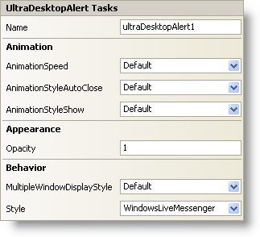

////

|metadata|
{
    "name": "windesktopalert-smart-tag",
    "controlName": ["WinDesktopAlert"],
    "tags": ["API","Design Environment"],
    "guid": "{A962EFEC-1690-4F2F-BB6C-F7047FD563DE}",  
    "buildFlags": [],
    "createdOn": "0001-01-01T00:00:00Z"
}
|metadata|
////

= WinDesktopAlert Smart Tag

In Visual Studio 2005 (.NET Framework 2.0), each Infragistics Windows Forms control/component is equipped with a Smart Tag. By simply selecting the control/component, a Smart Tag anchor appears. When you click this anchor, a pop-up panel appears, providing you with quick and easy access to the most common properties and settings of the control/component.

The WinDesktopAlert™ Smart Tag contains the name of the control, as well as the following sections:

* Animation -- Provides access to properties that manipulate the movement of the component.
* Appearance -- Provides common tasks involving the appearance, look, and feel of the component.
* Behavior -- Provides easy access to properties that govern how the control behaves on the form.

See below for a description of the item (e.g., field, drop-down list, checkbox) in each section, as well as the item's corresponding property in the properties grid.

[options="header", cols="a,a,a"]
|====
|Animation|Description|Corresponding Property

|AnimationSpeed
|Determines how slow or fast the desktop alert window will fade or scroll in and out.
| pick:[win-forms="link:infragistics4.win.misc.v{ProductVersion}~infragistics.win.misc.ultradesktopalert~animationspeed.html[AnimationSpeed]"] 

|AnimationStyleAutoClose
|If the AutoClose property is set to True (default), The desktop alert window will automatically close in the manner described by this property: by fading, scrolling, or both.
| pick:[win-forms="link:infragistics4.win.misc.v{ProductVersion}~infragistics.win.misc.ultradesktopalert~animationstyleautoclose.html[AnimationStyleAutoClose]"] 

|AnimationStyleShow
|When the desktop alert window appears, you can have it fade in, scroll in, or a combination of both.
| pick:[win-forms="link:infragistics4.win.misc.v{ProductVersion}~infragistics.win.misc.ultradesktopalert~animationstyleshow.html[AnimationStyleShow]"] 

|====

[options="header", cols="a,a,a"]
|====
|Appearance|Description|Corresponding Property

|Opacity
|This property determines how transparent the desktop alert window is. Set the Opacity property to 0 for full transparency (the window will be invisible) or set it to 1 for full opacity (you will see nothing behind the window).
| pick:[win-forms="link:infragistics4.win.misc.v{ProductVersion}~infragistics.win.misc.ultradesktopalert~opacity.html[Opacity]"] 

|====

[options="header", cols="a,a,a"]
|====
|Behavior|Description|Corresponding Property

|MultipleWindowDisplayStyle
|If your end user has multiple desktop alert windows open simultaneously, this property governs whether the windows are tiled or if they overlap. Setting this property to None will disallow multiple desktop alert windows.
| pick:[win-forms="link:infragistics4.win.misc.v{ProductVersion}~infragistics.win.misc.ultradesktopalert~multiplewindowdisplaystyle.html[MultipleWindowDisplayStyle]"] 

|Style
|Change the entire look and feel of the desktop alert window from Office 2007 (default), to Windows Live Messenger.
| pick:[win-forms="link:infragistics4.win.misc.v{ProductVersion}~infragistics.win.misc.ultradesktopalert~style.html[Style]"] 

|====