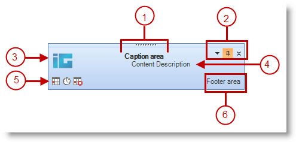

////

|metadata|
{
    "name": "windesktopalert-the-look-and-feel-of-windesktopalert",
    "controlName": ["WinDesktopAlert"],
    "tags": ["Styling"],
    "guid": "{EB3844FF-EADF-44BA-B06B-08BE8BD9F167}",  
    "buildFlags": [],
    "createdOn": "0001-01-01T00:00:00Z"
}
|metadata|
////

= The Look and Feel of WinDesktopAlert

The desktop alert window of WinDesktopAlert™ comes in two flavors:

== Office2007

== WindowsLiveMessenger

Both styles are very similar in looks and functionality, but are designed for very different purposes. The Office2007 style takes after the Microsoft® Outlook® New Mail Desktop Alerts. You can use this style of desktop alert along with your own mail program, or even use it in conjunction with our WinCalendarInfo™ component as a link:windesktopalert-creating-a-desktop-alert-reminder-for-winschedule.html[Desktop Alert Reminder].

The WindowsLiveMessenger style mimics the Windows Live Messenger instant messaging application. Use this style of desktop alert with your own instant messenger client or to broadcast quick updates to your end user about critical system events. Of course, you can change the entire look of both desktop alert windows with the help of the link:win-presentation-layer-framework-plf.html[Presentation Layer Framework]™ (PLF) and link:win-appearance-objects.html[Appearance] objects. You can also quickly change the look of the desktop alert window by modifying the link:{ApiPlatform}win{ApiVersion}~infragistics.win.office2007colortable.html[Office2007ColorTable] and even adding a link:win-blend-a-custom-color-with-office-2007-style-color-schemes.html[custom color blend].

Below is a list highlighting the features and differences of the two styles of desktop alert windows. The numbers in the list correspond to the callouts in the screen shot above.

[start=1]
. *Caption Area* -- The Caption area encompasses a little more in the WindowsLiveMessenger style than the Office2007 style. The WindowsLiveMessenger style includes a  pick:[win-forms="link:{ApiPlatform}win.misc{ApiVersion}~infragistics.win.misc.ultradesktopalert~captionareaappearance.html[CaptionAreaAppearance]"]  object which allows you to set an image as seen in the second screen shot above. The text in the Caption area is the same, however, between both styles. Set the  pick:[win-forms="link:{ApiPlatform}win.misc{ApiVersion}~infragistics.win.misc.ultradesktopalertshowwindowinfo~caption.html[Caption]"]  property to add a caption to your desktop alert window.
[start=2]
. *Drop-down, Pin, and Close buttons* -- This area is the same in both styles. The Close button is always visible, but the drop-down button and Pin button always default to Hidden. You need to specifically set the  pick:[win-forms="link:{ApiPlatform}win.misc{ApiVersion}~infragistics.win.misc.ultradesktopalert~dropdownbuttonvisible.html[DropDownButtonVisible]"]  and  pick:[win-forms="link:{ApiPlatform}win.misc{ApiVersion}~infragistics.win.misc.ultradesktopalertshowwindowinfo~pinbuttonvisible.html[PinButtonVisible]"]  properties to DefaultableBoolean.True and True respectively in order to display them.
[start=3]
. *Image* -- By default, WinDesktopAlert displays separate images for the  pick:[win-forms="link:{ApiPlatform}win.misc{ApiVersion}~infragistics.win.misc.ultradesktopalertshowwindowinfo~image.html[Image]"]  property for both styles of desktop alert window. Also, you can change the color of the border around the image area using the  pick:[win-forms="link:{ApiPlatform}win.misc{ApiVersion}~infragistics.win.misc.ultradesktopalert~mainimageareabordercolor.html[MainImageAreaBorderColor]"]  property. In WindowsLiveMessenger style, this border defaults to a light bluish color; in Office2007 style, the border defaults to Color.Transparent. Set the MainImageAreaBorderColor property to Transparent to remove the border, or any other color to add a border.
[start=4]
. *Text Area* -- This area is occupied by the value of the  pick:[win-forms="link:{ApiPlatform}win.misc{ApiVersion}~infragistics.win.misc.ultradesktopalertshowwindowinfo~text.html[Text]"]  property. The text area can be link:winformattedlinklabel-formatting-text-and-hyperlinks.html[formatted text].
[start=5]
. *Alert Buttons* -- Displays a collection of Alert buttons.  pick:[win-forms="link:{ApiPlatform}win.misc{ApiVersion}~infragistics.win.misc.ultradesktopalertbutton.html[UltraDesktopAlertButtons]"]  are added to the  pick:[win-forms="link:{ApiPlatform}win.misc{ApiVersion}~infragistics.win.misc.desktopalertbuttonscollection.html[DesktopAlertButtonsCollection]"] . The buttons are always displayed in the lower-left corner of the desktop alert window unless the collection is empty; which in that case, no buttons are displayed.
[start=6]
. *Footer Text* -- The  pick:[win-forms="link:{ApiPlatform}win.misc{ApiVersion}~infragistics.win.misc.ultradesktopalertshowwindowinfo~footertext.html[FooterText]"]  is always displayed in the lower-right corner of the desktop alert window. When the end user clicks the FooterText, you can handle the DesktopAlertLinkClicked event and perform an action by specifying which action to perform when a specific link:{ApiPlatform}win.misc{ApiVersion}~infragistics.win.misc.desktopalertlinktype.html[link type] is clicked.