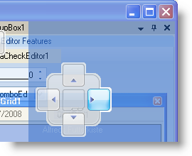

////

|metadata|
{
    "name": "windockmanager-change-windockmanagers-style",
    "controlName": ["WinDockManager"],
    "tags": ["Styling"],
    "guid": "{6EAA6393-8F06-4777-95E8-18DFC89B5158}",  
    "buildFlags": [],
    "createdOn": "0001-01-01T00:00:00Z"
}
|metadata|
////

= Change WinDockManager's Style

Most Infragistics Professional Windows Forms controls and components expose properties allowing you to change the look and feel of the component to a familiar Microsoft® operating system (i.e. Windows® XP or Vista™) or application (Microsoft Office® or Visual Studio®). WinDockManager™ exposes two properties that help you easily change WinDockManager's style.

link:{ApiPlatform}win.ultrawindock{ApiVersion}~infragistics.win.ultrawindock.ultradockmanager~windowstyle.html[WindowStyle] – The WindowStyle property changes the look and feel of each window contained in a pane; this includes the header, pin button, and close button.

link:{ApiPlatform}win.ultrawindock{ApiVersion}~infragistics.win.ultrawindock.ultradockmanager~dragindicatorstyle.html[DragIndicatorStyle] – When you click a window's header and drag it, you are presented with a visual cue as to where you can place that window. These drag indicators have three styles you can choose from, exposed by the DragIndicatorStyle enumeration.

The following example code sets the visual style of WinDockManager's windows to Visual Studio 2008 while setting the visual style of the drag indicators to Windows Vista.

*In Visual Basic:*

----
Me.UltraDockManager1.WindowStyle = _
	Infragistics.Win.UltraWinDock.WindowStyle.VisualStudio2008
Me.UltraDockManager1.DragIndicatorStyle = _
	Infragistics.Win.UltraWinDock.DragIndicatorStyle.VisualStudio2008Vista
----

*In C#:*

----
this.ultraDockManager1.WindowStyle = 
	Infragistics.Win.UltraWinDock.WindowStyle.VisualStudio2008;
this.ultraDockManager1.DragIndicatorStyle = 
	Infragistics.Win.UltraWinDock.DragIndicatorStyle.VisualStudio2008Vista;
----