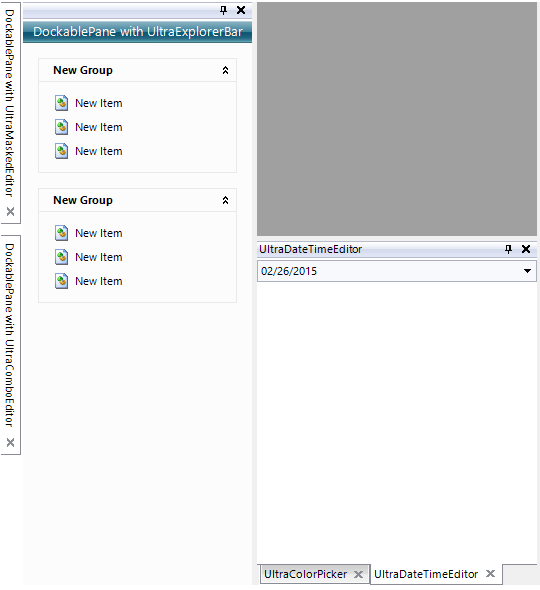
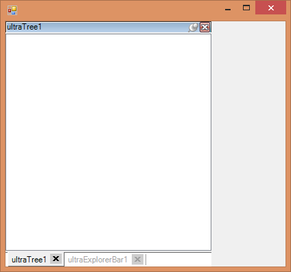

////
|metadata|
{
    "name": "windockmanager-close-buttons-on-tabs",
    "controlName": [],
    "tags": [],
    "guid": "6fa86f8f-5288-4863-94b5-ed07f0eed641",
    "buildFlags": [],
    "createdOn": "2015-02-27T20:59:12.2659871Z"
}
|metadata|
////

= Close Buttons on Tabs

== Close Buttons on Tabs

=== Purpose

This topic introduces the ability to place a close button on the tabs of a tabbed docked area.

=== Required background

The following topics are prerequisites to understanding this topic:

[options="header", cols="a,a"]
|====
|Topic|Purpose

| link:windockmanager-understanding-windockmanager.html[Understanding WinDockManager]
|Explains how to get started with the WinDockManager component.

|====

=== In this topic

This topic contains the following sections:

* <<CloseButtonLocations,Close Button Locations>>

** <<Overview,Overview>>
** <<Preview,Preview>>

* <<CloseButtonProperties,CloseButton Properties>>
* <<AddingCloseButtontoWinDockManager,Adding Close Button to WinDockManager>>

** <<Example,Example>>

* <<RelatedTopic,Related Topic>>

[[CloseButtonLocations]]
== Close Button Locations

[[Overview]]

=== Overview

In previous versions, the close buttons for tabs were only available in the caption area of a pane. With the addition of the  _CloseButtonLocation_  property, the close button can also appear on the tab itself for any tabbed dock area.

[[Preview]]

=== Preview

The following screenshot is a preview of the close button appearing in the caption area, tabs of a tab group, and an unpinned tab.

[[CloseButtonProperties]]
== CloseButton Properties

=== CloseButton property summary

The  _CloseButtonLocation_  property determines the display areas of the close button. The  _CloseButtonLocation_  property has been added to the  _GroupSettings_  object of the WinDockManager.

[options="header", cols="a,a,a"]
|====
|Property Name|Property Type|Description

|CloseButtonLocation
|CloseButtonLocation
|A flags enum that defines the areas the close button can now render.

|====

The following table summarizes the values of the CloseButtonLocation enum.

[options="header", cols="a,a"]
|====
|Property Name|Description

|Default
|This is the default value. The CloseButtonLocation is resolved using GroupSettings on both the specified pane and the owning WinDockManager. The Default values for both these settings will resolve to Caption.

|Caption
|The close button appears only in the caption area.

|TabGroup
|The close button appears in every TabItem within the TabGroup.

|TabGroupSelectedTab
|The close button appears in the Selected TabItem within the TabGroup and not in the other TabItems.

|AutoHide
|The close button appears in the tabs created in the UnpinnedTabArea when the pane is unpinned.

|AutoHideSelectedTab
|The close button appears in the Selected tab in the UnpinnedTabArea when the pane is unpinned and not the other unpinned tabs within the same group.

|AllTabs
|The close button will appear in every available TabItem, essentially combining TabGroup and AutoHide.

|AllSelectedTabs
|The close button will appear in the selected TabItems within a group, essentially combining TabGroupSelectedTab and AutoHideSelectedTab.

|All
|The close button will appear in all possible locations.

|====

[[AddingCloseButtontoWinDockManager]]
== Adding Close Button to WinDockManager

[[Example]]

=== Example

The screenshot below demonstrates how the WinDockManager component with a WinTree and a WinExplorerBar docked as a TabGroup looks as a result of setting the DefaultGroupSettings.CloseButtonLocation property to All:

[options="header", cols="a,a"]
|====
|Property|Value

|DefaultGroupSettings.CloseButtonLocation
|All

|====

*In C#:* 

[source]
---- 
// Set the DefaultGroupSettings.CloseButtonLocation property to All. 
this.ultraDockManager1.DefaultGroupSettings.CloseButtonLocation = Infragistics.Win.UltraWinDock.CloseButtonLocation.All; 
// Dock some controls as a TabGroup. 
Infragistics.Win.UltraWinDock.DockAreaPane dockAreaPane = this.ultraDockManager1.DockControls( 
 new Control[] { this.ultraTree1, this.ultraExplorerBar1 },
 Infragistics.Win.UltraWinDock.DockedLocation.DockedLeft,
 Infragistics.Win.UltraWinDock.ChildPaneStyle.TabGroup);
---- 

*In Visual Basic:* 

---- 
' Set the DefaultGroupSettings.CloseButtonLocation property to All. 
Me.UltraDockManager1.DefaultGroupSettings.CloseButtonLocation = 
Infragistics.Win.UltraWinDock.CloseButtonLocation.All 
' Dock some controls as a TabGroup. 
Dim dockAreaPane As Infragistics.Win.UltraWinDock.DockAreaPane = Me.UltraDockManager1.DockControls( 
 New Control() { Me.UltraTree1, Me.UltraExplorerBar1 }, 
Infragistics.Win.UltraWinDock.DockedLocation.DockedLeft, 
Infragistics.Win.UltraWinDock.ChildPaneStyle.TabGroup)
----

[[RelatedTopcic]]
== Related Content

=== Topics

The following topics provide additional information related to this topic:

[options="header", cols="a,a"]
|====
|Topic|Purpose

| link:wingrid-using-the-column-chooser-feature.html[Using the Column Chooser Feature]
|Contains general information related to using the _WinGrid_™ Column Chooser feature.

|====