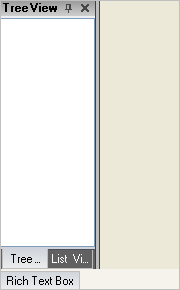

////

|metadata|
{
    "name": "windockmanager-docking-controls-with-windockmanager-through-code",
    "controlName": ["WinDockManager"],
    "tags": ["Layouts"],
    "guid": "{AD505A49-8498-4392-88A9-CA921B46549B}",  
    "buildFlags": [],
    "createdOn": "2005-07-07T00:00:00Z"
}
|metadata|
////

= Docking Controls with WinDockManager through Code

== Background

The WinDockManager™ allows controls to be docked to the sides of a application in panes, or windows. These panes can contain a single control or multiple controls. This topic will show you how to arrange these panes in code.

== Questions

* How do I dock a window in code?

== Solution

There are four main objects that you need to know about when docking windows in code.

[start=1]
. pick:[win-forms="link:{ApiPlatform}win.ultrawindock{ApiVersion}~infragistics.win.ultrawindock.dockablecontrolpane.html[DockableControlPane]"]  - The simplest pane, it holds a single control.
[start=2]
. pick:[win-forms="link:{ApiPlatform}win.ultrawindock{ApiVersion}~infragistics.win.ultrawindock.dockablegrouppane.html[DockableGroupPane]"]  - A pane that holds multiple DockableControlPanes.
[start=3]
. pick:[win-forms="link:{ApiPlatform}win.ultrawindock{ApiVersion}~infragistics.win.ultrawindock.dockareapane.html[DockAreaPane]"]  - The pane that corresponds to a particular edge of the application.
[start=4]
. pick:[win-forms="link:{ApiPlatform}win.ultrawindock{ApiVersion}~infragistics.win.ultrawindock.ultradockmanager.html[UltraDockManager]"]  - The manager of all the docking panes.

Using these four objects, we can dock whatever controls we want to the side of a form or other container.

== Sample Project

Start a new project, and place three controls on to a form -- a UltraDockManager ListView, a TreeView, and a RichTextBox. Arrange the controls on the form any way you want. In the Form load add the following code:

*In Visual Basic:*

----
Imports Infragistics.Win.UltraWinDock
...
Private Sub Docking_Controls_with_WinDockManager_through_Code_Load( _
  ByVal sender As System.Object, _
  ByVal e As System.EventArgs) Handles MyBase.Load
	SuspendLayout()
	Dim dcpTreeView As New DockableControlPane("tree", "Tree View", TreeView1)
	Dim dcpListView As New DockableControlPane("list", "List View", ListView1)
	Dim dcpRichText As New DockableControlPane("rtb", "Rich Text Box", RichTextBox1)
	Dim dgpTreeList As New DockableGroupPane()
	dgpTreeList.ChildPaneStyle = ChildPaneStyle.TabGroup
	dgpTreeList.Panes.Add(dcpTreeView)
	dgpTreeList.Panes.Add(dcpListView)
	Dim dapLeft As New DockAreaPane(DockedLocation.DockedLeft)
	dapLeft.Panes.Add(dgpTreeList)
	Dim dapBottom As New DockAreaPane(DockedLocation.DockedBottom)
	dapBottom.Panes.Add(dcpRichText)
	dcpRichText.Unpin()
	dcpRichText.FlyoutSize = New Size(0, 100)
	Me.UltraDockManager1.DockAreas.Add(dapLeft)
	Me.UltraDockManager1.DockAreas.Add(dapBottom)
	ResumeLayout()
End Sub
----

*In C#:*

----
using Infragistics.Win.UltraWinDock;
...
private void Docking_Controls_with_WinDockManager_through_Code_Load(object sender, 
  EventArgs e)
{
	SuspendLayout();
	DockableControlPane dcpTreeView = 
	  new DockableControlPane("tree", "Tree View", this.treeView1);
	DockableControlPane dcpListView = 
	  new DockableControlPane("list", "List View", this.listView1);
	DockableControlPane dcpRichText = 
	  new DockableControlPane("rtb", "Rich Text Box", this.richTextBox1);
	DockableGroupPane dgpTreeList = new DockableGroupPane();
	dgpTreeList.ChildPaneStyle = ChildPaneStyle.TabGroup;
	dgpTreeList.Panes.Add(dcpTreeView);
	dgpTreeList.Panes.Add(dcpListView);
	DockAreaPane dapLeft = new DockAreaPane(DockedLocation.DockedLeft);
	dapLeft.Panes.Add(dgpTreeList);
	DockAreaPane dapBottom = new DockAreaPane(DockedLocation.DockedBottom);
	dapBottom.Panes.Add(dcpRichText);
	dcpRichText.Unpin();
	dcpRichText.FlyoutSize = new Size(0, 100);
	this.ultraDockManager1.DockAreas.Add(dapLeft);
	this.ultraDockManager1.DockAreas.Add(dapBottom);
	ResumeLayout();
}
----

Build and run the project. You should see something to the following appear.

We will now review the code shown above to explain in more detail what each line is doing.

== Code Discussion

The suspend layout method call is not entirely necessary, but it makes the code more efficient because it prevents the sizing logic from being performed while we set up all the panes.

----
SuspendLayout()
----

The first objects you will create are the dockable control panes. You need one of these for each of the controls you want to dock. Set up the key for the pane, the title, and which control it should wrap.

----
Dim dcpTreeView As New DockableControlPane("tree", "Tree View", TreeView1)
Dim dcpListView As New DockableControlPane("list", "List View", ListView1)
Dim dcpRichText As New DockableControlPane("rtb", "Rich Text Box", RichTextBox1)
----

Next we will set up the group that will contain the ListView and the TreeView. You want the style of the group to be tabs, so you must set the ChildPaneStyle property. Then all you do is add the control panes to the group pane.

----
Dim dgpTreeList As New DockableGroupPane()
dgpTreeList.ChildPaneStyle = ChildPaneStyle.TabGroup
dgpTreeList.Panes.Add(dcpTreeView)
dgpTreeList.Panes.Add(dcpListView)
----

The dock area panes are the last objects instantiated. First you create the dock area pane for the left side, and add the group containing the Tree and the List to it. Do the same thing for the rich text box, but dock that one at the bottom.

----
Dim dapLeft As New DockAreaPane(DockedLocation.DockedLeft)
dapLeft.Panes.Add(dgpTreeList)
Dim dapBottom As New DockAreaPane(DockedLocation.DockedBottom)
dapBottom.Panes.Add(dcpRichText)
----

To keep the docked windows at the bottom unpinned, unpin it with this code. This creates a problem, however. If you unpin it in code before a size has been set, it will fly-out to a size of 0 pixels. To prevent this, set a new flyout size. You can set the size to 100 pixels in each direction, in case the user decides to move the rich text box to one of the side dock areas.

----
dcpRichText.Unpin()
dcpRichText.FlyoutSize = New Size(100, 100)
----

The final step is to let the UltraDockManager know that these panes have been created. The DockAreas are registered by adding them to the DockAreas collection.

----
UltraDockManager1.DockAreas.Add(dapLeft)
UltraDockManager1.DockAreas.Add(dapBottom)
----

Now enable the form to perform its layout processing.

----
ResumeLayout()
----

== Review

In this exercise you learned how to create new dockable windows for controls, and how to group controls together.