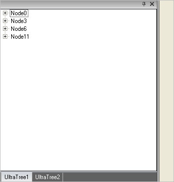

////

|metadata|
{
    "name": "windockmanager-group-multiple-windows-together",
    "controlName": ["WinDockManager"],
    "tags": ["Localization"],
    "guid": "{731B8EA9-C225-44E6-A9C6-6BBD46DC80AA}",  
    "buildFlags": [],
    "createdOn": "2005-07-07T00:00:00Z"
}
|metadata|
////

= Group Multiple Windows Together

The grouping of windows is accomplished by simply dragging the window around the application. If the window forms to a specific target area, it can be grouped there. Grouping of windows with the WinDockManager™ component will mimic the grouping of windows within Visual Studio.NET.

Use the following code to group windows by creating a DockableGroupPane, and then adding DockableControlPanes to the Panes collection:

*In Visual Basic:*

----
Imports Infragistics.Win.UltraWinDock
...
Private Sub Group_Multiple_Windows_Together_Load(ByVal sender As Object, _
  ByVal e As System.EventArgs) Handles MyBase.Load
	Dim dgpWinTree As New DockableGroupPane()
	Dim dapWinTree As New DockAreaPane(DockedLocation.DockedLeft)
	Dim dcpWinTree1 As New DockableControlPane()
	Dim dcpWinTree2 As New DockableControlPane()
	' Add the controls to the DockableControlPanes
	dcpWinTree1.Control = Me.UltraTree1
	dcpWinTree1.TextTab = "UltraTree1"
	dcpWinTree2.Control = Me.UltraTree2
	dcpWinTree2.TextTab = "UltraTree//2"
	' Set the Style to display the panes in
	dgpWinTree.ChildPaneStyle = ChildPaneStyle.TabGroup
	' Add the DockableControlPanes to the DockableGroupPane
	dgpWinTree.Panes.Add(dcpWinTree1)
	dgpWinTree.Panes.Add(dcpWinTree2)
	' Add the DockableGroupPane to the DockAreaPane
	dapWinTree.Panes.Add(dgpWinTree)
	' Add the newly created DockAreaPane to the UltraDockManager's DockAreas collection
	Me.UltraDockManager1.DockAreas.Add(dapWinTree)
End Sub
----

*In C#:*

----
using Infragistics.Win.UltraWinDock;
...
private void Group_Multiple_Windows_Together_Load(object sender, EventArgs e)
{
	DockableGroupPane dgpWinTree = new DockableGroupPane();
	DockAreaPane dapWinTree = new DockAreaPane(DockedLocation.DockedLeft);
	DockableControlPane dcpWinTree1 = new DockableControlPane();
	DockableControlPane dcpWinTree2 = new DockableControlPane();
	// Add the controls to the DockableControlPanes
	dcpWinTree1.Control = this.ultraTree1;
	dcpWinTree1.TextTab = "UltraTree1";
	dcpWinTree2.Control = this.ultraTree2;
	dcpWinTree2.TextTab = "UltraTree2";
	// Set the Style to display the panes in
	dgpWinTree.ChildPaneStyle = ChildPaneStyle.TabGroup;
	// Add the DockableControlPanes to the DockableGroupPane
	dgpWinTree.Panes.Add(dcpWinTree1);
	dgpWinTree.Panes.Add(dcpWinTree2);
	// Add the DockableGroupPane to the DockAreaPane
	dapWinTree.Panes.Add(dgpWinTree);
	// Add the newly created DockAreaPane to the UltraDockManager's DockAreas collection
	this.ultraDockManager1.DockAreas.Add(dapWinTree);
}
----

