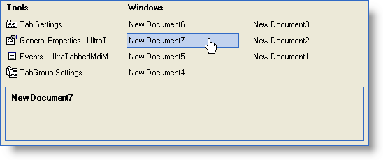

////

|metadata|
{
    "name": "windockmanager-pane-navigator-whats-new-2006-1",
    "controlName": [],
    "tags": [],
    "guid": "{193216CA-707E-4C53-B459-94C6CB93C880}",  
    "buildFlags": [],
    "createdOn": "0001-01-01T00:00:00Z"
}
|metadata|
////

= Pane Navigator

Visual Studio® 2005 introduced the concept of a navigation interface to help users manage their open documents and tool windows. Infragistics captured the essence of this concept and applied it to the WinDockManager™ control. However, this concept is not just specific to Visual Studio 2005.

The navigator will automatically function with default settings if the hosting control of WinDockManager is an MDI parent. The navigator is a must for any end user with a large amount of MDI child windows to manage. By pressing Ctrl-Tab, the navigator will display in the middle of the screen, much like Windows'® Alt-Tab functionality. At a glance, the navigator's interface shows the dockable panes, MDI child forms, and a description area. Select the individual form you wish to activate by left-clicking it or by navigating to it with the arrow keys and then pressing Enter.

== Related Topics

link:windockmanager-prevent-the-navigator-from-being-displayed.html[Prevent the Navigator from Being Displayed]

link:windockmanager-show-the-navigator-programmatically.html[Show the Navigator Programmatically]