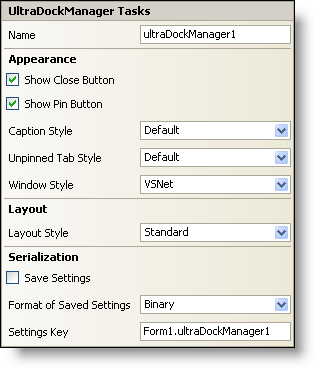

////

|metadata|
{
    "name": "windockmanager-smart-tag",
    "controlName": ["WinDockManager"],
    "tags": ["Editing"],
    "guid": "{6DB12FB4-C883-46EC-9CFB-F33860EBCA24}",  
    "buildFlags": [],
    "createdOn": "0001-01-01T00:00:00Z"
}
|metadata|
////

= WinDockManager Smart Tag

In Visual Studio 2005 (.NET Framework 2.0), each Infragistics Windows Forms control/component is equipped with a Smart Tag. By simply selecting the control/component, a Smart Tag anchor appears. When you click this anchor, a pop-up panel appears, providing you with quick and easy access to the most common properties and settings of the control/component.

The WinDockManager™ Smart Tag contains the name of the component, as well as the following sections:

* Appearance -- Provides common tasks involving the appearance, and look-and-feel of the WinDockManager component.
* Layout -- Offers a property that will determine the layout of the dockable panes.
* Serialization -- Provides quick access to properties used in the IPersistComponentSettings interface (new in Visual Studio 2005).

See below for a description of the item (e.g., field, drop-down list, checkbox) in each section, as well as the item's corresponding property in the properties grid.

[options="header", cols="a,a,a"]
|====
|Appearance|Description|Corresponding Property

|Show Close Button
|Select the check box to display the close button in a pane's caption.
| pick:[win-forms="link:infragistics4.win.ultrawindock.v{ProductVersion}~infragistics.win.ultrawindock.ultradockmanager~showclosebutton.html[ShowCloseButton]"] 

|Show Pin Button
|Select the check box to display the pin button in a pane's caption.
| pick:[win-forms="link:infragistics4.win.ultrawindock.v{ProductVersion}~infragistics.win.ultrawindock.ultradockmanager~showpinbutton.html[ShowPinButton]"] 

|Caption Style
|The caption in the pane can be styled like Visual Studio .NET, Windows, Visual C++ 6, Office 2003, Visual Studio 2005, and Office 2007.
| pick:[win-forms="link:infragistics4.win.ultrawindock.v{ProductVersion}~infragistics.win.ultrawindock.ultradockmanager~captionstyle.html[CaptionStyle]"] 

|Unpinned Tab Style
|Select from the drop-down what style you want the un-pinned panes to have.
| pick:[win-forms="link:infragistics4.win.ultrawindock.v{ProductVersion}~infragistics.win.ultrawindock.ultradockmanager~unpinnedtabstyle.html[UnpinnedTabStyle]"] 

|Window Style
|Select from the drop-down menu the overall window style (e.g., VSNET, Office2003, VisualStudio2005, or Office2007) that you want to apply to the dockable panes.
| pick:[win-forms="link:infragistics4.win.ultrawindock.v{ProductVersion}~infragistics.win.ultrawindock.ultradockmanager~windowstyle.html[WindowStyle]"] 

|====

[options="header", cols="a,a,a"]
|====
|Layout|Description|Corresponding Property

|Layout Style
|Select from the drop-down how you want the dockable panes to be positioned. Choose from Standard or FillContainer.
| pick:[win-forms="link:infragistics4.win.ultrawindock.v{ProductVersion}~infragistics.win.ultrawindock.ultradockmanager~layoutstyle.html[LayoutStyle]"] 

|====

[options="header", cols="a,a,a"]
|====
|Serialization|Description|Corresponding Property

|Save Settings
|If you select this checkbox, the component will automatically load/save its property settings with the application's settings.
|< title="Link to the API Reference Guide to the savesettings member."A style="hs-build-flags: win-forms" href="Infragistics4.Win.UltraWinDock.v{ProductVersion}~Infragistics.Win.UltraWinDock.UltraDockManager~SaveSettings.html">SaveSettings

|Format of Saved Settings
|The component can save its settings in either binary or XML format.
| pick:[win-forms="link:infragistics4.win.ultrawindock.v{ProductVersion}~infragistics.win.ultrawindock.ultradockmanager~savesettingsformat.html[SaveSettingsFormat]"] 

|Settings Key
|You can specify the settings key that will be used to uniquely identify the settings' values that will be loaded/saved. By default, Visual Studio 2005 sets the settings key value based on the name of the containing form/control and the name of the component.
| pick:[win-forms="link:infragistics4.win.ultrawindock.v{ProductVersion}~infragistics.win.ultrawindock.ultradockmanager~settingskey.html[SettingsKey]"] 

|====