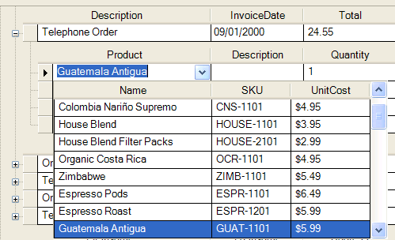

////

|metadata|
{
    "name": "windropdown-about-windropdown",
    "controlName": ["WinDropDown"],
    "tags": ["Getting Started","Selection"],
    "guid": "{8491EEFC-CA56-4511-AFC9-2D2750F3975A}",  
    "buildFlags": [],
    "createdOn": "0001-01-01T00:00:00Z"
}
|metadata|
////

= About WinDropDown

The WinDropDown™ control is a Windows Forms control that can be used with WinGrid™ to provide a multi-column drop-down list within a grid cell. The WinGrid control has built-in support for a single-column, simple, drop-down list. WinDropDown is derived from the same base class as the WinGrid and as such, it has most of the same functionality (e.g. sorting, filtering, and appearances). You can attach the WinDropDown control to a grid via the  pick:[win-forms="link:{ApiPlatform}win.ultrawingrid{ApiVersion}~infragistics.win.ultrawingrid.ultragridcomboeditor~valuelist.html[ValueList]"]  property of the grid column or cell.

WinDropDown is designed to be used specifically with WinGrid and cannot be used as a stand-alone editor. WinDropDown will only function properly when assigned to the Column.*ValueList* property. Other Infragistics Editors implement an interface known as *IProvidesEmbeddableEditor* which is not implemented by WinDropDown. This means that you cannot assign WinDropDown directly to the Column.*EditorControl* property.

You can customize WinDropDown in the same way that you would customize the WinGrid. You can also use its designer by clicking on WinDropDown’s Start button to open the UltraWinDropDown designer. In the designer, you can show or hide columns, use Row Layouts, set column formatting, and so forth.

