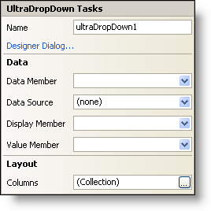

////

|metadata|
{
    "name": "windropdown-smart-tag",
    "controlName": ["WinDropDown"],
    "tags": ["Getting Started"],
    "guid": "{9711FBD9-9616-48A9-AD72-B8E47790752B}",  
    "buildFlags": [],
    "createdOn": "2005-11-11T00:00:00Z"
}
|metadata|
////

= WinDropDown Smart Tag

In Visual Studio 2005 (.NET Framework 2.0), each Infragistics Windows Forms control/component is equipped with a Smart Tag. By simply selecting the control/component, a Smart Tag anchor appears. When you click this anchor, a pop-up panel appears, providing you with quick and easy access to the most common properties and settings of the control/component.

The WinDropDown™ Smart Tag contains the name of the control, as well as the following sections:

* Data -- Refers to any underlying data the control is using such as data sources and data members.
* Layout -- Offers properties that will determine where and how the control is placed on the form.

See below for a description of the item (e.g., field, drop-down list, checkbox) in each section, as well as the item's corresponding property in the properties grid.

[options="header", cols="a,a,a"]
|====
|Data|Description|Corresponding Property

|Data Member
|Once you have selected a valid data source, you can select all available data members from this drop-down.
| pick:[win-forms="link:infragistics4.win.ultrawingrid.v{ProductVersion}~infragistics.win.ultrawingrid.ultragridbase~datamember.html[DataMember]"] 

|Data Source
|Click the drop-down and all available data sources in your project will be displayed. If you do not have a data source set up, you can select, "Add Project Data Source..." to create one.
| pick:[win-forms="link:infragistics4.win.ultrawingrid.v{ProductVersion}~infragistics.win.ultrawingrid.ultragridbase~datasource.html[DataSource]"] 

|Display Member
|The Display Member is a field from the data source that will be displayed in the edit area.
| pick:[win-forms="link:infragistics4.win.ultrawingrid.v{ProductVersion}~infragistics.win.ultrawingrid.ultradropdownbase~displaymember.html[DisplayMember]"] 

|Value Member
|The Value Member is a field from the data source that will actually be bound to the data.
| pick:[win-forms="link:infragistics4.win.ultrawingrid.v{ProductVersion}~infragistics.win.ultrawingrid.ultradropdownbase~valuemember.html[ValueMember]"] 

|====

[options="header", cols="a,a,a"]
|====
|Layout|Description|Corresponding Property

|Columns
|More than one column can be displayed in the WinDropDown's drop-down. This is where you can edit the Columns collection. You can also edit the Columns collection in the properties grid. Expand link:infragistics4.win.ultrawingrid.v{ProductVersion}~infragistics.win.ultrawingrid.ultragriddisplaylayout.html[DisplayLayout], expand link:infragistics4.win.ultrawingrid.v{ProductVersion}~infragistics.win.ultrawingrid.ultragridlayout~bands.html[Bands], and then expand Band 0 (which will display in the grid as "0 - _tablename_ "). Under Band 0, click the ellipsis (...) in the Columns row to open the Columns collection.
|n/a

|====