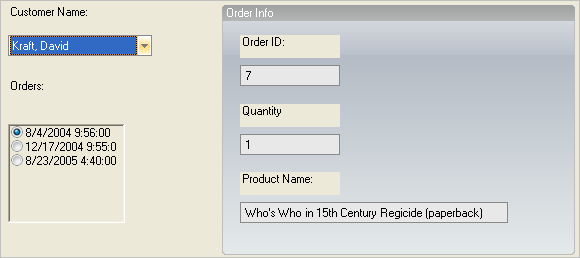

////

|metadata|
{
    "name": "wineditors-binding-wincomboeditor-and-winoptionset-controls-to-data",
    "controlName": ["WinEditors"],
    "tags": [],
    "guid": "{559A7F1B-F607-4290-A21A-9994758820CE}",  
    "buildFlags": [],
    "createdOn": "2005-12-09T00:00:00Z"
}
|metadata|
////

= Binding WinComboEditor and WinOptionSet Controls to Data

== Introduction

This topic applies to the following WinEditor™ controls:

* WinComboEditor™
* WinOptionSet™

The WinComboEditor and WinOptionSet controls have been given databinding capabilities. They can be given a data source from which a list of data values is retrieved and displayed as items in the control. The databinding is one-way, meaning that the data source will not be modified by the control bound to it. In addition to the standard members associated with .NET databinding, both controls also expose an  pick:[win-forms="link:{ApiPlatform}win.ultrawineditors{ApiVersion}~infragistics.win.ultrawineditors.ultracomboeditor~initializedataitem_ev.html[InitializeDataItem]"]  event. This event fires once for every ValueListItem created to represent an entity found in the data source. Handlers of this event can apply value-specific formatting to the bound  pick:[win-forms="link:{ApiPlatform}win{ApiVersion}~infragistics.win.valuelistitem.html[ValueListItem]"]  (i.e. the "data item"), such as setting the ForeColor of items with negative quantities of money to red.

This article will demonstrate how you can use the databinding functionality of these two controls. The sample application allows the user to view the orders placed by a given customer, and details about each order. Below is a screen shot of the sample application that will be created in this article:

== Setting Up the Form

First create a new WinForms project in Visual Studio. Add the controls seen in the image above to the form at design-time. The top left control is an UltraComboEditor with an UltraLabel above it. Name the UltraComboEditor 'cmbCustomers'.

Next add the UltraOptionSet and UltraLabel seen beneath the UltraComboEditor. Name the UltraOptionSet 'optOrders'.

Now it's time to add the group of controls seen on the right half of the Form. First add the UltraGroupBox and set its  pick:[win-forms="link:{ApiPlatform}win.misc{ApiVersion}~infragistics.win.misc.ultragroupbox~text.html[Text]"]  property to "Order Info." Now add three UltraLabels and three UltraTextEditors, as seen above. Set the Text of the UltraLabels to the strings seen in the image above. From top to bottom, the name of the WinTextEditors should be set to: 'txtOrderID', 'txtProductName', and 'txtQuantity'. Lastly, set the ReadOnly property of the WinTextEditor controls to true so that the end-user cannot modify the values they contain.

== Creating Data

Now that the controls are on the Form it is time to write the code which establishes the databinding of the WinComboEditor and WinOptionSet. First you will create a method which creates some dummy data to bind to. The sample application's data is stored in a DataSet which contains two related DataTables; Customers and Orders. Type or paste the following method into the Form's code file:

*In Visual Basic:*

----
Private Shared Function CreateCustomerOrdersData() As DataSet
	Dim ds As New DataSet("CustomerOrders")
	' Create the Customers table.
	Dim tbl As New DataTable("Customers")
	tbl.Columns.Add("ID", GetType(Integer)).Unique = True
	tbl.Columns.Add("FirstName", GetType(String))
	tbl.Columns.Add("LastName", GetType(String))
	tbl.Columns.Add("DisplayName", GetType(String)).Expression = _
	  "LastName + ',' + FirstName"
	tbl.Rows.Add(New Object() {1, "Alice", "Brighton"})
	tbl.Rows.Add(New Object() {2, "Frank", "Ashport"})
	tbl.Rows.Add(New Object() {3, "David", "Kraft"})
	ds.Tables.Add(tbl)
	' Create the Orders table.
	tbl = New DataTable("Orders")
	tbl.Columns.Add("OrderID", GetType(Integer)).Unique = True
	tbl.Columns.Add("CustID", GetType(Integer))
	tbl.Columns.Add("ProductName", GetType(String))
	tbl.Columns.Add("Quantity", GetType(Integer))
	tbl.Columns.Add("OrderDate", GetType(DateTime))
	tbl.Rows.Add(New Object() {1, 3, "Lord Wellingtons Deluxe Polo Helmet", 1, _
	  New DateTime(2004, 12, 17, 9, 55, 0)})
	tbl.Rows.Add(New Object() {2, 2, "Death Valley Ballerina Slippers", 13, _
	  New DateTime(2005, 3, 1, 14, 21, 0)})
	tbl.Rows.Add(New Object() {3, 3, "Elektron Disco Grease", 6, _
	  New DateTime(2005, 8, 23, 16, 40, 0)})
	tbl.Rows.Add(New Object() {4, 1, "Foxtrot Your Way to Fame (Disc 1 of 7)", 1, _
	  New DateTime(2004, 12, 3, 2, 49, 0)})
	tbl.Rows.Add(New Object() {5, 1, "Jacque's Xtreme Chin Strap", 4, _
	  New DateTime(2004, 7, 9, 12, 23, 0)})
	tbl.Rows.Add(New Object() {6, 2, "PostureMaster 9000", 2, _
	  New DateTime(2004, 12, 16, 10, 26, 0)})
	tbl.Rows.Add(New Object() {7, 3, _
	  "Who's Who in 15th Century Regicide (paperback)", 1, _
	  New DateTime(2004, 8, 4, 9, 56, 0)})
	ds.Tables.Add(tbl)
	' Create a relationship between the two tables, based on the ID of customers.
	ds.Relations.Add("cust2orders", _
	  ds.Tables("Customers").Columns("ID"), _
	  ds.Tables("Orders").Columns("CustID"))
	Return ds
End Function
----

*In C#:*

----
private static DataSet CreateCustomerOrdersData()
{
	DataSet ds = new DataSet("CustomerOrders");
	// Create the Customers table.
	DataTable tbl = new DataTable("Customers");
	tbl.Columns.Add("ID",  typeof(int)).Unique = true;
	tbl.Columns.Add("FirstName", typeof(string));
	tbl.Columns.Add("LastName", typeof(string));
	tbl.Columns.Add("DisplayName", typeof(string)).Expression = 
	  "LastName + ', ' + FirstName";
	tbl.Rows.Add(new Object[] {1, "Alice", "Brighton"});
	tbl.Rows.Add(new Object[] {2, "Frank", "Ashport"});
	tbl.Rows.Add(new Object[] {3, "David", "Kraft"});
	ds.Tables.Add( tbl );
	// Create the Orders table.
	tbl = new DataTable("Orders");
	tbl.Columns.Add("OrderID", typeof(int)).Unique = true;
	tbl.Columns.Add("CustID", typeof(int));            
	tbl.Columns.Add("ProductName", typeof(string));
	tbl.Columns.Add("Quantity", typeof(int));
	tbl.Columns.Add("OrderDate", typeof(DateTime));
	tbl.Rows.Add(new Object[] {1, 3, "Lord Wellingtons Deluxe Polo Helmet", 1, 
	  new DateTime(2004, 12, 17, 9, 55, 0)});
	tbl.Rows.Add(new Object[] {2, 2, "Death Valley Ballerina Slippers", 13, 
	  new DateTime(2005, 3, 1, 14, 21, 0)});
	tbl.Rows.Add(new Object[] {3, 3, "Elektron Disco Grease", 6, 
	  new DateTime(2005, 8, 23, 16, 40, 0)});
	tbl.Rows.Add(new Object[] {4, 1, "Foxtrot Your Way to Fame (Disc 1 of 7)", 1, 
	  new DateTime(2004, 12, 3, 2, 49, 0)});
	tbl.Rows.Add(new Object[] {5, 1, "Jacque's Xtreme Chin Strap", 4, 
	  new DateTime(2004, 7, 9, 12, 23, 0)});
	tbl.Rows.Add(new Object[] {6, 2, "PostureMaster 9000", 2, 
	  new DateTime(2004, 12, 16, 10, 26, 0)});
	tbl.Rows.Add(new Object[] {7, 3, 
	  "Who's Who in 15th Century Regicide (paperback)", 1, 
	  new DateTime(2004, 8, 4, 9, 56, 0)});
	ds.Tables.Add( tbl );
	// Create a relationship between the two tables, based on the ID of customers.
	ds.Relations.Add("cust2orders", 
	  ds.Tables["Customers"].Columns["ID"], 
	  ds.Tables["Orders"].Columns["CustID"]);
	return ds;
}
----

== Binding the WinComboEditor

Now we will add the code which binds the WinComboEditor to the "Customers" DataTable. The combo should show values from the "DisplayName" column, which is a computed column in the DataTable that returns the customer's name in the , format.

The first thing to do is add a private DataSet member variable in the Form-derived class called 'dsCustOrders' so that the data source is easily available after the Form has loaded. Then add a handler for the Load event of your Form and type or paste the following code into it:

*In Visual Basic:*

----
Private dsCustOrders As DataSet
Private Sub Databinding_the_WinComboEditor_and_WinOptionSet_Controls_Load( _
  ByVal sender As System.Object, ByVal e As System.EventArgs) Handles MyBase.Load
	' Get a DataSet with two related tables; Customers and Orders.
	Me.dsCustOrders = CreateCustomerOrdersData()
	' Bind the UltraComboEditor to the Customers table.  Make the display
	' value come from the DisplayName column and the control's value come
	' from the ID column.
	Me.cmbCustomers.SetDataBinding(Me.dsCustOrders, "Customers")
	Me.cmbCustomers.DisplayMember = "DisplayName"
	Me.cmbCustomers.ValueMember = "ID"
	' Do not allow the end-user to edit the items.
	Me.cmbCustomers.DropDownStyle = Infragistics.Win.DropDownStyle.DropDownList
	' Sort the customer names in the drop-down.
	Me.cmbCustomers.SortStyle = Infragistics.Win.ValueListSortStyle.Ascending
End Sub
----

*In C#:*

----
private DataSet dsCustOrders;
private void Databinding_the_WinComboEditor_and_WinOptionSet_Controls_Load(
  object sender, 
  EventArgs e)
{
	// Get a DataSet with two related tables; Customers and Orders.
	this.dsCustOrders = CreateCustomerOrdersData();
	// Bind the UltraComboEditor to the Customers table.  Make the display
	// value come from the DisplayName column and the control's value come
	// from the ID column.
	this.cmbCustomers.SetDataBinding(this.dsCustOrders, "Customers");
	this.cmbCustomers.DisplayMember = "DisplayName";
	this.cmbCustomers.ValueMember = "ID";
	// Do not allow the end-user to edit the items.
	this.cmbCustomers.DropDownStyle = Infragistics.Win.DropDownStyle.DropDownList;
	// Sort the customer names in the drop-down.
	this.cmbCustomers.SortStyle = Infragistics.Win.ValueListSortStyle.Ascending;
}
----

== Value-specific Appearance Settings for Customers

At this point the WinComboEditor has been bound to the Customers DataTable and knows to display the formatted names of the customers. There is, however, another requirement wherein any customer who has made more than two orders should be visually differentiated from the other customers in the drop-down list. We will make the background color of those "preferred" customers gold so that it is easy to identify them. The code which selectively assigns the background color will execute in a handler of the WinComboEditor's link:{ApiPlatform}win.ultrawineditors{ApiVersion}~infragistics.win.ultrawineditors.ultracomboeditor~initializedataitem_ev.html[ pick:[win-forms="InitializeDataItem"] ] event. That event fires once when a ValueListItem is created to represent a value found in the data source. Below is the code which applies the value-specific settings:

*In Visual Basic:*

----
Private Sub cmbCustomers_InitializeDataItem(ByVal sender As Object, _
  ByVal e As Infragistics.Win.InitializeDataItemEventArgs) _
  Handles cmbCustomers.InitializeDataItem
	Dim view As DataRowView = CType(e.ValueListItem.ListObject, DataRowView)
	' If a customer has more than two orders, indicate they are a good
	' customer by coloring their item in the drop-down gold.
	Dim row As DataRow = view.Row
	If row.GetChildRows("cust2orders").Length > 2 Then
		e.ValueListItem.Appearance.BackColor = Color.Gold
	End If
End Sub
----

*In C#:*

----
private void cmbCustomers_InitializeDataItem(object sender, 
  Infragistics.Win.InitializeDataItemEventArgs e)
{
	DataRowView view = e.ValueListItem.ListObject as DataRowView;
	if(view != null)
	{
		// If a customer has more than two orders, indicate they are a good
		// customer by coloring their item in the drop-down gold.
		DataRow row = view.Row;
		if(row.GetChildRows("cust2orders").Length > 2)
			e.ValueListItem.Appearance.BackColor = Color.Gold;
	}
}
----

== Binding the WinOptionSet

At this point the WinComboEditor is bound to a data source and value-specific settings are applied to the individual data items when they are created. From the end-user's perspective, the WinComboEditor now displays customer names and highlights the "preferred" customers with a golden background. When the user selects a customer from the list, we need to display that customer's orders in the WinOptionSet. The logic which will display a customer's orders executes in response to the selected customer in the WinComboEditor being changed.

Add a handler for the WinComboEditor's ValueChanged event and put the following code into it:

*In Visual Basic:*

----
Private Sub cmbCustomers_ValueChanged(ByVal sender As Object, _
  ByVal e As System.EventArgs) Handles cmbCustomers.ValueChanged
	' Create a DataView which exposes the selected customer's orders.
	Dim rowView As DataRowView
	If Not Me.cmbCustomers.SelectedItem Is Nothing Then
		rowView = CType(Me.cmbCustomers.SelectedItem.ListObject, DataRowView)
	Dim ordersTbl As DataTable = Me.dsCustOrders.Tables("Orders")
	Dim rowFilter As String = String.Format("CustID = {0}", rowView.Row("ID").ToString())
	Dim dataView As New DataView(ordersTbl, rowFilter, "OrderDate ASC", _
	  DataViewRowState.CurrentRows)
	' Bind the UltraOptionSet to that DataView.
	Me.optOrders.DataSource = dataView
	Me.optOrders.DisplayMember = "OrderDate"
	Me.optOrders.ValueMember = "OrderID"
	' Select the first order in the list.
	Me.optOrders.CheckedIndex = 0
	End If
End Sub
----

*In C#:*

----
private void cmbCustomers_ValueChanged(object sender, System.EventArgs e)
{
	// Create a DataView which exposes the selected customer's orders.
	DataRowView rowView = 
	  this.cmbCustomers.SelectedItem.ListObject as DataRowView;
	DataTable ordersTbl = 
	  this.dsCustOrders.Tables["Orders"];
	string rowFilter = 
	  String.Format("CustID = {0}", rowView.Row["ID"].ToString());
	DataView dataView = 
	  new DataView( ordersTbl, rowFilter, "OrderDate ASC", 
	  DataViewRowState.CurrentRows );
	// Bind the UltraOptionSet to that DataView.
	this.optOrders.DataSource = dataView;
	this.optOrders.DisplayMember = "OrderDate";
	this.optOrders.ValueMember = "OrderID";
	// Select the first order in the list.
	this.optOrders.CheckedIndex = 0;
}
----

== Displaying Order Details

When the user selects a customer's order from the WinOptionSet it is necessary to display the details of that order in the controls contained in the WinGroupBox. This is simply a matter of retrieving the DataRow which contains the details about the selected order, and then populating the WinTextEditors with that data. The following code shows how to do that:

*In Visual Basic:*

----
Private Sub optOrders_ValueChanged(ByVal sender As Object, _
  ByVal e As System.EventArgs) Handles optOrders.ValueChanged
	If Me.optOrders.Value Is Nothing Then
		' If there is no selected order, reset the text in the text editors.
		Me.txtOrderID.ResetText()
		Me.txtProductName.ResetText()
		Me.txtQuantity.ResetText()
	Else
		' Find the row in the Orders table which represents the selected order.
		Dim orderID As Integer = Convert.ToInt32(Me.optOrders.Value)
		Dim query As String = String.Format("OrderID = {0}", orderID)
		Dim orderRow As DataRow = Me.dsCustOrders.Tables("Orders").Select(query)(0)
		' Display information about that order in the text editors.
		Me.txtOrderID.Text = orderID.ToString()
		Me.txtProductName.Text = orderRow("ProductName").ToString()
		Me.txtQuantity.Text = orderRow("Quantity").ToString()
	End If
End Sub
----

*In C#:*

----
private void optOrders_ValueChanged(object sender, System.EventArgs e)
{
	if( this.optOrders.Value == null )
	{
		// If there is no selected order, reset the text in the text editors.
		this.txtOrderID.ResetText();
		this.txtProductName.ResetText();
		this.txtQuantity.ResetText();                                
	}
	else
	{
		// Find the row in the Orders table which represents the selected order.
		int orderID = Convert.ToInt32( this.optOrders.Value );
		string query = String.Format("OrderID = {0}", orderID);
		DataRow orderRow = 
		  this.dsCustOrders.Tables["Orders"].Select( query )[0];
		// Display information about that order in the text editors.
		this.txtOrderID.Text = orderID.ToString();
		this.txtProductName.Text = orderRow["ProductName"].ToString();
		this.txtQuantity.Text = orderRow["Quantity"].ToString();
	}
}
----

== Conclusion

The databinding support of the WinComboEditor and WinOptionSet makes it very easy to populate the control with data. The standard  pick:[win-forms="link:{ApiPlatform}win.ultrawineditors{ApiVersion}~infragistics.win.ultrawineditors.ultracomboeditor~datasource.html[DataSource]"] ,  pick:[win-forms="link:{ApiPlatform}win.ultrawineditors{ApiVersion}~infragistics.win.ultrawineditors.ultracomboeditor~datamember.html[DataMember]"] ,  pick:[win-forms="link:{ApiPlatform}win.ultrawineditors{ApiVersion}~infragistics.win.ultrawineditors.ultracomboeditor~displaymember.html[DisplayMember]"] , and  pick:[win-forms="link:{ApiPlatform}win.ultrawineditors{ApiVersion}~infragistics.win.ultrawineditors.ultracomboeditor~valuemember.html[ValueMember]"]  properties allow you to establish the binding, and the InitializeDataItem event provides a convenient way for the ValueListItems contained in the control to have value-specific settings.