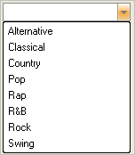

////

|metadata|
{
    "name": "wineditors-choosing-an-appearance",
    "controlName": ["WinEditors"],
    "tags": ["How Do I","Styling"],
    "guid": "{ACB0F3A7-8583-4BA9-96AE-918BD457C44F}",  
    "buildFlags": [],
    "createdOn": "2005-06-07T00:00:00Z"
}
|metadata|
////

= Choosing an Appearance

This topic applies to all WinEditor™ controls.

To create a consistent look within some applications, you may want to change the look and feel of one of the WinEditor controls. The  pick:[win-forms="link:{ApiPlatform}win.ultrawineditors{ApiVersion}~infragistics.win.ultrawineditors.texteditorcontrolbase~displaystyle.html[DisplayStyle]"]  property allows you selects from OfficeXP, Office2000, VisualStudio2005, Office2007 and many more styles. The following example code shows you how to set the DisplayStyle property use the Office2007 look and feel.

*In Visual Basic:*

----
Imports Infragistics.Win
...
Private Sub Choose_the_WinEditors_Look_Load(ByVal sender As System.Object, _
  ByVal e As System.EventArgs) Handles MyBase.Load
	Me.UltraComboEditor1.DisplayStyle = _
	  EmbeddableElementDisplayStyle.Office2007
End Sub
----

*In C#:*

----
using Infragistics.Win;
...
private void Choose_the_WinEditors_Look_Load(object sender, EventArgs e)
{
	this.ultraComboEditor1.DisplayStyle = 
	  EmbeddableElementDisplayStyle.Office2007;
}
----

