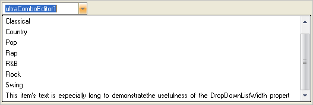

////

|metadata|
{
    "name": "wineditors-configuring-the-width-of-the-drop-down-menu",
    "controlName": ["WinEditors"],
    "tags": ["How Do I"],
    "guid": "{F8070EFA-3E87-4E90-86A2-7F73920CEF54}",  
    "buildFlags": [],
    "createdOn": "2005-06-07T00:00:00Z"
}
|metadata|
////

= Configuring the Width of the Drop-Down Menu

This topic applies to the following WinEditor™ controls:

* WinComboEditor™
* WinFontNameEditor™

The  pick:[win-forms="link:{ApiPlatform}win.ultrawineditors{ApiVersion}~infragistics.win.ultrawineditors.ultracomboeditor~dropdownlistwidth.html[DropDownListWidth]"]  property makes it possible to explicitly set the width of the drop-down list that appears when the drop-down button is clicked.

The UltraComboEditor and UltraFontNameEditor elements each have different default values for this property; The default value for the UltraComboEditor element is 0, which causes the list to be the same width as the element itself. The default value for the UltraFontNameEditor element is -1, which causes the list to be the same width as the longest item in the list. Additionally, the width can be set to a specific value (unit is pixels), for example, 200.

The following code will cause the drop-down list to automatically size itself to accommodate the width of the longest item in the list:

*In Visual Basic:*

----
Private Sub Use_the_DropDownListWidth_Property_Load(ByVal sender As System.Object, _
  ByVal e As System.EventArgs) Handles MyBase.Load
	Me.UltraComboEditor1.Items.Add( _
	  "This item's text is especially long to demonstrate" & _
	  "the usefulness of the DropDownListWidth property")
	Me.UltraComboEditor1.DropDownListWidth = -1
End Sub
----

*In C#:*

----
private void Use_the_DropDownListWidth_Property_Load(object sender, EventArgs e)
{
	this.ultraComboEditor1.Items.Add( 
	  "This item's text is especially long to demonstrate" + 
	  "the usefulness of the DropDownListWidth property");
	this.ultraComboEditor1.DropDownListWidth = -1;
}
----

