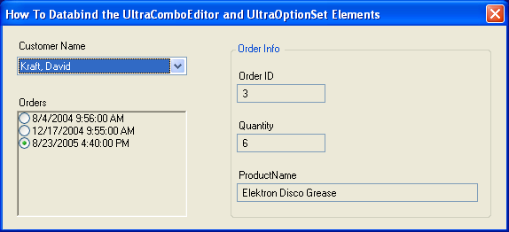

////

|metadata|
{
    "name": "wineditors-datasource-property-added-to-winoptionset-whats-new-2005-3",
    "controlName": [],
    "tags": [],
    "guid": "{2503356D-A543-4F5D-82D8-6F37A9BD45E8}",  
    "buildFlags": [],
    "createdOn": "0001-01-01T00:00:00Z"
}
|metadata|
////

= DataSource Property Added to WinOptionSet

The WinOptionSet™ control can now be bound to a data source via a new  pick:[win-forms="link:{ApiPlatform}win.ultrawineditors{ApiVersion}~infragistics.win.ultrawineditors.ultraoptionset~datasource.html[DataSource]"]  property. To allow for databinding, you must set the DataSource property of the WinComboEditor and specify the following members:

*  pick:[win-forms="link:{ApiPlatform}win.ultrawineditors{ApiVersion}~infragistics.win.ultrawineditors.ultraoptionset~datamember.html[DataMember]"] 
*  pick:[win-forms="link:{ApiPlatform}win.ultrawineditors{ApiVersion}~infragistics.win.ultrawineditors.ultraoptionset~displaymember.html[DisplayMember]"] 
*  pick:[win-forms="link:{ApiPlatform}win.ultrawineditors{ApiVersion}~infragistics.win.ultrawineditors.ultraoptionset~valuemember.html[ValueMember]"] 

The WinOptionSet then displays the values found in the data source and exposes them through the DisplayMember property. When a bound  pick:[win-forms="link:{ApiPlatform}win{ApiVersion}~infragistics.win.valuelistitem.html[ValueListItem]"] is created, the  pick:[win-forms="link:{ApiPlatform}win.ultrawineditors{ApiVersion}~infragistics.win.ultrawineditors.ultraoptionset~initializedataitem_ev.html[InitializeDataItem]"]  event fires, once per item. Each event gives you a chance to apply value-dependent appearance settings to the item.

== Related Topic:

link:wineditors-binding-wincomboeditor-and-winoptionset-controls-to-data.html[Databinding the WinComboEditor and WinOptionSet Controls]