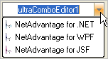

////

|metadata|
{
    "name": "wineditors-displaying-items-with-images",
    "controlName": ["WinEditors"],
    "tags": ["Data Presentation","How Do I"],
    "guid": "{2AA8804D-4770-4560-9CF2-016F41345B62}",  
    "buildFlags": [],
    "createdOn": "2005-06-07T00:00:00Z"
}
|metadata|
////

= Displaying Items with Images

This topic applies to the following WinEditor™ controls:

* WinTextEditor™
* WinComboEditor™
* WinFontNameEditor™
* WinDateTimeEditor™
* WinNumericEditor™
* WinCurrencyEditor™

All of the WinEditors elements support the display of images via the  pick:[win-forms="link:{ApiPlatform}win{ApiVersion}~infragistics.win.appearance.html[Appearance]"]  object's  pick:[win-forms="link:{ApiPlatform}win{ApiVersion}~infragistics.win.appearance~image.html[Image]"]  property.

The WinComboEditor element also supports the display of images for each item in its drop-down list, via the Image property of the item's Appearance. Furthermore, the WinComboEditor element exposes an  pick:[win-forms="link:{ApiPlatform}win.ultrawineditors{ApiVersion}~infragistics.win.ultrawineditors.ultracomboeditor~itemappearance.html[ItemAppearance]"]  property, which applies to all items in the list. Note that when an individual item's Appearance is set, it takes precedence over the element's ItemAppearance.

== Assigning images to items in the Drop-down list

The following code demonstrates how to use the Appearance object of each item in the WinComboEditor's drop-down list in conjunction with an ImageList control to display an image for that item.

.Note
[NOTE]
====
The exercise assumes that the project contains a standard ImageList control with 3 images assigned to it.
====

*In Visual Basic:*

----
Private Sub Work_with_ImageLists_Load(ByVal sender As System.Object, _
  ByVal e As System.EventArgs) Handles MyBase.Load
	' Set the Appearance of each item in the UltraComboEditor's Items 
	' collection to one of the images in the ImageList 
	' Note that the Image property of the Appearance object can be set to 
	' either an image or an index into an ImageList's Images collection
	Dim i As Integer
	For i = 0 To 2
		Me.UltraComboEditor1.Items(i).Appearance.Image = Me.ImageList1.Images(i)
	Next
End Sub   
----

*In C#:*

----
private void Work_with_ImageLists_Load(object sender, EventArgs e)
{
	// Set the Appearance of each item in the UltraComboEditor's Items 
	// collection to one of the images in the ImageList
	// Note that the Image property of the Appearance object can be set to 
	// either an image or an index into an ImageList's Images collection
	for ( int i = 0; i $$<=$$ 2; i++ )
	{
		this.ultraComboEditor1.Items[i].Appearance.Image = this.imageList1.Images[i];
	}
}   
----

