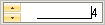

////

|metadata|
{
    "name": "wineditors-displaying-spin-buttons",
    "controlName": ["WinEditors"],
    "tags": ["How Do I"],
    "guid": "{71F5825B-B100-41EE-8C56-4482550D6CFD}",  
    "buildFlags": [],
    "createdOn": "2005-06-07T00:00:00Z"
}
|metadata|
////

= Displaying Spin Buttons

This topic applies to all WinEditor™ controls:

By default, WinEditors do not display Spin Buttons. Spin Buttons can be displayed, however, by setting the  pick:[win-forms="link:{ApiPlatform}win{ApiVersion}~infragistics.win.spinbuttondisplaystyle.html[SpinButtonDisplayStyle]"]  property, which enables the end user to increment or decrement the current value of a spinnable section using the mouse. The  pick:[win-forms="link:{ApiPlatform}win.ultrawineditors{ApiVersion}~infragistics.win.ultrawineditors.ultranumericeditorbase~spinbuttonalignment.html[SpinButtonAlignment]"]  property determines whether the spin buttons are displayed on the left or right of the control. The  pick:[win-forms="link:{ApiPlatform}win{ApiVersion}~infragistics.win.editorwithmask~spinwrap.html[SpinWrap]"]  property determines whether the spin button should wrap the value of a spinnable section based on its Min/Max value.

== Setting Spin Button Display Style

The following code demonstrates how to configure the controls so that their spin buttons are always displayed. The code then demonstrates how to configure the controls so that their spin buttons appear on the left side of the element. It also demonstrates how to configure the controls so that their spin buttons wrap the value of a spinnable section based on their Min/Max values.

*In Visual Basic:*

----
Imports Infragistics.Win
...
Private Sub Display_Spin_Buttons_Load(ByVal sender As System.Object, _
  ByVal e As System.EventArgs) Handles MyBase.Load
	Me.UltraNumericEditor1.SpinButtonDisplayStyle = ButtonDisplayStyle.Always
	Me.UltraNumericEditor1.SpinButtonAlignment = ButtonAlignment.Left
	Me.UltraNumericEditor1.SpinWrap = True
End Sub
----

*In C#:*

----
using Infragistics.Win;
...
private void Display_Spin_Buttons_Load(object sender, EventArgs e)
{
	this.ultraNumericEditor1.SpinButtonDisplayStyle = ButtonDisplayStyle.Always;
	this.ultraNumericEditor1.SpinButtonAlignment = ButtonAlignment.Left;
	this.ultraNumericEditor1.SpinWrap = true;
} 
----

